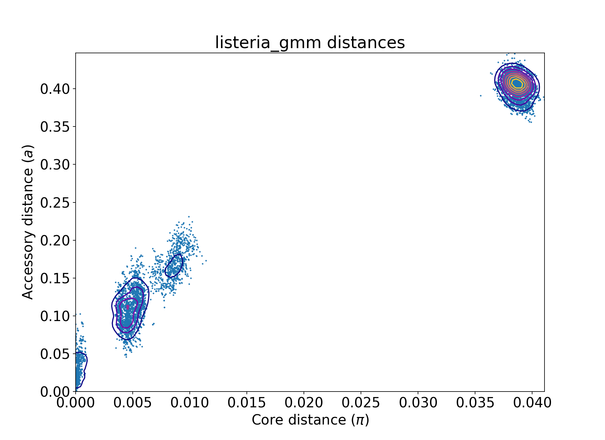
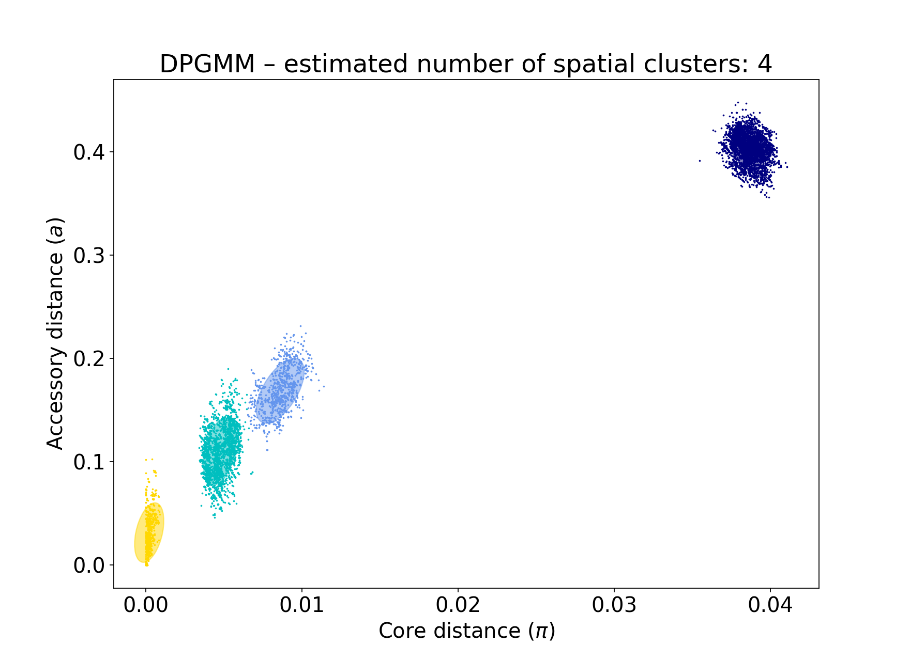
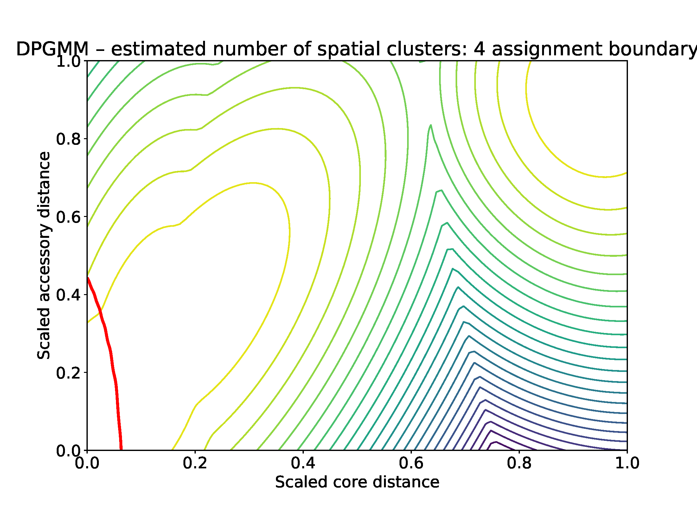
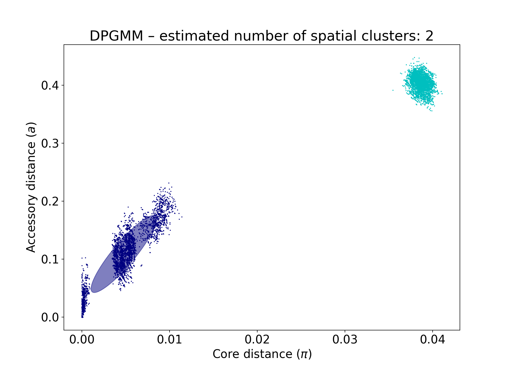
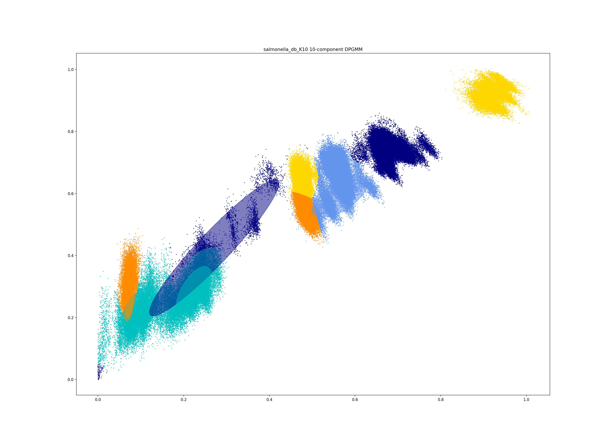

Fitting new models
==================

If you cannot find an existing model for your species in the
`list <https://poppunk.net/pages/databases.html>`__ you will want to fit your own.
This process is flexible, and there are five different models you can use depending
on the population structure of your dataset.

.. contents::
   :local:

Overview
--------

First, use ``poppunk --create-db`` to sketch your input data and calculate distances
between all samples. This is detailed in :doc:`sketching`.

Then, use ``poppunk --fit-model <model_name>`` with one of the following model names:

- ``bgmm`` -- Bayesian Gaussian Mixture Model. Best for small sample collections
  with strain-structure. Works best when distance distribution components are clearly
  separated.
- ``dbscan`` -- HDBSCAN. A good general method for larger sample collections with
  strain-structure. Some points will always be designated as noise, so a subsequent run
  of model refinement may help improve the fit.
- ``refine`` -- Model refinement. Requires a model already fitted with ``bgmm`` or ``dbscan``
  and attempts to improve it by maximising the network score. Particularly useful when
  components overlap significantly (often due to recombination), or when the strain boundary
  is thought to lie somewhere within a component.
- ``lineage`` -- Lineage clustering. To find lineages within a strain (subclustering), or
  find clusters in a population without strain structure. Uses a simple nearest neighbour approach
  so is more of a heuristic. Network scores are not meaningful in this mode.
- ``threshold`` -- Apply a given core or accessory distance threshold to define clusters. Useful if
  a cutoff threshold is already known/calculated, is estimated from a plot, or to compare a threshold
  between datasets or species.

The most useful guide to deciding which model to use is the ``_distanceDistribution.png`` file
showing the core and accessory distances. More details on each of these models is given
further down this page.

A completed fit will consist of:

- A ``_clusters.csv`` file, which gives the strain (cluster) for each sample in the database.
- ``_fit.npz`` and ``_fit.pkl`` files, which contain numeric data and metadata for the fit.
- A ``_graph.gt`` file, which is the network defining the fit in graph-tool format.
- Some plots of the fit, which depend on the specific model used.
- A ``.refs`` file, which lists the samples kept as 'references' for assigning
  future samples (see :doc:`model_distribution` for more details).

This page will use 128 *Listeria monocytogenes* samples from `Kremer et al <https://doi.org/10.1016/j.cmi.2016.12.008>`__,
which can be downloaded from `figshare <https://doi.org/10.6084/m9.figshare.7083389>`__. The distribution of
core and accessory distances from the ``--create-db`` step is as follows

Common arguments
----------------
- ``--ref-db``: the output prefix used with ``--create-db`` i.e. the directory where the .h5 file is located
- ``--output``: where to save the model. If not specified this defaults to ``ref-db``.
- ``--overwrite``: overwrite any existing files in the output directory.
- ``--external-clustering``: any additional labels to add to the cluster output.

External clusters may be other cluster names, such as serotype, sequence type, cgMLST etc.
PopPUNK clusters are mapped as one-to-many, so that each strain is labelled with all of
the clusters any of its members is assigned to in this file. This input file must
be comma separated, one sample per line, with the sample name as the first column, and
other clusters as subsequent columns. A header line with 'sample' and the names of other cluster
types is required. Output is to ``output/output_external_clusters.csv``.

How good is my fit?
-------------------
We have found the best way to assess this is to use :doc:`visualisation` on your output
and look at your assigned clusters against a tree, to determine whether they have
the specificity required.

You can also compare models with their network score, and
whether the output plots look as expected. Typically the key thing is that
**your spatial component nearest the origin is accurate**. More detail is given for each model below.

Interpreting the network summary
^^^^^^^^^^^^^^^^^^^^^^^^^^^^^^^^
All fits will output a network summary which looks similar to this::

    Network summary:
        Components	31
        Density	0.0897
        Transitivity	1.0000
        Score	0.9103

- Components are the number of strains (clusters) found using this model.
- Density is the proportion of distances assigned as 'within-strain'. Generally
  smaller is better as this gives more specific clusters, but too close to zero
  may be an over-specific model.
- Transitivity measures whether every member of each strain is connected to every
  other member. Closer to 1 is better, but this can be achieved with very loose fits.
- Score synthesises the above as :math:`(1 - \mathrm{density}) * \mathrm{transitivity}`,
  which gives a single number between 0 (bad) and 1 (good) which in many cases is
  at a maximum when it accurately describes strains in the data.

bgmm
----
This mode fits a `Bayesian Gaussian mixture model <https://scikit-learn.org/stable/modules/generated/sklearn.mixture.BayesianGaussianMixture.html>`__
to the core and accessory distances. With few points, methods such as DBSCAN may struggle to find
clusters due to the sparsity, whereas a BGMM can often find a good fit. A further advantage
is that the equation for the posterior is known, so all points will have an assignment and a non-linear
boundary found exactly.

However, when there are a very large number of points the likelihood has a tendency
to totally override the prior in the estimated posterior, meaning many overlapping components
may be fitted, which may give poor clusters, and is less robust to adding more data.

The key parameter to specify is the maximum number of components ``--K``. You should
choose a number based on the number of components you can see on your distance plot. This
may be automatically reduced if there is insufficent evidence for this many components. As a rule of thumb,
if you have under 150 samples or under 1000 samples and clear components then this mode should give
a good fit.

A better network score is evidence of a better fit, but the output files should also be used to
judge this. With the test dataset, four components are visible::

    poppunk --fit-model bgmm --ref-db listeria --K 4
    PopPUNK (POPulation Partitioning Using Nucleotide Kmers)
        (with backend: sketchlib v1.6.0
        sketchlib: /Users/jlees/miniconda3/envs/pp-py38/lib/python3.8/site-packages/pp_sketchlib.cpython-38-darwin.so)

    Graph-tools OpenMP parallelisation enabled: with 1 threads
    Mode: Fitting bgmm model to reference database

    Fit summary:
        Avg. entropy of assignment	0.0042
        Number of components used	4

    Scaled component means:
        [0.9415286  0.90320047]
        [0.11542755 0.24570244]
        [0.20966101 0.37694884]
        [0.00527421 0.07043826]

    Network summary:
        Components	31
        Density	0.0897
        Transitivity	1.0000
        Score	0.9103
    Removing 97 sequences

    Done

In the output to the terminal:

- The average entropy of assignment is a measure of the certainty of assignment
  of each point. Lower is better. Higher values may indicate overlapping components,
  perhaps due to high amounts of recombination between strains.
- Number of components used is how many components from ``K`` were actually used
  in the spatial fit. This is usually equal to ``K``, but may be reduced in small datasets.
- Scaled component means are the centres of the fitted components in the model, where
  the core and accessory distances have been rescaled between 0 and 1. These can be
  used with :ref:`manual-start`.

The fit actually just uses the component closest to the origin -- any distances
assigned to this component are within-strain. This is the most important part of the
fit in this mode.

You can see that this gives a good network score, and fits the data well:

The position of the boundary is also produced (in red), along with contours of
the fitted mixture components:

If you make K too low, some components will be merged, resulting in a less-specific
fit with fewer clusters, that do not fully delineate all of the strains (in this
case just finding the two main lineages of *Listeria* in this data)::

    poppunk --fit-model bgmm --ref-db listeria --K 2
    PopPUNK (POPulation Partitioning Using Nucleotide Kmers)
        (with backend: sketchlib v1.6.0
        sketchlib: /Users/jlees/miniconda3/envs/pp-py38/lib/python3.8/site-packages/pp_sketchlib.cpython-38-darwin.so)

    Graph-tools OpenMP parallelisation enabled: with 1 threads
    Mode: Fitting bgmm model to reference database

    Fit summary:
        Avg. entropy of assignment	0.0007
        Number of components used	2

    Scaled component means:
        [0.11627304 0.2432584 ]
        [0.9415286  0.90320047]

    Network summary:
        Components	2
        Density	0.5405
        Transitivity	1.0000
        Score	0.4595
    Removing 126 sequences

    Done

Too many components in a small dataset are automatically reduced to an
appropriate number, obtaining the same good fit as above::

    poppunk --fit-model bgmm --ref-db listeria --K 10
    PopPUNK (POPulation Partitioning Using Nucleotide Kmers)
	(with backend: sketchlib v1.6.0
	 sketchlib: /Users/jlees/miniconda3/envs/pp-py38/lib/python3.8/site-packages/pp_sketchlib.cpython-38-darwin.so)

    Graph-tools OpenMP parallelisation enabled: with 1 threads
    Mode: Fitting bgmm model to reference database

    Fit summary:
        Avg. entropy of assignment	0.3195
        Number of components used	4

    Scaled component means:
        [0.9415286  0.90320047]
        [3.72458739e-07 4.73196248e-07]
        [0.00527421 0.07043826]
        [0.20966682 0.37695524]
        [0.11542849 0.2457043 ]
        [1.68940242e-11 2.14632815e-11]
        [7.66987488e-16 9.74431443e-16]
        [3.48211781e-20 4.42391191e-20]
        [1.58087904e-24 2.00845290e-24]
        [7.17717973e-29 9.11836205e-29]

    Network summary:
        Components	31
        Density	0.0897
        Transitivity	1.0000
        Score	0.9103
    Removing 97 sequences

    Done

In a dataset with more points, and less clear components, too many components can lead to
a bad fit:

This is clearly a poor fit. The real issue is that the component whose mean is nearest
the origin is unclear, and doesn't include all of the smallest distances.

dbscan
------

refine
------

.. _manual-start:

Using fit refinement when mixture model totally fails
^^^^^^^^^^^^^^^^^^^^^^^^^^^^^^^^^^^^^^^^^^^^^^^^^^^^^
If the mixture model does not give any sort of reasonable fit to the points,
you can manually provide a file with ``--manual-start`` to give the starting parameters to
``--refine-fit`` mode. The format of this file is as follows::

    mean0 0,0
    mean1 0.5,0.6
    start_point 0.3

A key, followed by its value (space separated).

``mean0`` and ``mean1`` define the points (x,y) to draw the line between, and
``start_point`` is the distance along this line to draw the initial boundary
(which is normal to the line).

lineage
-------

threshold
---------

Use an existing model with new data
-----------------------------------

There is also one further mode, ``--use-model``, which may be useful in limited circumstances. This
applies any of the above models to a new dataset without refitting it. This may be useful if a reference
dataset has changed (been added to or removed from) and you do not wish to refit the model, for example
because it is already in use. However, typically you would use :doc:`query_assignment` with ``--update-db``
to add to a model.
