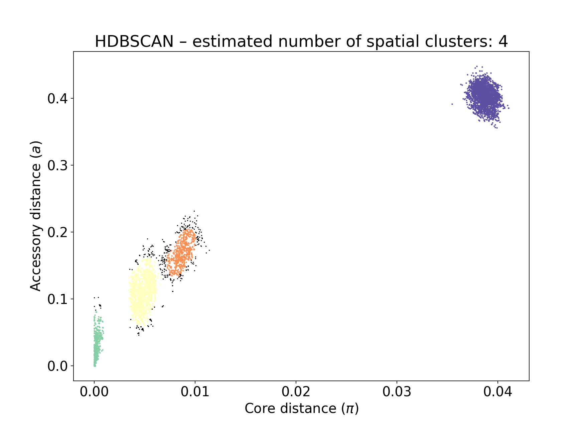
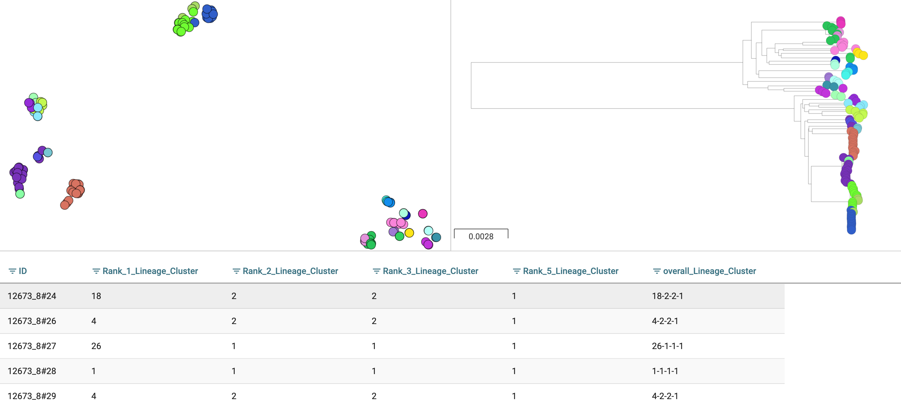
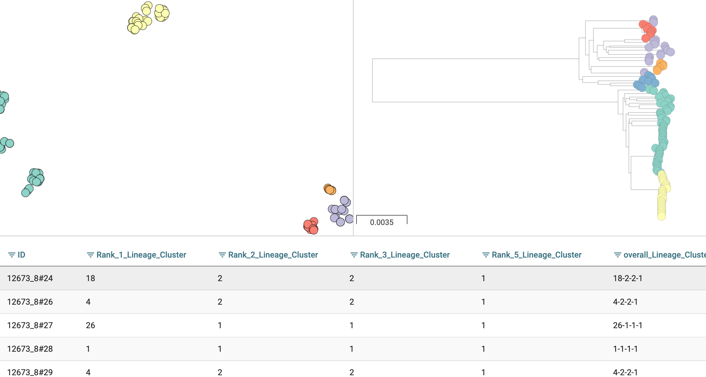

Fitting new models (``--fit-model``)
====================================

.. |nbsp| unicode:: 0xA0
   :trim:

If you cannot find an existing model for your species in the
`list <https://www.bacpop.org/poppunk/>`__ you will want to fit your own.
This process is flexible, and there are five different models you can use depending
on the population structure of your dataset.

.. note::
    After fitting a model to a new species we would like to share it on our website,
    so others can use it for assigning queries. If you are open to this, please read
    :doc:`model_distribution` after this page.

Overview
--------

First, use ``poppunk --create-db`` to sketch your input data and calculate distances
between all samples. This is detailed in :doc:`sketching`.

Then, use ``poppunk --fit-model <model_name>`` with one of the following model names:

- ``bgmm`` -- Bayesian Gaussian Mixture Model. Best for small sample collections
  with strain-structure. Works best when distance distribution components are clearly
  separated.
- ``dbscan`` -- HDBSCAN. A good general method for larger sample collections with
  strain-structure. Some points will always be designated as noise, so a subsequent run
  of model refinement may help improve the fit.
- ``refine`` -- Model refinement. Requires a model already fitted with ``bgmm`` or ``dbscan``
  and attempts to improve it by maximising the network score. Particularly useful when
  components overlap significantly (often due to recombination), or when the strain boundary
  is thought to lie somewhere within a component.
- ``threshold`` -- Apply a given core or accessory distance threshold to define VLKCs. Useful if
  a cutoff threshold is already known/calculated, is estimated from a plot, or to compare a threshold
  between datasets or species.
- ``lineage`` -- Lineage clustering. To find lineages within a strain (subclustering), or
  find clusters in a population without strain structure. Uses a simple nearest neighbour approach
  so is more of a heuristic. Network scores are not meaningful in this mode.

The most useful guide to deciding which model to use is the ``_distanceDistribution.png`` file
showing the core and accessory distances. More details on each of these models is given
further down this page.

A completed fit will consist of:

- A ``_clusters.csv`` file, which gives the VLKC (strain) for each sample in the database.
- A ``_unword_clusters.csv`` file, which gives an English-pronounceable name instead of a number
  to each VLKC.
- ``_fit.npz`` and ``_fit.pkl`` files, which contain numeric data and metadata for the fit.
- A ``_graph.gt`` file, which is the network defining the fit in graph-tool format.
- Some plots of the fit, which depend on the specific model used.
- A ``.refs`` file, which lists the samples kept as 'references' for assigning
  future samples (see :doc:`model_distribution` for more details).

This page will use 128 *Listeria*\ |nbsp| \ *monocytogenes* genomes from `Kremer et al <https://doi.org/10.1016/j.cmi.2016.12.008>`__,
which can be downloaded from `figshare <https://doi.org/10.6084/m9.figshare.7083389>`__. The distribution of
core and accessory distances from the ``--create-db`` step is as follows:

.. image:: images/listeria_dists.png
   :alt:  Core and accessory distances for the example data
   :align: center

We also show some examples with 616 *Streptococcus*\ |nbsp| \ *pneumoniae* genomes, which are more complex.
These genomes were collected from Massachusetts,
first reported `here <https://www.nature.com/articles/ng.2625>`__ and can be accessed
`here <https://www.nature.com/articles/sdata201558>`__.

Common arguments
----------------
- ``--ref-db``: the output prefix used with ``--create-db`` i.e. the directory where the .h5 file is located
- ``--output``: where to save the model. If not specified this defaults to ``ref-db``.
- ``--overwrite``: overwrite any existing files in the output directory.
- ``--external-clustering``: any additional labels to add to the cluster output.
- ``--graph-weights``: save the edges weights in the network as their Euclidean core-accessory
  distances, rather than as 0 or 1 (useful for visualising the network).

External clusters may be other cluster names, such as serotype, sequence type, cgMLST etc.
VLKCs are mapped as one-to-many, so that each strain is labelled with all of
the clusters any of its members is assigned to in this file. This input file must
be comma separated, one sample per line, with the sample name as the first column, and
other clusters as subsequent columns. A header line with 'sample' and the names of other cluster
types is required. Output is to ``output/output_external_clusters.csv``.

How good is my fit?
-------------------
We have found the best way to assess this is to use :doc:`visualisation` on your output
and look at your assigned VLKCs against a tree, to determine whether they have
the specificity required.

You can also compare models with their network score, and
whether the output plots look as expected. Typically the key thing is that
**your spatial component nearest the origin is accurate**. More detail is given for each model below.

Interpreting the network summary
^^^^^^^^^^^^^^^^^^^^^^^^^^^^^^^^
All fits will output a network summary which looks similar to this::

    Network summary:
        Components				59
        Density					0.0531
        Transitivity				0.9966
        Mean betweenness			0.0331
        Weighted-mean betweenness		0.0454
        Score					0.9438
        Score (w/ betweenness)			0.9126
        Score (w/ weighted-betweenness)		0.9009

- Components are the number of VLKCs (strains) found using this model.
- Density is the proportion of distances assigned as 'within-strain'. Generally
  smaller is better as this gives more specific clusters, but too close to zero
  may be an over-specific model.
- Transitivity measures whether every member of each strain is connected to every
  other member. Closer to 1 is better, but this can be achieved with very loose fits.
- Score synthesises the above as :math:`(1 - \mathrm{density}) * \mathrm{transitivity}`,
  which gives a single number between 0 (bad) and 1 (good) which in many cases is
  at a maximum when it accurately describes strains in the data.
- Two further scores for larger networks. See :ref:`alt-scores` for more information
  on these.

.. _bgmm:

bgmm
----
This mode fits a `Bayesian Gaussian mixture model <https://scikit-learn.org/stable/modules/generated/sklearn.mixture.BayesianGaussianMixture.html>`__
to the core and accessory distances. With few points, methods such as DBSCAN may struggle to find
clusters due to the sparsity, whereas a BGMM can often find a good fit. A further advantage
is that the equation for the posterior is known, so all points will have an assignment and a non-linear
boundary found exactly.

However, when there are a very large number of points the likelihood has a tendency
to totally override the prior in the estimated posterior, meaning many overlapping components
may be fitted, which may give poor clusters, and is less robust to adding more data. It is possible
for this mode to fail to converge, but it is more likely to produce a bad fit in difficult cases.

The key parameter to specify is the maximum number of components ``--K``. You should
choose a number based on the number of components you can see on your distance plot. This
may be automatically reduced if there is insufficent evidence for this many components. As a rule of thumb,
if you have under 150 samples or under 1000 samples and clear components then this mode should give
a good fit.

A better network score is evidence of a better fit, but the output files should also be used to
judge this. With the test dataset, four components are visible::

    poppunk --fit-model bgmm --ref-db listeria --K 4
    PopPUNK (POPulation Partitioning Using Nucleotide Kmers)
        (with backend: sketchlib v1.6.0
        sketchlib: /Users/jlees/miniconda3/envs/pp-py38/lib/python3.8/site-packages/pp_sketchlib.cpython-38-darwin.so)

    Graph-tools OpenMP parallelisation enabled: with 1 threads
    Mode: Fitting bgmm model to reference database

    Fit summary:
        Avg. entropy of assignment	0.0042
        Number of components used	4

    Scaled component means:
        [0.9415286  0.90320047]
        [0.11542755 0.24570244]
        [0.20966101 0.37694884]
        [0.00527421 0.07043826]

    Network summary:
        Components	31
        Density	0.0897
        Transitivity	1.0000
        Score	0.9103
    Removing 97 sequences

    Done

In the output to the terminal:

- The average entropy of assignment is a measure of the certainty of assignment
  of each point. Lower is better. Higher values may indicate overlapping components,
  perhaps due to high amounts of recombination between strains.
- Number of components used is how many components from ``K`` were actually used
  in the spatial fit. This is usually equal to ``K``, but may be reduced in small datasets.
- Scaled component means are the centres of the fitted components in the model, where
  the core and accessory distances have been rescaled between 0 and 1. These can be
  used with :ref:`manual-start`.

The fit actually just uses the component closest to the origin -- any distances
assigned to this component are within-strain. This is the most important part of the
fit in this mode.

You can see that this gives a good network score, and fits the data well:

The position of the boundary is also produced (in red), along with contours of
the fitted mixture components:

.. image:: images/bgmm_k4_boundary.png
   :alt:  BGMM fit with K = 4
   :align: center

If you make K too low, some components will be merged, resulting in a less-specific
fit with fewer clusters, that do not fully delineate all of the strains (in this
case just finding the two main lineages of *Listeria* in this data)::

    poppunk --fit-model bgmm --ref-db listeria --K 2
    PopPUNK (POPulation Partitioning Using Nucleotide Kmers)
        (with backend: sketchlib v1.6.0
        sketchlib: /Users/jlees/miniconda3/envs/pp-py38/lib/python3.8/site-packages/pp_sketchlib.cpython-38-darwin.so)

    Graph-tools OpenMP parallelisation enabled: with 1 threads
    Mode: Fitting bgmm model to reference database

    Fit summary:
        Avg. entropy of assignment	0.0007
        Number of components used	2

    Scaled component means:
        [0.11627304 0.2432584 ]
        [0.9415286  0.90320047]

    Network summary:
        Components	2
        Density	0.5405
        Transitivity	1.0000
        Score	0.4595
    Removing 126 sequences

    Done

.. image:: images/bgmm_k2_fit.png
   :alt:  BGMM fit with K = 2
   :align: center

Too many components in a small dataset are automatically reduced to an
appropriate number, obtaining the same good fit as above::

    poppunk --fit-model bgmm --ref-db listeria --K 10
    PopPUNK (POPulation Partitioning Using Nucleotide Kmers)
	(with backend: sketchlib v1.6.0
	 sketchlib: /Users/jlees/miniconda3/envs/pp-py38/lib/python3.8/site-packages/pp_sketchlib.cpython-38-darwin.so)

    Graph-tools OpenMP parallelisation enabled: with 1 threads
    Mode: Fitting bgmm model to reference database

    Fit summary:
        Avg. entropy of assignment	0.3195
        Number of components used	4

    Scaled component means:
        [0.9415286  0.90320047]
        [3.72458739e-07 4.73196248e-07]
        [0.00527421 0.07043826]
        [0.20966682 0.37695524]
        [0.11542849 0.2457043 ]
        [1.68940242e-11 2.14632815e-11]
        [7.66987488e-16 9.74431443e-16]
        [3.48211781e-20 4.42391191e-20]
        [1.58087904e-24 2.00845290e-24]
        [7.17717973e-29 9.11836205e-29]

    Network summary:
        Components	31
        Density	0.0897
        Transitivity	1.0000
        Score	0.9103
    Removing 97 sequences

    Done

In a dataset with more points, and less clear components, too many components can lead to
a bad fit:

This is clearly a poor fit. The real issue is that the component whose mean is nearest
the origin is unclear, and doesn't include all of the smallest distances.

.. _dbscan:

dbscan
------
This mode uses `HDBSCAN <https://hdbscan.readthedocs.io/en/latest/>`__ to find clusters
in the core and accessory distances. This is a versatile clustering algorithm capable of
finding non-linear structure in the data, and can represent irregularly shaped components
well. Possible drawbacks are that a fit cannot always be found (this can happen
for small datasets with sparse points, or for datasets without much structure in the core
and accessory), and that some points are classified as 'noise' so not all of their
edges are included in the network (these are the small black points).

.. warning::
    HDBSCAN models are not backwards compatible from sklearn v1.0 onwards. We
    would recommend using at least this version. Even better would be to then run
    model refinement (:ref:`refine-models`) to get a simpler and faster model
    for onward query assignment.

dbscan usually needs little modification to run::

    poppunk --fit-model dbscan --ref-db listeria
    PopPUNK (POPulation Partitioning Using Nucleotide Kmers)
	(with backend: sketchlib v1.6.0
	 sketchlib: /Users/jlees/miniconda3/envs/pp-py38/lib/python3.8/site-packages/pp_sketchlib.cpython-38-darwin.so)

    Graph-tools OpenMP parallelisation enabled: with 1 threads
    Mode: Fitting dbscan model to reference database

    Fit summary:
        Number of clusters	5
        Number of datapoints	8128
        Number of assignments	7804

    Scaled component means
        [0.94155383 0.90322459]
        [0.00527493 0.07044794]
        [0.20945986 0.37491995]
        [0.12876077 0.34294888]
        [0.11413982 0.24224743]

    Network summary:
        Components	31
        Density	0.0897
        Transitivity	1.0000
        Score	0.9103
    Removing 97 sequences

    Done

In the output to the terminal:

- The number of clusters is the number of spatial components found in the data.
- Number of datapoints is the number of points used (all-vs-all distances), which
  may have been subsampled from the maximum.
- Number of assignments is the number of points assign to one of the spatial components,
  so excluding noise points.
- Scaled component means are the centres of the fitted components in the model, where
  the core and accessory distances have been rescaled between 0 and 1. These can be
  used with :ref:`manual-start`.

The fit actually just uses the component closest to the origin -- any distances
assigned to this component are within-strain. This is the most important part of the
fit in this mode. In this case the identification of this component is identical to the bgmm
fit, so they produce the same strains. Note there is a small yellow cluster which is poorly
defined, but as it does not impact the within-strain cluster the fit is unaffected:

.. image:: images/dbscan_fit.png
   :alt:  DBSCAN fit
   :align: center

You can alter the fit with ``--D``, which sets a maximum number of clusters, and
``--min-cluster-prop`` which sets the minimum number of points a cluster can have (as
a proportion of 'Number of datapoints). If the means of both of the core and accessory are not
strictly increasing between the within-strain and next further component, the clustering
fails. In this case the minimum number of samples per cluster is halved, and the fit is
tried again. If this goes below ten, no fit can be found.

Increasing ``--min-cluster-prop`` or decreasing ``--D`` gets rid of the errant cluster above::

    poppunk --fit-model dbscan --ref-db listeria --min-cluster-prop 0.01
    PopPUNK (POPulation Partitioning Using Nucleotide Kmers)
        (with backend: sketchlib v1.6.0
        sketchlib: /Users/jlees/miniconda3/envs/pp-py38/lib/python3.8/site-packages/pp_sketchlib.cpython-38-darwin.so)

    Graph-tools OpenMP parallelisation enabled: with 1 threads
    Mode: Fitting dbscan model to reference database

    Fit summary:
        Number of clusters	4
        Number of datapoints	8128
        Number of assignments	7805

    Scaled component means
        [0.94155383 0.90322459]
        [0.00522549 0.06876396]
        [0.11515678 0.24488282]
        [0.21152104 0.37635505]

    Network summary:
        Components	31
        Density	0.0886
        Transitivity	0.9953
        Score	0.9071
    Removing 95 sequences

    Done

But note that a few more noise points are generated, and fewer samples are removed
when pruning cliques:

Setting either ``--min-cluster-prop`` or ``--D`` too low can cause the fit to fail::

    poppunk --fit-model dbscan --ref-db listeria --min-cluster-prop 0.05
    PopPUNK (POPulation Partitioning Using Nucleotide Kmers)
        (with backend: sketchlib v1.6.0
        sketchlib: /Users/jlees/miniconda3/envs/pp-py38/lib/python3.8/site-packages/pp_sketchlib.cpython-38-darwin.so)

    Graph-tools OpenMP parallelisation enabled: with 1 threads
    Mode: Fitting dbscan model to reference database

    Failed to find distinct clusters in this dataset

.. _refine-models:

refine
------
Model refinement is slightly different: it takes a model already fitted by :ref:`bgmm`
or :ref:`dbscan` and tries to improve it by optimising the network score. This starts
with a parallelised global optimisation step, followed by a serial local optimisation
step (which can be turned off with ``--no-local``). Use of multiple ``--cpus`` is
effective for these model fits.

Briefly:

* A line between the within- and between-strain means is constructed
* The point on this line where samples go from being assigned as within-strain to between-strain is used as the starting point
* A line normal to the first line, passing through this point is constructed. The triangle formed by this line and the x- and y-axes is now the decision boundary. Points within this line are within-strain.
* The starting point is shifted by a distance along the first line, and a new decision boundary formed in the same way. The network is reconstructed.
* The shift of the starting point is optimised, as judged by the network score. First globally by a grid search, then locally near the global optimum.

Applying this to the *Listeria* DBSCAN fit (noting that you may specify a separate
directory to load the model from with ``--model-dir``, if multiple model fits are available)::

    poppunk --fit-model refine --ref-db listeria --model-dir dbscan
    PopPUNK (POPulation Partitioning Using Nucleotide Kmers)
        (with backend: sketchlib v1.6.0
        sketchlib: /Users/jlees/miniconda3/envs/pp-py38/lib/python3.8/site-packages/pp_sketchlib.cpython-38-darwin.so)

    Graph-tools OpenMP parallelisation enabled: with 1 threads
    Mode: Fitting refine model to reference database

    Loading DBSCAN model
    Loaded previous model of type: dbscan
    Initial model-based network construction based on DBSCAN fit
    Initial boundary based network construction
    Decision boundary starts at (0.63,0.62)
    Trying to optimise score globally
    Trying to optimise score locally

    Optimization terminated successfully;
    The returned value satisfies the termination criteria
    (using xtol =  1e-05 )
    Network summary:
        Components	29
        Density	0.0897
        Transitivity	0.9984
        Score	0.9088
    Removing 93 sequences

    Done

As this model was already well fitted, this doesn't change much, and finds very similar
VLKC assignments (though noise points are eliminated):

.. image:: images/listeria_refined.png
   :alt:  A refine fit on Listeria
   :align: center

The default is to search along the entire range between the within- and between-strain clusters,
but sometimes this can include undesired optima, particularly near the origin. To exclude these,
use ``--pos-shift`` to alter the distance between the end of the search range and the origin
and ``--neg-shift`` for the start of the search range.

This mode is more useful in species with a relatively high recombination rate the distinction between
the within- and between-strain distributions may be blurred in core and
accessory space. This does not give the mixture model enough information to
draw a good boundary as the likelihood is very flat in this region:

.. image:: images/pneumo_unrefined.png
   :alt:  A bad DPGMM fit
   :align: center

Although the score of this fit looks ok (0.904), inspection of the network and
microreact reveals that it is too liberal and VLKCs/strains have been merged. This
is because some of the blur between the origin and the central distribution has
been included, and connected clusters together erroneously.

The likelihood of the model fit and the decision boundary looks like this:

.. image:: images/pneumo_likelihood.png
   :alt:  The likelihood and decision boundary of the above fit
   :align: center

Using the core and accessory distributions alone does not give much information
about exactly where to put the boundary, and the only way to fix this would be
by specifying strong priors on the weights of the distributions. Fortunately
the network properties give information in the region, and we can use
``--refine-fit`` to tweak the existing fit and pick a better boundary.

Here is the refined fit, which has a score of 0.939, and 62 rather than 32
components:

.. image:: images/pneumo_refined.png
   :alt:  The refined fit
   :align: center

Which, looking at the `microreact output <https://microreact.org/project/SJxxLMcaf>`__, is much better:

.. image:: images/refined_microreact.png
   :alt:  The refined fit, in microreact
   :align: center

.. _alt-scores:

Alternative network scores
^^^^^^^^^^^^^^^^^^^^^^^^^^
Two additional network scores are now available using node betweenness. We have observed
that in some refined fits to large datasets, some clusters are merged with a single high-stress
edge at a relatively large distance. These scores aim to create a more conservative boundary that splits
these clusters.

For these scores:

- The network is split into :math:`S` connected components (the strains) each of size :math:`w_i`
- For each component with at least four nodes, the betweenness of the nodes are calculated
- Each component is summarised by the maximum betweenness of any member node :math:`b^{\mathrm{max}}_i`

.. math::

    \mathrm{score}_1 &= \mathrm{score}_0 \cdot (1 - \frac{1}{S} \sum_{i = 1}^S  b^{\mathrm{max}}_i) \\
    \mathrm{score}_2 &= \mathrm{score}_0 \cdot (1 - \frac{1}{S \cdot \Sigma w_i} \sum_{i = 1}^S  \left[ b^{\mathrm{max}}_i \cdot w_i \right])

Score 1 is printed as score (w/ betweenness) and score 2 as score (w/ weighted-betweenness). Use ``--score-idx``
with 0 (default), 1 (betweenness) or 2 (weighted-betweenness) to choose which score to optimise in refine
mode. The default is the original score 0. Note that scores 1 and 2 may take longer to compute due to
the betweenness calculation, though this can take advantage of multiple ``--threads``.

Unconstrained (two-dimensional) optimisation
^^^^^^^^^^^^^^^^^^^^^^^^^^^^^^^^^^^^^^^^^^^^
In the default mode described above, the boundary gradient is set from the identified
means in the input model, and the position of the intercept is optimised (one-dimensional optimisation).

In cases where the gradient of the boundary is not well set by the two means in the
plot, you can optimise both the intercept and the gradient by adding the ``--unconstrained`` option
(which is incompatible with ``--indiv-refine``). This will perform a global search
of 20 x 20 (400 total) x- and y-intercept positions, followed by a 1D local search
to further optimise the intercept (unless ``--no-local`` is added).

As this calculates the boundary at ten times as many positions, it is generally expected to
take ten times longer. However, you can effectively parallelise this with up to 20 ``--threads``::

    poppunk --fit-model refine --ref-db listeria --model-dir dbscan --unconstrained --threads 4
    PopPUNK (POPulation Partitioning Using Nucleotide Kmers)
        (with backend: sketchlib v1.6.2
        sketchlib: /Users/jlees/Documents/Imperial/pp-sketchlib/build/lib.macosx-10.9-x86_64-3.8/pp_sketchlib.cpython-38-darwin.so)

    Graph-tools OpenMP parallelisation enabled: with 4 threads
    Mode: Fitting refine model to reference database

    Loading BGMM 2D Gaussian model
    Loaded previous model of type: bgmm
    Initial model-based network construction based on Gaussian fit
    Initial boundary based network construction
    Decision boundary starts at (0.52,0.43)
    Trying to optimise score globally
    Trying to optimise score locally

    Optimization terminated successfully;
    The returned value satisfies the termination criteria
    (using xtol =  1e-05 )
    Network summary:
        Components				59
        Density					0.0531
        Transitivity				0.9966
        Mean betweenness			0.0331
        Weighted-mean betweenness		0.0454
        Score					0.9438
        Score (w/ betweenness)			0.9126
        Score (w/ weighted-betweenness)		0.9009
    Removing 545 sequences

    Done

Which gives a slightly higher network score, though overall similar clusters:

.. image:: images/unconstrained_refine.png
   :alt:  Refining fit with --unconstrained
   :align: center

This is because the gradient from the 1D optimisation was well set. Unconstrained optimisation
can be useful with clusters which aren't parallel to the line that connects them. This is an
example in *E.*\ |nbsp| \ *coli*:

.. list-table::

    * - .. figure:: images/ecoli_refine_constrained.png

           1D refine fit between DBSCAN cluster centroids

      - .. figure:: images/ecoli_refine_unconstrained.png

           Unconstrained 2D fit over a greater range

The search range will always be defined by a trapezium in light red -- bounded by
the two axes, and two lines passing through the means which are normal to the line
which connects the means.

.. _manual-start:

Using fit refinement when mixture model totally fails
^^^^^^^^^^^^^^^^^^^^^^^^^^^^^^^^^^^^^^^^^^^^^^^^^^^^^
If the mixture model does not give any sort of reasonable fit to the points,
you can manually provide a file with ``--manual-start`` to give the starting parameters to
``--refine-fit`` mode. The format of this file is as follows::

    start 0,0
    end 0.5,0.6
    scaled True

A key, followed by its value (space separated).

``start`` and ``end`` define the points (x,y) to draw the line between.
These define the two red points (and therefore the
search range) in the output plot.

``scaled`` defines whether these are on the [0,1] scale. If these have been set
using means from the terminal output this should be ``True``. Otherwise, if you
have set them based on the plot (unscaled space), set to ``False``.

.. _indiv-refine:

Using core/accessory only
^^^^^^^^^^^^^^^^^^^^^^^^^
In some cases, such as analysis within a lineage, it may be desirable to use
only core or accessory distances to classify further queries. This can be
achieved by adding the ``--indiv-refine both`` option, which will allow these boundaries to be
placed independently, allowing the best fit in each case::

    poppunk --fit-model refine --ref-db listeria --model-dir dbscan --indiv-refine both
    PopPUNK (POPulation Partitioning Using Nucleotide Kmers)
        (with backend: sketchlib v1.6.0
        sketchlib: /Users/jlees/miniconda3/envs/pp-py38/lib/python3.8/site-packages/pp_sketchlib.cpython-38-darwin.so)

    Graph-tools OpenMP parallelisation enabled: with 1 threads
    Mode: Fitting refine model to reference database

    Loading DBSCAN model
    Loaded previous model of type: dbscan
    Initial model-based network construction based on DBSCAN fit
    Initial boundary based network construction
    Decision boundary starts at (0.63,0.62)
    Trying to optimise score globally
    Trying to optimise score locally

    Optimization terminated successfully;
    The returned value satisfies the termination criteria
    (using xtol =  1e-05 )
    Refining core and accessory separately
    Initial boundary based network construction
    Decision boundary starts at (0.63,0.62)
    Trying to optimise score globally
    Trying to optimise score locally

    Optimization terminated successfully;
    The returned value satisfies the termination criteria
    (using xtol =  1e-05 )
    Initial boundary based network construction
    Decision boundary starts at (0.63,0.62)
    Trying to optimise score globally
    Trying to optimise score locally

    Optimization terminated successfully;
    The returned value satisfies the termination criteria
    (using xtol =  1e-05 )
    Network summary:
        Components	29
        Density	0.0897
        Transitivity	0.9984
        Score	0.9088
    Network summary:
        Components	31
        Density	0.0897
        Transitivity	1.0000
        Score	0.9103
    Network summary:
        Components	31
        Density	0.0808
        Transitivity	0.9862
        Score	0.9064
    Removing 93 sequences

    Done

There are three different networks, and the core and accessory boundaries will
also be shown on the _refined_fit.png plot as dashed gray lines:

.. image:: images/indiv_refine.png
   :alt:  Refining fit with core and accessory individuals independently
   :align: center

To use one of these for your saved model, rerun, but instead setting
``--indiv-refine core`` or ``--indiv-refine accessory``.

.. _multi-boundary:

Running with multiple boundary positions
^^^^^^^^^^^^^^^^^^^^^^^^^^^^^^^^^^^^^^^^
To create clusters at equally spaced positions across the refinement range, add
the ``--multi-boundary <n>`` argument, with the number of positions specified by
``<n>``. This will create up to ``<n>`` sets of clusters, with boundaries equally spaced
between the origin and the refined boundary position.

Trivial cluster sets, where every sample is in its own cluster, will be excluded, so
the final number of clusters may be less than ``<n>``.

For a use of these cluster sets, see the :doc:`poppunk_iterate` section.

threshold
---------
In this mode no model is fitted. You provide the threshold at which within- and
between-strain distances is drawn. This can be useful if ``refine`` cannot find a boundary
due to a poorly performing network score, but one can clearly be seen from the plot.
It may also be useful to compare with other fits from related species where a boundary
has been identified using one of the fitting procedures.

Currently only a core-distance boundary is supported (if you would like an accessory or
combined mode available, please `raise an issue <https://github.com/johnlees/PopPUNK/issues>`__).
Provide the cutoff with ``--threshold``::

    poppunk --fit-model threshold --ref-db listeria --threshold 0.003
    PopPUNK (POPulation Partitioning Using Nucleotide Kmers)
        (with backend: sketchlib v1.6.0
        sketchlib: /Users/jlees/miniconda3/envs/pp-py38/lib/python3.8/site-packages/pp_sketchlib.cpython-38-darwin.so)

    Graph-tools OpenMP parallelisation enabled: with 1 threads
    Mode: Fitting threshold model to reference database

    Network summary:
        Components	31
        Density	0.0897
        Transitivity	1.0000
        Score	0.9103
    Removing 97 sequences

    Done

.. image:: images/listeria_threshold.png
   :alt:  A threshold fit on Listeria
   :align: center

.. _lineage-fit:

lineage
-------
This mode defines clusters by joining nearest neighbours. As this will typically
define subclusters within strains, we refer to these as 'lineages'. This can be used
to find subclusters in addition to one of the above models, or for species without
strain-structure (e.g. some viruses, *Neisseria gonorrhoeae*, *Mycobacterium tuberculosis*).
This is the highest resolution (most specific clusters) provided directly by PopPUNK. If it does
not meet your needs, take a look at :doc:`subclustering` for other options.

A model is not fitted, and a simple data-driven heuristic is used. For each sample, the
nearest :math:`k` neighbours will be indentified, and joined in the network. Connected components
of the network define lineages, as in the other models. Only core distances are used (add ``--use-accessory`` to modify this),
and in the case of ties all distances are included. Note that these are not necessarily
expected to be transitive, so network scores are not as informative of the optimum.

We refer to :math:`k` as the 'rank' of the model. Typically you won't know which rank
to use beforehand, so you can provide multiple integer values to the ``--rank`` option, comma separated.
Clusters from all ranks will be output, and all used with :doc:`query_assignment`. :math:`k = 1` is the
most specific rank, and higher values will form looser clusters. With the *Listeria* example::

    poppunk --fit-model lineage --ref-db listeria --ranks 1,2,3,5
    PopPUNK (POPulation Partitioning Using Nucleotide Kmers)
        (with backend: sketchlib v1.6.0
        sketchlib: /Users/jlees/miniconda3/envs/pp-py38/lib/python3.8/site-packages/pp_sketchlib.cpython-38-darwin.so)

    Graph-tools OpenMP parallelisation enabled: with 1 threads
    Mode: Fitting lineage model to reference database

    Network for rank 1
    Network summary:
        Components	26
        Density	0.0271
        Transitivity	0.1834
        Score	0.1785
    Network for rank 2
    Network summary:
        Components	12
        Density	0.0428
        Transitivity	0.3528
        Score	0.3377
    Network for rank 3
    Network summary:
        Components	6
        Density	0.0589
        Transitivity	0.4191
        Score	0.3944
    Network for rank 5
    Network summary:
        Components	2
        Density	0.0904
        Transitivity	0.5319
        Score	0.4838
    Parsed data, now writing to CSV

    Done

This has produced four fits, with ranks 1, 2, 3 and 5 (with fit information contained in
the .pkl file, and a .npz file for each rank). The _clusters.csv will contain the clusters
from the lowest rank. The _lineages.csv file contains all of the assignments, a column
with all of the ranks hyphen-separated (which will give clusters indentical to the lowest rank)::

    id,Rank_1_Lineage,Rank_2_Lineage,Rank_3_Lineage,Rank_5_Lineage,overall_Lineage
    12673_8#24,18,2,2,1,18-2-2-1
    12673_8#26,4,2,2,1,4-2-2-1
    12673_8#27,26,1,1,1,26-1-1-1
    12673_8#28,1,1,1,1,1-1-1-1
    12673_8#29,4,2,2,1,4-2-2-1
    12673_8#31,18,2,2,1,18-2-2-1
    12673_8#32,9,8,1,1,9-8-1-1
    12673_8#34,7,7,1,1,7-7-1-1
    12673_8#36,1,1,1,1,1-1-1-1

The best way to assess the ranks is by visualising them (:doc:`visualisation`)::

    poppunk_visualise --distances listeria/listeria.dists --ref-db listeria --microreact

    Graph-tools OpenMP parallelisation enabled: with 1 threads
    PopPUNK: visualise
    Loading previously lineage cluster model
    Writing microreact output
    Parsed data, now writing to CSV
    Building phylogeny
    Running t-SNE

    Done

This can be loaded in microreact: https://microreact.org/project/dVNMftmK6VXRvDxBfrH2y.
Rank 1 has the smallest clusters:

Rank 3 has larger clusters. Some of these clusters are polyphyletic on the core neighbour-joining
tree:

At the model fit stage, you will also get histograms which show the distances included
in the network, a useful comparison with the original distance distribution and between ranks:

.. list-table::

    * - .. figure:: images/listeria_lineage_rank_1_histogram.png

           Rank 1

      - .. figure:: images/listeria_lineage_rank_3_histogram.png

           Rank 3

Use an existing model with new data
-----------------------------------

There is also one further mode, ``--use-model``, which may be useful in limited circumstances. This
applies any of the above models to a new dataset without refitting it. This may be useful if a reference
dataset has changed (been added to or removed from) and you do not wish to refit the model, for example
because it is already in use. However, typically you would use :doc:`query_assignment` with ``--update-db``
to add to a model::

    poppunk --use-model --ref-db new_db --model-dir old_db
    PopPUNK (POPulation Partitioning Using Nucleotide Kmers)
	(with backend: sketchlib v1.6.0
	 sketchlib: /Users/jlees/miniconda3/envs/pp-py38/lib/python3.8/site-packages/pp_sketchlib.cpython-38-darwin.so)

    Graph-tools OpenMP parallelisation enabled: with 1 threads
    Mode: Using previous model with a reference database

    Loading BGMM 2D Gaussian model
    Loaded previous model of type: bgmm
    Network summary:
        Components	31
        Density	0.0897
        Transitivity	1.0000
        Score	0.9103
    Removing 97 sequences

    Done
