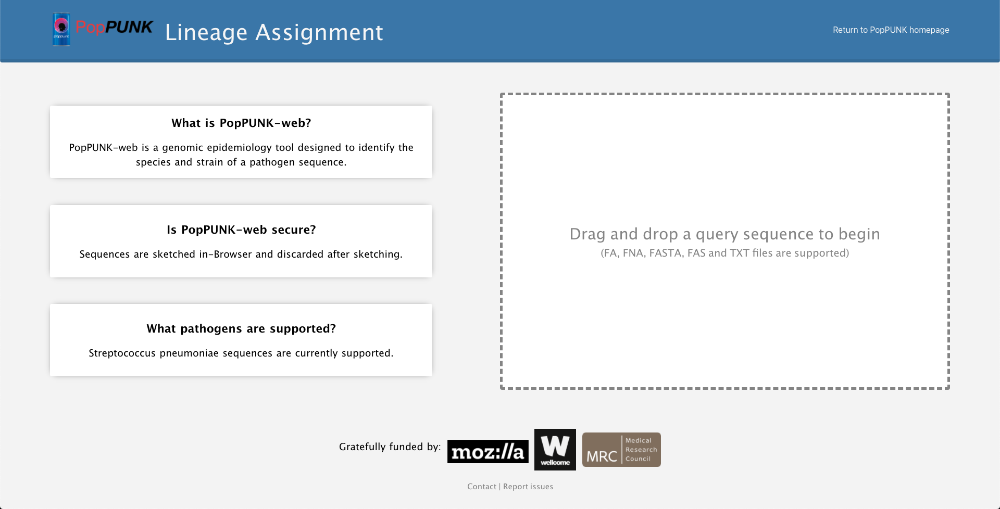
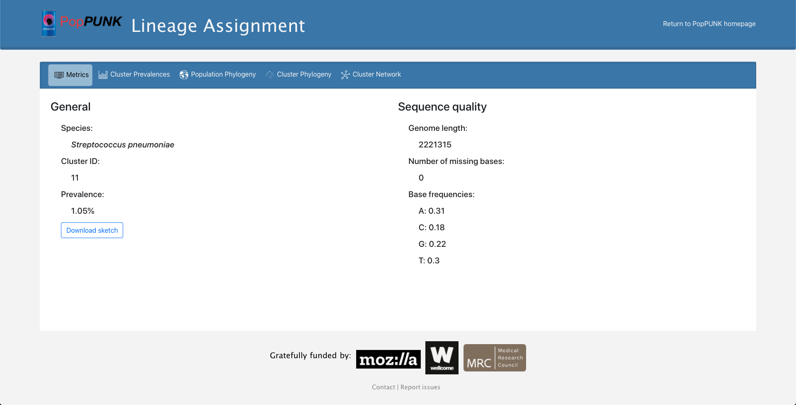
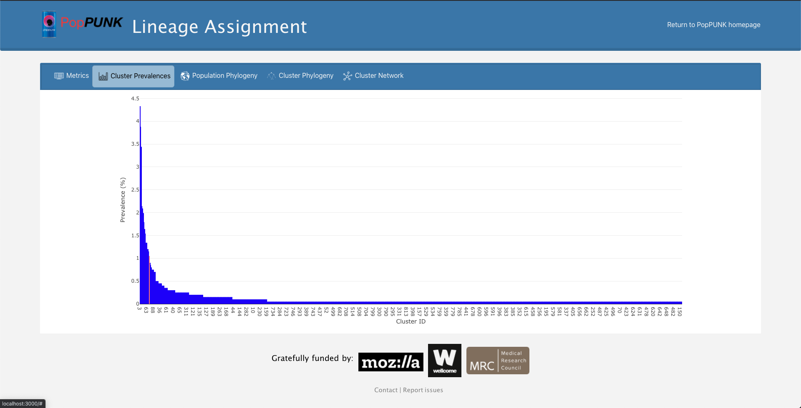
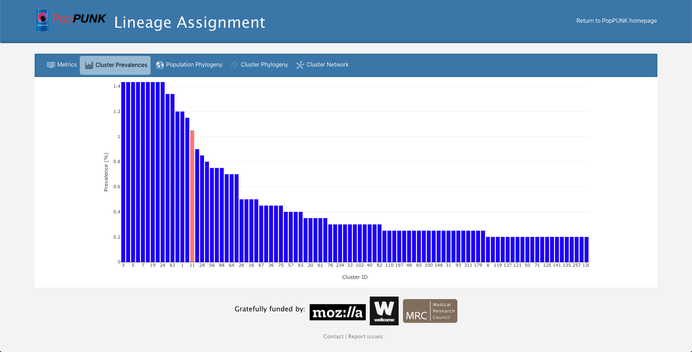
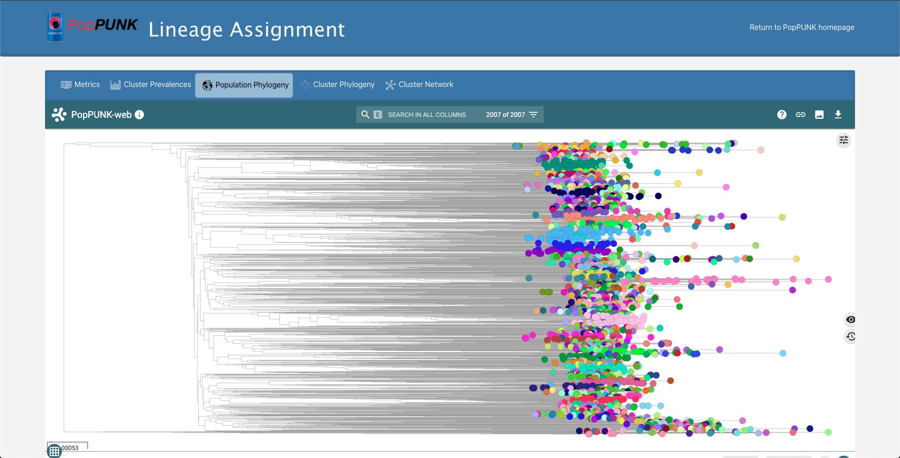
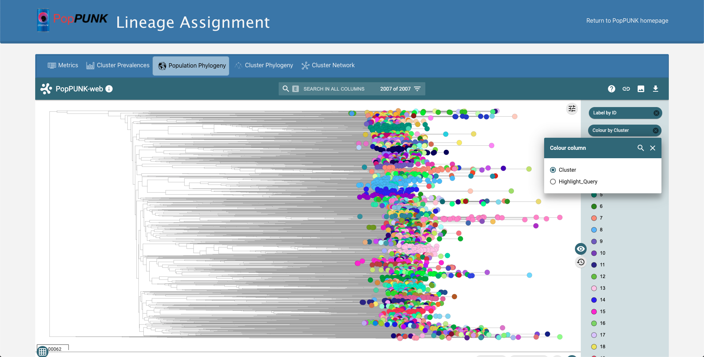
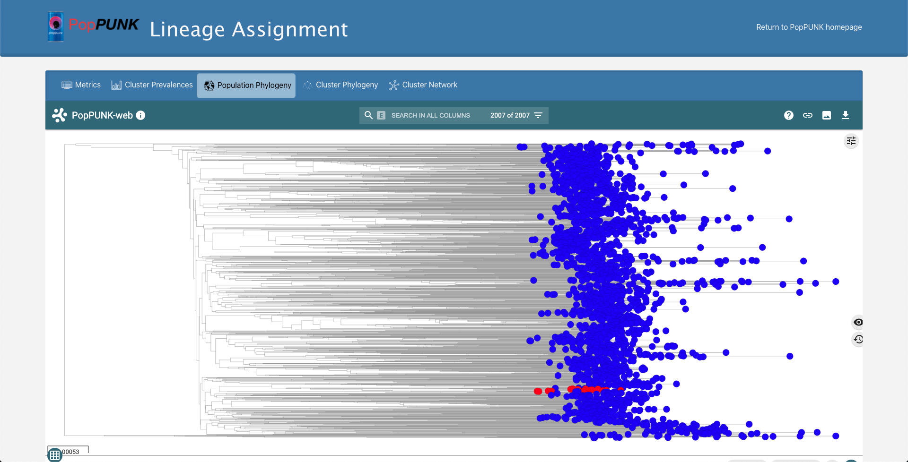
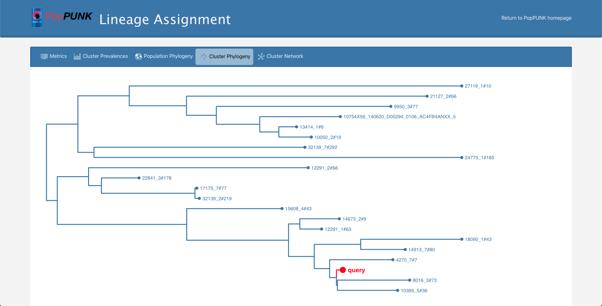
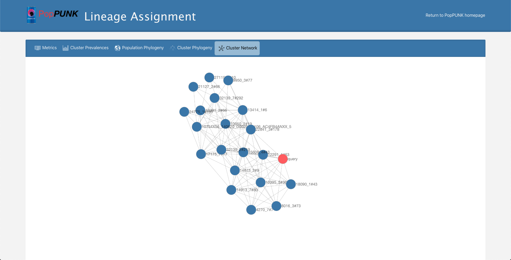

PopPUNK-web
=================
PopPUNK-web is available at https://web.poppunk.net/.
This interface has been designed for non-specialists and allows you to easily analyse and assign lineages to your query genomic sequences,
using pre-optimised species-specific databases and default parameters.

.. contents::
   :local:

How it works
------------
PopPUNK-web uses C++ code compiled to WebAssembly to sketch query sequences client side, then post this sketch to our Python backend running PopPUNK.
This means your raw genomic sequences remain anonymous and secure as they never actually leave your machine.

Using PopPUNK-web
-----------------------
PopPUNK-web allows you to upload a single isolate's genomic sequence through our user-friendly drag and drop interface (shown below).
After sketching and lineage assignment, information is returned on the species and lineage your query has been assigned to, relative to the genomic sequences in our pre-built databases.
We then use this assignment to generate and return a series of visualisations that provide additional information on the relationship of your sequence to those in our databases.
Currently, PopPUNK-web only supports *S. pneumoniae* sequences but we hope to expand this in the near future.

Outputs
-------
The interactive outputs of PopPUNK-web are conventiently located in a single results page.
You can navigate through the different outputs by using the tabs at the top of the results page.

Sequence metrics
^^^^^^^^^^^^^^^^
This tab displays the species and lineage assigned to your query sequence, in addition to the prevalence of the lineage in our databases and information regarding the quality of your uploaded sequence.
Sequence quality metrics indicate the length of your sequence in base pairs, the number of Ns and the frequencies of each base within the sequence.
The frequencies of A & T bases and C & G bases should be approximately equal.

Cluster prevalences
^^^^^^^^^^^^^^^^^^^
PopPUNK-web uses the plotly.js package (https://plotly.com) to plot the prevalences of all clusters in our species-specific database, including the assigned query sequence.
Cluster IDs are shown across the x-axis and the corresponding prevalence (%) in our database shown on the y-axis.
Bars are organised by decreasing cluster prevalence.
To visualise subsections of this plot, use your scroll wheel or double click an area to zoom in. Double click again to zoom back out.

The bar corresponding to the assigned cluster of your query sequence is highlighted in orange.

Population phylogeny
^^^^^^^^^^^^^^^^^^^^
We make use of the Microreact REST API (https://microreact.org/showcase) to display a phylogeny indicating the relationships of all isolates in the assigned species database.
By default, isolates are coloured based on their assigned cluster in our database.

This phylogeny does not include your query isolate however, the cluster your query has been assigned to can be highlighted by selecting "Highlight_query," instead of "Cluster" (as shown below).

Cluster phylogeny
^^^^^^^^^^^^^^^^^
We use Phylocanvas (http://phylocanvas.org) to display a phylogeny of your query sequence and its relationships to isolates assigned to the same cluster.
Your query sequence is highlighted in red as shown below.

Cluster network
^^^^^^^^^^^^^^^
Cytoscape.js (https://js.cytoscape.org) is used to display a network representing the cluster assigned to your query sequence.
Your query sequence is highlighted in orange as shown below.
Edge lengths are currently arbitrary and do not represent evolutionary distances.

New features
------------
Do you have a feature you would like to see in PopPUNK-web? File an issue on the PopPUNK-web GitHub repository (https://github.com/johnlees/PopPUNK-web/issues).

Issues/Bugs
-----------
As PopPUNK-web is a new feature, it is possible there are bugs or issues we have no come across yet.
If you identify a problem with PopPUNK-web, please file an issue on the PopPUNK-web GitHub repository (https://github.com/johnlees/PopPUNK-web/issues).
