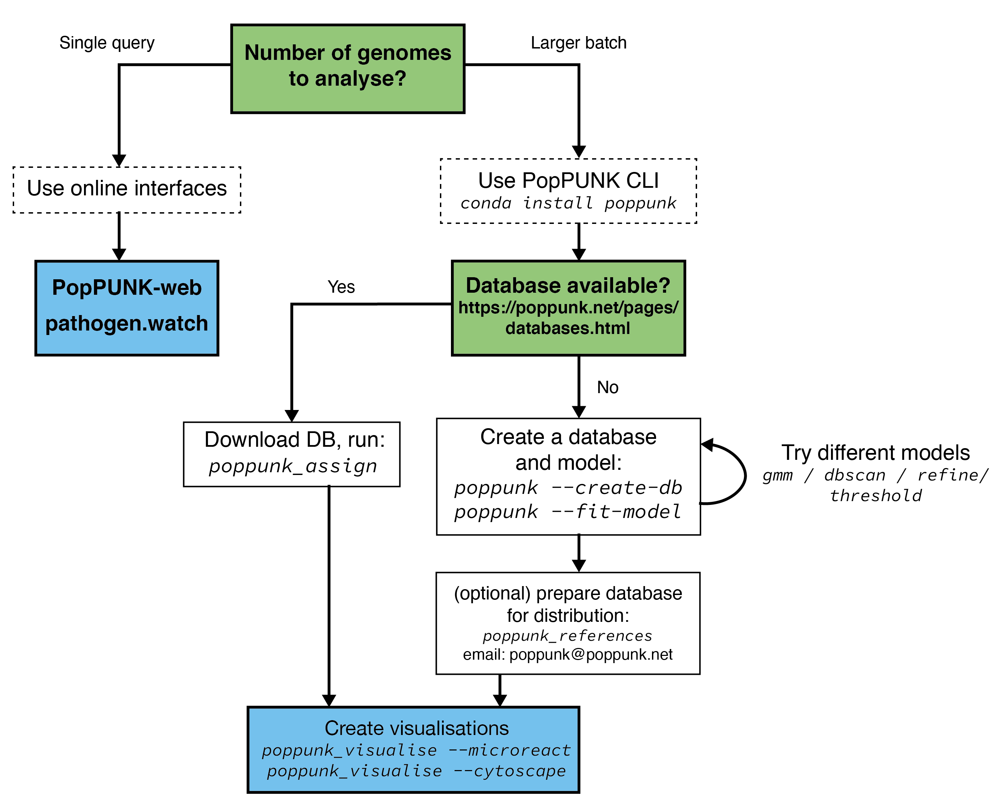

Overview
====================
This page details the way in which we would advise that you *should* use and
run PopPUNK, if possible.

Use an online interface
-----------------------
If available, you may want to use one of the browser-based interfaces to
PopPUNK. These include `PopPUNK-web <https://web.poppunk.net/>`__ and
`pathogen.watch <https://pathogen.watch/genomes/all?genusId=1301&speciesId=1313>`__
(*S. pneumoniae* only).

.. warning::
   PopPUNK-web is temporarily down while we work on an updated and better supported
   version.

Using these interfaces requires nothing to be installed or set up, doesn't require any
genome data to be shared with us, and will return interactive visualisations. If your
species isn't available, or you have large batches of genomes to cluster you will
likely want to use the command line interface instead.

Use the command line interface
------------------------------

Installation and version
^^^^^^^^^^^^^^^^^^^^^^^^
Install via conda if possible. Version 2.5.0 of PopPUNK and version 2.0.0 of pp-sketchlib
are the current minimum supported versions.

Use query assignment mode
^^^^^^^^^^^^^^^^^^^^^^^^^
If a database is available for your species (see https://poppunk.net/pages/databases.html)
we would strongly recommend downloading it to use to cluster your genomes. This
has many advantages:

* No need to run through the potentially complex model fitting.
* Assured model performance.
* Considerably faster run times.
* Use existing cluster definitions.
* Use the context of large, high quality reference populations to interpret your genomes' clusters.

See :doc:`query_assignment` for instructions on how to use this mode.

You can think of this as being similar to using an existing MLST/cgMLST/wgMLST scheme
to define your sample's strains.

Fit your own model
^^^^^^^^^^^^^^^^^^
If a database isn't available for your species, you can fit your own. This consists of three steps:

1. Sketch your genomes (see :doc:`sketching`).
2. Fit a model (see :doc:`model_fitting`).
3. Repeat step two, until you have a model which works for your needs.

After getting a good fit, you may want to share it with others so that they can
use it to assign queries. See :doc:`model_distribution` for advice. We would also
be interested to hear from you if you'd like to add your new model to the
pre-fit databases above -- please contact poppunk@poppunk.net.

Create visualisations
^^^^^^^^^^^^^^^^^^^^^
A number of plots are created by default. You can also
create files for further visualisation in `microreact <https://microreact.org/>`__,
`cytoscape <http://www.cytoscape.org/>`__,
`grapetree <http://dx.doi.org/10.1101/gr.232397.117>`__ and
`phandango <http://jameshadfield.github.io/phandango/>`_. We have found that
looking at the appearance of clusters on a tree is always very helpful, and would
recommend this for any fit.

Older versions of PopPUNK mandated this be chosen as part of the main analysis,
and then with ``--generate-viz`` mode. This is now run separately, after the
main analysis, with ``poppunk_visualise``.

See :doc:`visualisation` for details on options.