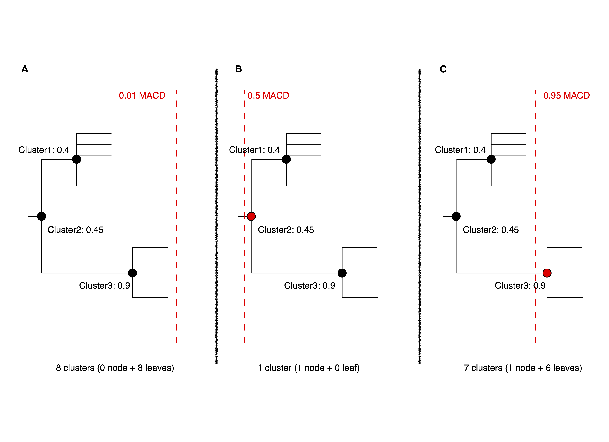

Iterative PopPUNK
==================

Running with multiple boundary positions
----------------------------------------
To create clusters at equally spaced positions across the refinement range, 
add the ``--multi-boundary <n>`` argument, with the number of positions specified by ``<n>``. 
This will create up to ``<n>`` sets of clusters, with boundaries equally spaced between 
the origin and the refined boundary position.

Trivial cluster sets, where every sample is in its own cluster, will be excluded, 
so the final number of clusters may be less than ``<n>``. The script to analyse these is 
``poppunk_iterate.py``. Basic usage is to provide the output directory as ``--db``, 
but run ``--help`` for other common options. This replies on finding files 
named ``<db>/<db>_boundary<n>_clusters.csv``, where ``<n>`` is the boundary iteration number 
(continuous integers increasing from zero). Clusters must contain at least two samples.

The ``poppunk_iterate.py`` script performs the following steps:

1. Starting from the most specific clusters (nearest the origin), it will iteratively add new clusters which are either:
   
	a. Total new clusters
	b. Subsets of existing clusters
	c. Existing clusters are subset of the new cluster.

2. Remove duplicate clusters.
3. Calculate average core distance within this cluster set.
4. Create a tree by nesting smaller clusters within larger clusters whey are subsets of.
5. Output the combined clusters, average core distances, and tree.
6. Cut this tree to pick a set of clusters under a similarity given by a ``--cutoff``.

Step-by-Step Tutorial
---------------------

**Step 1: Sketching (--create-db)**

First, use ``poppunk --create-db`` to sketch input data and calculate distances between samples. 
For the details, refer to :doc:`sketching`. To run this, using the following command::
	
	poppunk --create-db --r-files rlist.txt --output <database> --threads 8

**Step 2: Initial model fitting (--fit-model)**

In iterative-PopPUNK, a universal model recommended for fitting the initial model is GMM with 2 or 3 components (K=2 or K=3), 
because more datasets can be analysed using this setting (DBSCAN fits sometimes fail to coverage). 
The details for model fitting can be found in :doc:`model_fitting`. To run this, using the following command::

	poppunk --fit-model bgmm --K 2 --ref-db <database> --output <database> --threads 16

**Step 3: Multi-level clustering by moving decision boundary iteratively (--fit-model refine --multi-boundary)**

After fitting the initial model with GMM (with 2 or 3 components), refine it by moving the decision boundary 
to multiple positions between the origin and the combined decision boundary using the ``--multi-boundary`` option. 
To expand within-strain component, use ``--neg-shift``. Details can be found in :doc:`model_fitting` (the **refine** section). 
To run this, use the following command::

	poppunk --fit-model refine --multi-boundary 30 --ref-db <database> --output <database> --threads 16

**Step 4: Choosing clusters under given similarity cutoffs (poppunk_iterate.py)**

With ``<n>`` sets of clusters created in Step 3, ``poppunk_iterate.py`` is used to assemble a hierarchical tree 
of iterative-PopPUNK clusters, while also calculating the average core distance within each cluster set. To run this step, 
use the following command::

	poppunk_iterate.py --db <database> --cutoff 0.2  --output <prefix> --cpus 16

**Outputs:**

- <prefix>_iterate.tree.nwk: this is the hierarchical tree of iterative-PopPUNK clusters.
- <prefix>_iterate.clusters.csv: this file contains all cluster sets from ``<n>`` positions, along with their corresponding average core distances.
- <prefix>_iterative.cutoff_clusters.csv: this file contains a single set of clusters that meets a specified similarity cutoff.

.. note::
	We recommend using same name for <database> as in steps 1-3 (``--ref-db`` and ``--output``) to save the outputs from each step in a same folder
    
  
Examples
--------

The following example demonstrate how to use iterative-PopPUNK with 500 *E.coli* representative genomes from `Horesh et al. 2021 <https://doi.org/10.1099/mgen.0.000499>`__. 
You can download the genomes at https://doi.org/10.6084/m9.figshare.13270073.

**Step 1**::

    paste <(ls *fa) <(ls *fa) > rlist.txt
    poppunk --create-db --r-files rlist.txt --output ecoli --threads 16
    
This will create a PopPUNK database named "ecoli" by sketching the input genomes using 16 threads. 
The program will calculate random match chances using Monte Carlo and calculate distances using 16 threads. 
Once complete, the sketches will be written to a local file.

**Step 2**

Next, fit a Bayesian Gaussian Mixture Model (bgmm) to reference database using the following commands::

    poppunk --fit-model bgmm --K 2 --ref-db ecoli --output ecoli --threads 16
    
This will fit the bgmm model to the ``ecoli`` database, assign distances with the model, and summarize the fit. 
The output will include the scaled component means and network summary.

**Step 3**

After fitting the bgmm model, refine the model using the following commands::
	
    poppunk --fit-model refine --ref-db ecoli --output ecoli --multi-boundary 30 --threads 16
    
This will load the previous bgmm model, construct an initial model-based network, and optimize the score globally. 
The program will then create multiple boundary fits and summarize the network. The output will include the components, 
density, transitivity, mean betweenness, weighted-mean betweenness, score, score with betweenness and score with weighted-betweenness.

**Step 4**

Finally, run ``poppunk_iterate.py`` with the following command to iterate over the PopPUNK analysis::

	poppunk_iterate.py --db ecoli --cpus 16 --cutoff 0.2 --output 0.2_ecoli

This will run iteraive-PopPUNK with a cutoff 0.2 and output the results to files with prefix ``0.2_ecoli``. 

Common questions
----------------

**1. How can I use Iterative-PopPUNK to achieve sublineage clustering from a large outbreak dataset?**

To demonstrate how to achieve multi-level clustering from a large outbreak setting using Iterative-PopPUNK, 
we will use another example dataset consisting of 2,640 pathogenic *Vibrio parahaemolyticus* genomes from `Yang et al. 2022 <https://doi.org/10.1038/s41564-022-01182-0>`__.

**Step 1: Creating a PopPUNK database**

First, we need to create a reference database and fit a PopPUNK model using the following commands::
	
	paste <(ls *fa) <(ls *fa) > rlist.txt
	poppunk --create-db --r-files rlist.txt --output VP --threads 16
	poppunk --fit-model bgmm --K 2 --ref-db VP --output VP --threads 16
	poppunk --fit-model refine --ref-db VP --output VP --multi-boundary 30 --threads 16 --neg-shift -1
	poppunk_iterate.py --db VP --cpus 16 --cutoff 0.5 --output 0.5_VP

After running Step 1, iterative-PopPUNK produces a result file ``0.5_iterative.cutoff_clusters.csv``, 
which gives 9 PopPUNK clusters exactly corresponding to 9 clonal groups described in Yang et al. 2022.

.. note::
	For closely related genomes (e.g. genomes within clonal group), we need to increase the sketch size for more precise distance calculation. In this example, we increase the sketching size to 100000. For more information, please refer to sketching section for details
    
.. contents::
   :local:
   
**Step 2: Sublineage clustering for clonal groups**

Next, we extract the clonal groups estimated by Iterative-PoPUNK in Step 1 and run Iterative-PopPUNK again for sublineage clustering. 
For example, we use the two largest clonal groups estimated in Step 1 for downstream analysis.

Sublineage clustering for clonal group CG3::

	poppunk --create-db --r-files cg3_rlist.txt --output VP_cg3 --threads 16 --sketch-size 100000
	poppunk --fit-model bgmm --K 2 --ref-db VP_cg3 --output VP_cg3 --threads 16
	poppunk --fit-model refine --ref-db VP_cg3 --output VP_cg3 --multi-boundary 30 --threads 16 
	poppunk_iterate.py --db VP --cpus 16 --cutoff 0.4 --output 0.4_VP_cg3

Sublineage clustering for clonal group CG189::
	
	poppunk --create-db --r-files cg189_rlist.txt --output VP_cg189 --threads 16 --sketch-size 100000
	poppunk --fit-model bgmm --K 2 --ref-db VP_cg189 --output VP_cg189 --threads 16
	poppunk --fit-model refine --ref-db VP_cg189 --output VP_cg189 --multi-boundary 30 --threads 16 
	poppunk_iterate.py --db VP --cpus 16 --cutoff 0.2 --output 0.2_VP_cg189

**Results**:

.. image:: images/vp_ipp_result.png
	:alt:  Iterative-PopPUNK multi-level clustering results from Clonal Groups to Outbreak level
	:align: center

The results demonstrate the effectiveness of using iterative-PopPUNK for sublineage clustering in large outbreak datasets. 
For example, in clonal group CG3, we extracted 274 outbreak groups (after removal of non-pathogenic isolates), 
while iterative-PopPUNK identified 80 clusters with a 40% MACD cutoff. The concordance of iterative-PopPUNK clustering 
with the identified outbreak groups was 60% (48/80), indicating that iterative-PopPUNK is able to achieve a finer resolution 
than clonal level. Moreover, the isolate clustering concordance (i.e. isolates assigned to a same group by both methods) was 90% (1596/1768), 
indicating high agreement between iterative-PopPUNK and outbreak groups at the isolate level. For clonal group CG189, 
iterative-PopPUNK identified 25 clusters with a 20% MACD cutoff, which showed a cluster concordance of 80% (20/25) with outbreak groups, 
and an isolate clustering concordance of 95% (259/273). It is worth noting that different genetic distance measurements can 
account for inconsistencies between iterative-PopPUNK clusters and outbreak groups.

**2. How can I determine when I should add "--neg-shift" or "--pos-shift" ?**

Iterative-PopPUNK allows for the use of "--neg-shift" and "--pos-shift" parameters to refine the initial model fit 
and estimate more clusters in either a higher or lower genetic level. These parameters adjust the decision boundary ranges for cluster estimation.

By default, adding "--neg-shift" with a value below zero moves the initial decision boundary line towards a higher genetic level, 
while a positive value for "--pos-shift" moves the line towards the origin. The value chosen for these parameters should align with 
the research interests of the user.

For instance, consider the E. coli dataset. Without adding "--neg-shift", iterative-PopPUNK may fail to find phylogroups. 
Figure 1 shows the distribution plot for this dataset with default settings, while Figure 2 shows the same plot after adding 
a value of -0.25 for "--neg-shift":

.. list-table::

    * - .. figure:: images/ecoli_refined_fit.png

           Figure 1: refine fit with default settings

      - .. figure:: images/ecoli_refined_fit_with_neg.png

           Figure 2: refine fit with default settings after adding -0.25 neg-shift

In summary, users should determine whether to add "--neg-shift" or "--pos-shift" based on their research interests, and adjust the value accordingly.

**3. why does the number of clusters increase with larger cutoff values?**

In iterative PopPUNK, the choice of cutoff value has a significant impact on the resulting number and composition of clusters. In general, 
increasing the cutoff value leads to fewer and larger clusters, while decreasing the cutoff value leads to more and smaller clusters. 
However, in some cases, increasing the cutoff value can paradoxically lead to an increase in the number of clusters, which may seem counterintuitive. 

To understand why this happens, we need to look at the role of average core distance (ACD) in cluster formation. 
ACD is a measure of the average genetic distance between all pairs of isolates within a cluster. When the ACD is low, 
it means that the isolates within the cluster are genetically similar to each other, while a high ACD indicates that there are 
significant genetic differences between the isolates.

In a large dataset, the ACD of one cluster's parent cluster is greatly affected by small clusters or singleton isolates. 
This is because the ACD of a parent cluster is calculated as the average ACD of all the clusters it contains. As a result, 
if a parent cluster contains one or more small clusters with extreme high ACD values, its own ACD value will be inflated, 
which may cause it to be split into multiple singletons at higher cutoff values.

Consider the following simplified iterative-PopPUNK tree:

In Figure A, a very small cutoff value results in no nodes being selected, leaving a set of 8 clusters or singletons. 
When the cutoff is increased to 0.5 in Figure B, only one cluster, Cluster2, is selected. However, when a higher cutoff value of 0.95 is adopted, 
Cluster3 is selected, and the remaining six isolates are left as singletons, resulting in a total of 7 clusters.

To address this issue, you can check the "<prefix>.clusters.csv" file to identify small clusters with extreme high ACD values. 
If present, check the PopPUNK distribution plot ("<prefix>_distanceDistribution.png") to determine if there are any distanced components. 
You can remove low-quality or distanced samples from your dataset using the "--qc-db" option (please refer to :doc:`qc`).

In the examples given above, removing the two isolates from Cluster3 would help to solve the problem and lead to a more accurate clustering result.

By carefully selecting the cutoff value and performing quality control on the input data, you can obtain robust and 
biologically meaningful clusterings with iterative PopPUNK.
