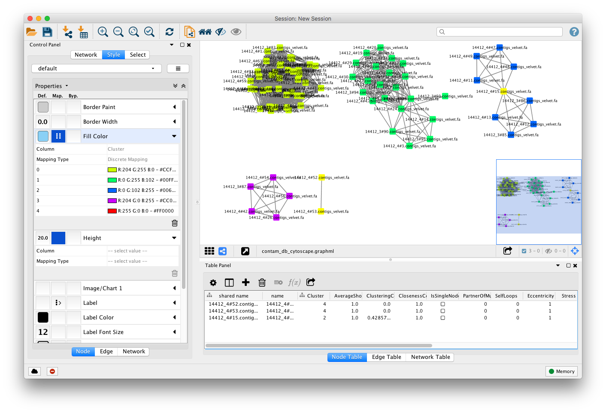

Data quality control
====================
PopPUNK now comes with some basic quality control options which are applied by
default when running ``--create-db``:

- Outlying genome length (calculated during sketching, for assemblies or reads).
- Too many 'N's.
- Outlying accessory distance.

Accessory distance is also used with ``poppunk_assign``.

You can set the behaviour when creating the database by setting ``--qc-filter``
to one of the following three values if any failing samples are found:

- ``stop`` (default) -- Do not proceed past the sketching step, and throw an error.
- ``prune`` -- Remove failing samples from the sketch database before continuing.
- ``continue`` -- Ignore failing samples and run anyway.

In all cases a file will be written at ``qcreport.txt`` which lists the failing samples, and the
reasons why they failed. If running with either prune or continue, you may also add ``--retain-failures``
to write a separate sketch database with the failed samples.

Random match chances in PopPUNK are only calculated and added to the database after the chosen
QC step. If you use ``poppunk_sketch`` directly, they will be added without any automated QC.

QC of input sequences
---------------------
The first QC step is applied directly to the input sequences themselves, to identify poor
quality sequences.

You can change the genome length cutoff with ``--length-sigma`` which sets the maximum number
of standard deviations from the mean, and ``--length-range`` which sets an absolute range of
allowable sizes.

Ambiguous bases are controlled by ``--prop-n`` which gives the maximum percentage of Ns,
and ``--upper-n`` which gives the absolute maximum value.

QC of pairwise distances
------------------------
The second QC step uses the pairwise distances, to enable the removal of outlier samples
that may not be part of the taxon being studied.

By default, the maximum allowed accessory distance is 0.5 to ensure you check for contamination.
However, many species do really have high accessory values above this range, in which case you
should increase the value of ``--max-a-dist``.

The maximum allowed core distance is also 0.5, by default. This can be altered with ``--max-pi-dist``.

All sequences differing from the type isolate by distances greater than either threshold will be
identified by the analysis, with the behaviour determined by the ``--qc-filter`` option. The type
isolate will be selected by PopPUNK, unless specified using ``--type-isolate``.

Removing samples from an existing database
------------------------------------------
You can use the ``poppunk_prune`` command to remove samples from a database,
for example those found to be of poor quality. Create a file
``remove.txt`` with the names of the samples you wish to remove, one per line,
and run::

   poppunk_prune --remove remove.txt --distances strain_db/strain_db.dists --output pruned_db

This will remove the samples from the ``strain_db.dists`` files, from which
``--model-fit`` can be run again.

Dealing with poor quality data
------------------------------
In this example we analyse 76 *Haemophilus influenzae* isolates. One isolate, 14412_4_15,
is contaminated with 12% of reads being *Haemophilus parainfluenzae* and a total
assembly length of 3.8Mb. It would be removed before input, but its presence
can also be found with ``PopPUNK --qc-filter continue``.

With the distances
^^^^^^^^^^^^^^^^^^
A fit with three mixture components overestimates the number of between strain
links, and gives a network with a poor score (0.6849) and only five components:

.. image:: images/contam_DPGMM_fit.png
   :alt:  A bad fit to pairwise distances
   :align: center

Distances in the top left of the plot, with low core distances and high
accessory distances, are due to the contaminated contigs in the isolate.
Finding which isolates contribute to these distances reveals a clear culprit::

    awk '$3<0.02 && $4 > 0.3 {print $1}' contam_db/contam_db.search.out | cut -f 1 | sort | uniq -c
       1 14412_3_81
       1 14412_3_82
       1 14412_3_83
       1 14412_3_84
       1 14412_3_88
       1 14412_3_89
       1 14412_3_91
       1 14412_3_92
       1 14412_4_1
       1 14412_4_10
      28 14412_4_15

In this case it is sufficient to increase the number of mixture components to four,
which no longer includes these inflated distances. This gives a score of 0.9401 and 28 components:

.. image:: images/contam_DPGMM_better_fit.png
   :alt:  A better fit to pairwise distances
   :align: center

The best thing to do is to remove the poor quality isolate, or if possible
remove the contaminated reads/contigs from the assembly.

With the network
^^^^^^^^^^^^^^^^
Alternatively, the network itself can be inspected with ``--cytoscape``. Using
the approach detailed in :ref:`cytoscape-view` gives the following view:

The contaminated node appears when ordering by ClusteringCoefficient, Stress or
TopologicalCoefficient, and its edges appear when ordering by EdgeBetweeness.
It can be seen highlighted in the top right component, connecting two clusters
which otherwise have no links. It can be removed, and components recalculated in
cytoscape directly, though removal from the PopPUNK database is best.

The second largest cluster is also suspicious, where there are few triangles
(low transitivity) and the nodes involved have high Stress. This is indicative
of a bad fit overall, rather than a single problem sample.

