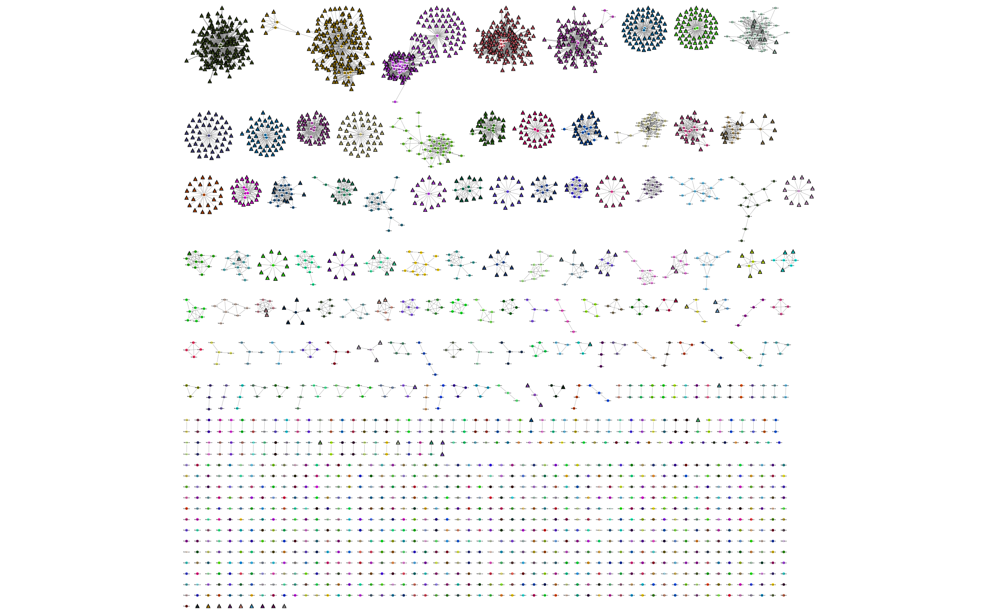

Query assignment
================
This is the recommended mode to use PopPUNK, as long as a database is available for
your species. If there is no DB available, you can fit your own (:doc:`model_fitting`).

Briefly, `download your reference database <https://poppunk.net/pages/databases.html>`__ and run::

    poppunk_assign --ref-db database --distances database/database.dists \
    --q-files qfile.txt --output poppunk_clusters --threads 8

.. contents::
   :local:

Downloading a database
----------------------
Current PopPUNK databases can be found here: https://poppunk.net/pages/databases.html

We refer to sequences in the database as references, and those being added
as queries.

A database called ``database`` will contain the following files, in ``database/``:

- ``database.h5`` -- the sketches of the reference sequences generated by ``pp-sketchlib``.
- ``database.dists.npy`` and ``database.dists.pkl`` -- the core and accessory distances for
  all pairwise comparisons in the sketch database.
- ``database.fit.npy`` and ``database.fit.pkl`` -- the model fit to the core and accessory distances.
- ``database_graph.gt`` -- the network defining the fit (loadable with ``graph_tool``).
- ``database_clusters.csv`` -- the PopPUNK clusters for the reference sequences.
- ``database_references.refs`` -- a minimal list of references needed to produce correct clusters.

If the ``.refs`` file is missing, all of the samples in the sketch database will be
used in the distance calculations.

You can use the following arguments to individually target these items if necessary,
for example when using an alternative fit, or if split across different directories. The
examples below refer to the default database name:

- (required) ``--ref-db database`` -- the name of directory containing the .h5 file.
- (required) ``--distances database/database.dists`` -- prefix of the distances.
- ``--model-dir database`` -- directory containing the model fit and network (dists + fit define the network).
- ``--previous-clustering database`` -- directory containing the PopPUNK clusters for the references.

Clustering your genomes
-----------------------
Create a file which lists your sample names and paths to their sequence data. This file
has no header, is tab separated, and contains the sample name in the first column. Subsequent
columns may contain paths to either assembled or raw read data (the type will automatically
be inferred by checking for the presence of quality scores). Data may be gzipped or uncompressed::

    MS1	ms1_assembled.fa
    MS2	ms2_assembled.fa
    SM14	SM14_1.fq.gz SM14_2.fq.gz

Save this as ``qfile.txt``. You're now ready to cluster them!
Run the following command::

    poppunk_assign --ref-db database --distances database/database.dists \
    --q-files qfile.txt --output poppunk_clusters --threads 8

This will first of all sketch your input genomes, saving them in ``poppunk_clusters/poppunk_clusters.h5``.
If you need to rerun part of the analysis with different options this will automatically be picked up
and loaded.

.. note::
    :doc:`qc` does not apply to query sequences. A test for maximum accessory distance
    will be made, but the program will only emit warnings and will run with all genomes
    anyway. Most options for sketching will be taken from the reference database, but you
    can still specify error filtering options from read input (``--min-kmer-count`` and
    ``--exact-count``) and specify your input as ``--strand-preserved``. See :doc:`sketching` for
    more information on these options.

Next, core and accessory distances between your input sketches and those in the database
will be computed. This has complexity :math:`O(RQ)` where :math:`R` is the number of
samples in ``database_references.refs`` and :math:`Q` is the number in ``qfile.txt``. These distances
are then fed into the model and used to update the network, and therefore clusters.

The output will look something like this::

    Graph-tools OpenMP parallelisation enabled: with 4 threads
    PopPUNK (POPulation Partitioning Using Nucleotide Kmers)
	    (with backend: sketchlib v1.5.1
	     sketchlib: /Users/jlees/miniconda3/envs/pp-py38/lib/python3.8/site-packages/pp_sketchlib.cpython-38-darwin.so)
    Mode: Assigning clusters of query sequences

    Sketching genomes using 8 thread(s)
    Calculating distances using 8 thread(s)
    Loading previously refined model
    Network loaded: 2007 samples
    Found novel query clusters. Calculating distances between them.
    Could not find random match chances in database, calculating assuming equal base frequencies
    Calculating distances using 8 thread(s)

Your clusters will be written to ``poppunk_clusters/poppunk_clusters_clusters.csv``::

    Taxon,Cluster
    21946_6_66,9
    22695_3_148,9
    22984_8_88,9
    21946_6_245,116
    21946_6_189,814
    22695_3_73,814
    21946_6_50,422
    21903_8_95,148
    21903_8_250,301
    22984_8_47,70

These names are identical to those used in the reference database, so retain
the same meaning between studies. If new clusters are found they will be numbered
in ascending order from largest to smallest, beginning from the end of the reference
clusters.

.. note::
    You may observed clusters merging (but never splitting). If your genomes
    do cause clusters to merge this will be noted in the output, and the new
    clusters will be named using the old ones. For example, if clusters 23 and 38
    merged, the new cluster would be called 23_38.

By default, only the query genome clusters are included here. The reference genome
clusters are considered unchanged from the input. If there are many merges and you
wish to know their new cluster IDs, use ``--update-db`` (:ref:`update-db`).

You can use ``poppunk_visualise`` to look at your results. Here's an example output
to cytoscape, showing the clusters as colours, reference genomes as circles and
queries as triangles (open in a new tab to zoom on detail):

Adding external cluster labels (MLST, CC etc)
^^^^^^^^^^^^^^^^^^^^^^^^^^^^^^^^^^^^^^^^^^^^^
Add the ``--external-clustering`` argument to add a CSV file of cluster definitions
which the output will be additionally labelled with, and output to ``database/database_external_clusters.csv``.
These can be any cluster definitions you wish, with as many columns as you like. A header row is required::

    sample,GPSC,MLST
    23430_1_186,1,22
    17794_6_29,23,43
    12291_4_13,1,2

For each PopPUNK cluster, all the samples found in said cluster will be accumulated.
From these accumulated samples the external clusters will be collected, and assigned
to all of these examples. This may give you a one-to-one mapping between PopPUNK clusters
and your external cluster, or you may find multiple external clusters refer to the
PopPUNK cluster giving output such as ``227;811;763;824``.

Using a model fitted with lineage assignment mode
^^^^^^^^^^^^^^^^^^^^^^^^^^^^^^^^^^^^^^^^^^^^^^^^^
You will need to add ``--assign-lineages`` to pick up the correct model, additionally
you can add options ``--rank`` to choose the rank to assign from (default is the lowest
available) and ``--use-accessory`` to use the accessory distances rather than the core
for clustering. You will find extra model files with the ranks listed in their name if
this model type is available.

Using a model fitted with ``--indiv-refine``
^^^^^^^^^^^^^^^^^^^^^^^^^^^^^^^^^^^^^^^^^^^^
If the database was fitted with the refine fit mode, and ``indiv-refine`` you may have
a core distance boundary, accessory boundary and combined core-accessory boundary fit. The
default is to use the combined boundary, to use the others add ``--core-only`` or
``--accessory-only``.

Increasing speed
----------------
Query assignment is the most efficient mode, typically requiring :math:`Q` sketches and
:math:`RQ` distances. If you are updating the database, this increases to :math:`Q^2 + RQ`
distances. If you are assigning a very large number of queries you can run ``poppunk_assign``
with ``--update-db`` repeatedly for batches of query input, as the :math:`Q^2` term will
be reduced by clique-pruning at each iteration.

Straightforward ways to increase speed include:

- Add ``--gpu-dist``, if you have a GPU available.
- Add ``--gpu-sketch``, if your input is all reads, and you have a GPU available. If
  your input is a mix of assemblies and reads, run in two separate batches, with
  the batch of reads using this option.
- Increase ``--threads``.

.. _update-db:

Updating the database
---------------------
If you want to add your query genomes into the reference database so that they
can be used to inform future cluster assignment, this is as simple as adding the
``--update-db`` option to the command above. This is particularly useful when novel
query clusters have been found -- they will then be the consistent name for future assignments::

    poppunk_assign --ref-db database --distances database/database.dists \
    --q-files qfile.txt --output poppunk_clusters --threads 8 --update-db

    Graph-tools OpenMP parallelisation enabled: with 4 threads
    PopPUNK (POPulation Partitioning Using Nucleotide Kmers)
        (with backend: sketchlib v1.5.1
        sketchlib: /Users/jlees/miniconda3/envs/pp-py38/lib/python3.8/site-packages/pp_sketchlib.cpython-38-darwin.so)
    Mode: Assigning clusters of query sequences

    Sketching 28 genomes using 4 thread(s)
    Writing sketches to file
    Calculating distances using 4 thread(s)
    Loading BGMM 2D Gaussian model
    Network loaded: 18 samples
    Calculating all query-query distances
    Could not find random match chances in database, calculating assuming equal base frequencies
    Calculating distances using 4 thread(s)
    Updating reference database to poppunk_clusters
    Removing 27 sequences

    Done

The new database contains all of the reference sequences, and all of your query sequences.
The ``poppunk_clusters`` folder will now contain all of the files of a reference
database listed above, except for the model. You can use ``--model-dir`` to target
this for future assignment, or copy it over yourself. Alternatively, if you run
with the same ``--output`` folder as ``--ref-db``, adding ``--overwrite``, the original
input folder will contain the updated database containing everything needed.

.. note::
    This mode can take longer to run with large numbers of input query genomes,
    as it will calculate all :math:`Q^2` query-query distances, rather than
    just those found in novel query clusters.
