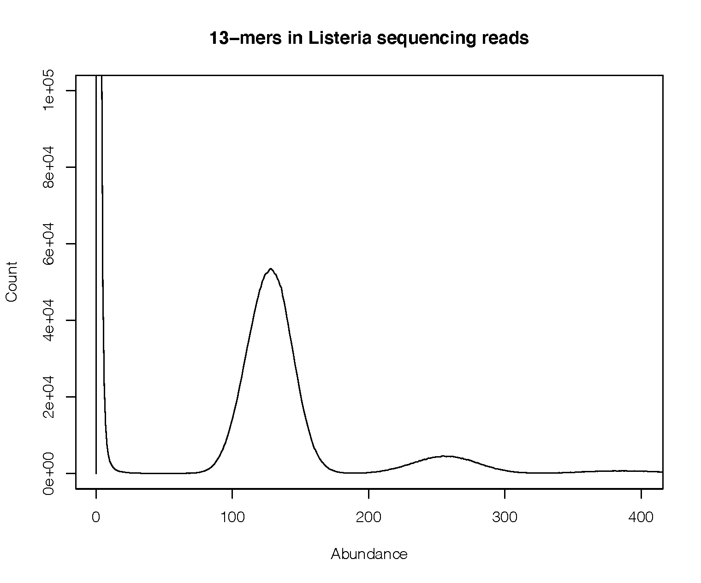
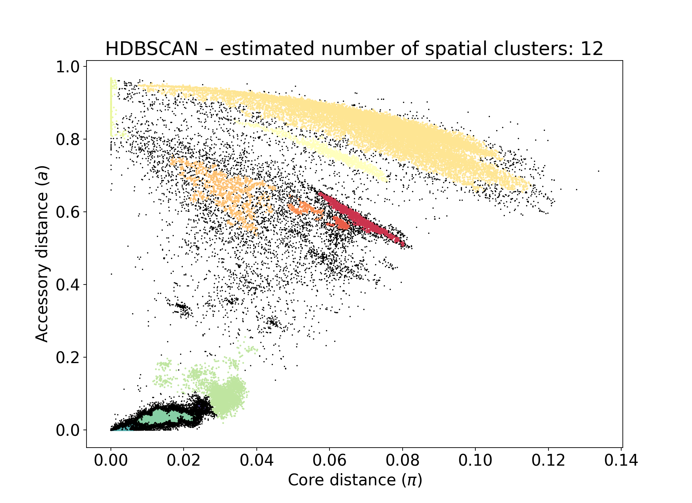

Sketching
=========

The basis of all analysis is estimation of core and accessory genome distances between samples.
PopPUNK uses genome sketching to make analysis more efficient. In previous versions we used
mash, however the current version now requires `pp-sketchlib <https://github.com/johnlees/pp-sketchlib>`__.

This page details options related to sketching and distance calculation, and is relevant
to both :doc:`query_assignment` and :doc:`model_fitting`.

.. contents::
   :local:

Overview
--------
Any input given to ``--r-files`` or ``--q-files`` will be sketched using the following
steps:

1. Run pp-sketchlib to sketch all input genomes.
2. (r-files only) Run :doc:`qc` on the sketches. Remove, ignore or stop, depending on ``--qc-filter``.
3. (r-files only) Calculate random match chances and add to the database.
4. Save sketches in a HDF5 datbase (the .h5 file).
5. (r-files only) Calculate core and accessory distances between every pair of sketches, save in .npy and .pkl.
6. (q-files only) Calculate core and accessory distances between query and reference sketches.
7. Report any core distances greater than ``--max-a-dist`` (and quit, if an r-file).

To run this before :doc:`model_fitting`, use ``--create-db``::

   poppunk --create-db --output database --r-files rlist.txt --threads 8

As noted elsewhere, the input is file which lists your sample names and paths to their sequence data. This file
has no header, is tab separated, and contains the sample name in the first column. Subsequent
columns may contain paths to either assembled or raw read data (the type will automatically
be inferred by checking for the presence of quality scores). Data may be gzipped or uncompressed::

    MS1	ms1_assembled.fa
    MS2	ms2_assembled.fa
    SM14	SM14_1.fq.gz SM14_2.fq.gz

The rest of this page describes options to further control this process.

.. note::
   Sketching considers k-mers on both the forward and reverse by default, as typically
   reads and assemblies are not aligned to a single strand. For genomes where input is
   always on the same (forward) strand, as may be the case with single-stranded
   viral genomes, use the ``--strand-preserved`` option to ignore the reverse strand
   k-mers.

Using pp-sketchlib directly
^^^^^^^^^^^^^^^^^^^^^^^^^^^
You can use pp-sketchlib directly to create sketches, though functionality is identical
to doing this through PopPUNK. You will need to run both sketch and query modes to generate
the sketch database and the distance files as in ``--create-db``::

   poppunk_sketch --sketch --rfile rfiles.txt --ref-db database --sketch-size 10000 --min-k 15 --k-step 2 --cpus 4
   poppunk_sketch --query --ref-db database --query-db database --cpus 4

You may want to do this if you anticipate trying different k-mer sizes, are using the
databases for other purposes, or running a very large analysis where it is useful to split
up the sketching and distance steps. Useful options include:

- ``--print`` -- to print distances in human-readable format to the terminal.
- ``--jaccard`` -- will output Jaccard distances at each k-mer length, rather than core and accessory distances.
- ``--subset`` -- to only calculate distances for a subset of the genomes in the reference database.

.. warning::
   Some options have slightly different names. See the pp-sketchlib README for full details.

Viewing information about a database
^^^^^^^^^^^^^^^^^^^^^^^^^^^^^^^^^^^^
Use ``poppunk_db_info`` on a HDF5 file::

    PopPUNK database:		ecoli.h5
    Sketch version:			9314bda28ed25a60dd40f9b9e896c0b269500fec
    Contains random matches:	True
    Number of samples:		10287
    K-mer sizes:			15,18,21,24,27
    Sketch size:			9984

Sketch size is always rounded to the nearest 64.

.. warning::
    The sketch version should match between databases you are comparing, but the program
    will still run with a warning if they don't. Check results carefully.

Add ``--list-samples`` to get further information for every sample::

    Name:	upec-240
	Base frequencies:	A:0.243987,C:0.247509,G:0.262923,T:0.24558
	Length:			5193782
	Missing bases:		2401

.. _kmer-length:

Choosing the right k-mer lengths
--------------------------------
To get a sensitive estimate of accessory distance independent from core
distance, a small a k-mer size as possible needs to be included in the fit.
However, for longer genomes too small a k-mer size will result in biased
estimates of distances as small k-mers will match at random. pp-sketchlib now
includes a correction for random matches, but there is still a lower limit at
which this can work. A simple formula for estimating this is:

.. math::

   r &= 1 - (1 - 2 \cdot 4^{-k})^{-l} \\
   J_r &= \frac{r^2}{2r - r^2}

where :math:`k` is the k-mer length, :math:`l` is the length of the genome and :math:`J_r`
is the Jaccard distance expected by chance. When :math:`J_r` approaches 1, estimation will
begin to fail.

.. note::
   For genomes on a single strand, the factor of two in the first formula above
   should be excluded.

At the other end, choosing a :math:`k` which is too long will result in all k-mers
mismatching. The greater the core distance :math:`\pi`, the lower the allowable maximum.

Some k-mer ranges for ``--k-min`` and ``--k-max`` we have found to work for various genomes:

.. table:: k-mer lengths by domain
   :widths: auto
   :align: center

   ==================  =================  ===========  =====  =====
    Domain/pathogen    Typical :math:`l`  :math:`\pi`  k-min  k-max
   ==================  =================  ===========  =====  =====
   Beta-coronaviruses  20kb               0.1          6      15
   Bacteria            2-5Mb              ~0.01-0.04   13     29
   Fungi               16Mb               ~0.01        15     31
   Plasmodium          23Mb               0.0005       17     31
   ==================  =================  ===========  =====  =====

A ``--kmer-step`` of four is usually sufficient, but drop this to two or three
to give the best accuracy at the expense of increased execution time.

A good model will have a straight line fit between :math:`\log(J)` and :math:`k`. Run
with the ``--plot-fit`` option to randomly choose a number
of sample pairs to plot the relation between k-mer distances and core and
accessory fits. This plot does not have to be perfectly straight, but the general trend
should be followed. If you have a point at the end going off the scale, you will want to adjust
your k-mer range.

.. image:: images/kmer_fit.png
   :alt:  A fixed fit to k-mer distances
   :align: center

Choosing the sketch size
^^^^^^^^^^^^^^^^^^^^^^^^
The default sketch size :math:`s` is 10000. Note that this is 10-fold greater than the mash
default of 1000 -- this is required to get sufficient resolution on :math:`\pi`. For closely
related genomes with smaller :math:`\pi`, you may need to increase the sketch size.

As a rule of thumb, choose :math:`s = \frac{1}{\pi}` based on the minimum resolution
in :math:`\pi` you need to observe.

.. important::
   Any Jaccard distances :math:`< \frac{5}{s}` will be
   ignored in the fit of core and accessory distances. This prevents spurious
   matches between very close sketches dominating, when a poor minimum k-mer length
   has been chosen.

Note that a larger sketch size will result in a linear increase in database size
and distance calculation time.

Sketching from read data
------------------------
You can also use sequence reads rather than assemblies as input. The main differences are that
this data is typically a lot larger, and may contain false k-mers as the result of sequencing
errors.

Read data is automatically detected for each input file. It may be interleaved, or given
as forward and reverse reads. Low frequency k-mers, which are assumed to be the result
of sequencing error, will be filtered out automatically. Use the ``--min-kmer-count`` option
to set the minimum number of k-mers needed to be observed to include these. Most error
k-mers will appear only once, but ideally set this somewhere between 1 and the coverage:

In this example the coverage is around 150x, so most correct k-mers have a frequency
centred around this point (there is a second peak at twice this value, which are
repeats). There is a large peak at a frequency of one, which are the error k-mers. In this
example any filter between 15-75 would be appropriate.

The default filter is a probabilistic countmin filter, assuming up to 134M unique k-mers. If you expect
significantly more k-mers than this, for example with longer genomes, you should add
the ``--exact-count`` argument to use a hash table instead. This is exact, but may
use more memory.

Sketching RNA viruses
---------------------
Firstly, if your viral genomes are single stranded, you probably need to add the
``--strand-preserved`` option.

For small genomes where strong selection is present, in the example here shown with influenza genomes, the third codon bias may be so
great that 6-mers (or any multiple of three) have fewer matches than 7-mers.
In a mostly coding genome the third codon position across a gene is more free to mutate, as it
can cause non-synonymous changes, whereas the first and second codons always cause coding changes. This
can cause issues with the core-accessory regression pushing some core distances to 0:

A solution to this is to use k-mers with spaced seeds, where only every third base
is added to the k-mer. This prevents multiples of the codon size lining up with heavily mutated
bases.

.. table:: Codon phased seeds
   :widths: auto
   :align: center

   ==================  =================  ==============
    k-mer               dense              Phased seed
   ==================  =================  ==============
   3                   XXX                X--X--X
   4                   XXXX               X--X--X--X
   5                   XXXXX              X--X--X--X--X
   ==================  =================  ==============

Add the ``--codon-phased`` option to enable this. This fixes the above example:

.. image:: images/flu_phased.png
   :alt:  RNA virus with codon phased seeds
   :align: center

.. note::
   When using a database constructed with codon phased seeds for :doc:`query_assignment`,
   codon phased seeds will automatically be turned on for the query sequences too.

GPU acceleration
----------------
There are two pieces of heavy computation that can be accelerated with the use of a CUDA-enabled
GPU:

- Sketching read data ``--gpu-sketch``.
- Calculating core and accessory distances ``--gpu-dist``.

We assume you have a GPU of at least compute capability v7.0 (Tesla) with drivers
correctly installed. You do not need the CUDA toolkit installed, as all libraries are
included with the pp-sketchlib executable.

.. note::
   You will see 'GPU' in the progress message if a GPU is successfully being used. If you
   see the usual CPU version your install may not have been compiled with CUDA.

Sketching read data with the GPU is a hybrid algorithm which can take advantage of
CPU threads too (which are used to read and process the fastq files). You can add
up to around 16 ``--threads`` to keep a typical consumer GPU busy. The sequence data
must fit in device memory, along with a 2Gb countmin filter. The countmin filter
is 134M entries wide. If you expect your reads to have more unique k-mers than this
you may see an increased error rate.

Typical output will look like this::

   Sketching 128 read sets on GPU device 0
   also using 16 CPU cores
   Sketching batch: 1 of 9
   k = 29   (100%)
   k = 29   (100%)
   k = 29   (100%)
   k = 29   (100%)
   k = 29   (100%)
   k = 29   (100%)
   k = 29   (100%)
   k = 29   (100%)
   k = 29   (100%)
   k = 29   (100%)
   k = 29   (100%)
   k = 29   (100%)
   k = 29   (100%)
   k = 29   (100%)
   k = 29   (100%)
   k = 29   (100%)
   Sketching batch: 2 of 9
   k = 29   (100%)
   k = 29   (100%)
   k = 29   (100%)
   k = 29   (100%)
   ....

Calculating distances with the GPU will give slightly different results to CPU distances,
but typically within 1%, which should not usually affect downstream results. The sketches,
random matches and distances must fit in the device memory. Around 35k bacterial genomes
uses around 10Gb of device memory, typical for a high-end consumer device. If the device memory
is exceeded the calculation will automatically be split into chunks, at only slightly reduced
efficiency. The amount of memory available and needed will be estimated at the start::

   Calculating distances on GPU device 0
   Estimated device memory required: 565Mb
   Total device memory: 11019Mb
   Free device memory: 10855Mb
   Progress (GPU): 100.0%

.. important::
   The GPU which is device 0 will be used by default. If you wish to target another
   GPU, use the ``--deviceid`` option. This may be important on computing clusters
   where you must use your job's allocated GPU.