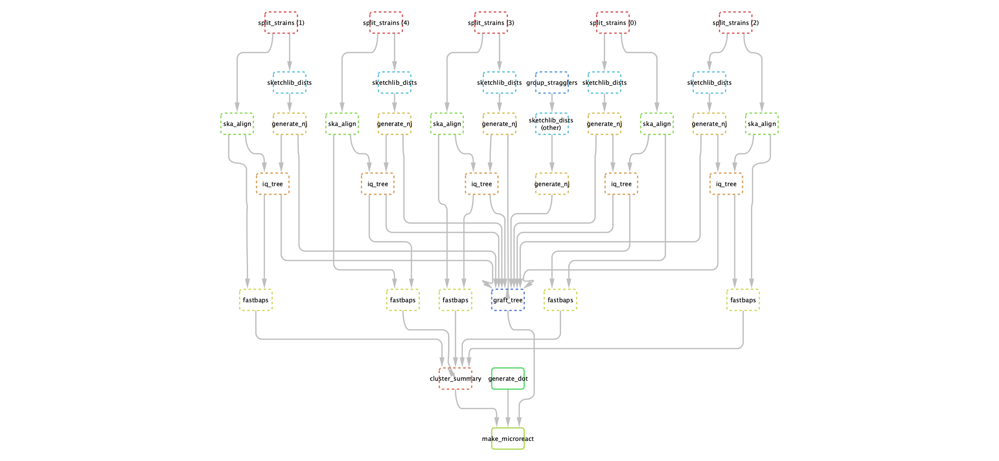

Subclustering with PopPIPE
==========================

**Contents**:

.. contents::
   :local:

Overview
--------
You can run `PopPIPE <https://github.com/johnlees/PopPIPE>`__ on your PopPUNK output,
which will run subclustering and visualisation within your strains. The pipeline
consists of the following steps:

- Split files into their strains.
- Calculate core and accessory distances within each strain.
- Use the core distances to make a neighbour-joining tree.
- (lineage_clust mode) Generate clusters from core distances with lineage clustering in PopPUNK.
- Use `ska <https://github.com/simonrharris/SKA>`__ to generate within-strain alignments.
- Use `IQ-TREE <http://www.iqtree.org/>`__ to generate an ML phylogeny for each strain using this alignment,
  and the NJ tree as a starting point.
- Use `fastbaps <https://github.com/gtonkinhill/fastbaps>`__ to generate subclusters which are partitions of the phylogeny.
- Create an overall visualisation with both core and accessory distances, as in PopPUNK.
  The final tree consists of refining the NJ tree by grafting the maximum likelihood trees for subclusters to their matching nodes.

An example DAG for the steps (excluding ``ska index``, for which there is one per sample):

Installation
------------
PopPIPE is a `snakemake <https://snakemake.readthedocs.io/en/stable/>`__ pipeline, which depends
upon snakemake and pandas::

    conda install snakemake pandas

Other dependencies will be automatically installed by conda the first time
you run the pipeline. You can also install them yourself and omit the `-use-conda`
directive to snakemake::

    conda env create -n poppipe --file=environment.yml

Then clone the repository::

    git clone git@github.com:johnlees/PopPIPE.git

Usage
-----
1. Modify ``config.yml`` as appropriate.
2. Run ``snakemake --cores <n_cores> --use-conda``.

On a cluster or the cloud, you can use snakemake's built-in ``--cluster`` argument::

    snakemake --cluster qsub -j 16 --use-conda

See the `snakemake docs <https://snakemake.readthedocs.io/en/stable/executing/cluster-cloud.html)>`__
for more information on your cluster/cloud provider.

Alternative runs
^^^^^^^^^^^^^^^^
For quick and dirty clustering and phylogenies using core distances from
`pp-sketchlib <https://github.com/johnlees/pp-sketchlib>`__ alone, run::

    snakemake --cores <n_cores> --use-conda lineage_clust

To create a visualisation on `microreact <https://microreact.org/>`__:

    snakemake --use-conda make_microreact

Config file
-----------

PopPIPE configuration
^^^^^^^^^^^^^^^^^^^^^

- ``script_location``: The ``scripts/`` directory, if not running from the root of this repository
- ``poppunk_db``: The PopPUNK HDF5 database file, without the ``.h5`` suffix.
- ``poppunk_clusters``: The PopPUNK cluster CSV file, usually ``poppunk_db/poppunk_db_clusters.csv``.
- ``poppunk_rfile``: The ``--rfile`` used with PopPUNK, which lists sample names and files, one per line, tab separated.
- ``min_cluster_size``: The minimum size of a cluster to run the analysis on (recommended at least 6).

IQ-TREE configuration
^^^^^^^^^^^^^^^^^^^^^

- ``enabled``: Set to ``false`` to turn off ML tree generation, and use the NJ tree throughout.
- ``mode``: Set to ``full`` to run with the specified model, set to ``fast`` to run using ``--fast`` (like fasttree).
- ``model``: A string for the ``-m`` parameter describing the model. Adding ``+ASC`` is recommended.

fastbaps configuration
^^^^^^^^^^^^^^^^^^^^^^

* ``levels``: Number of levels of recursive subclustering.
* ``script``: Location of the ``run_fastbaps`` script. Find by running ``system.file("run_fastbaps", package = "fastbaps")`` in R.

Updating a run
-----------------
Running ``snakemake`` from the same directory will keep outputs where possible,
so new additions will automatically be included.

**TODO**: How to do this when adding new isolates with ``poppunk_assign``
