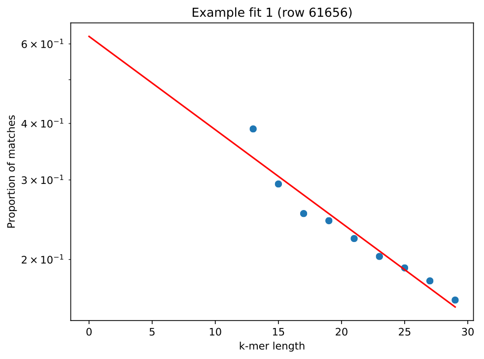
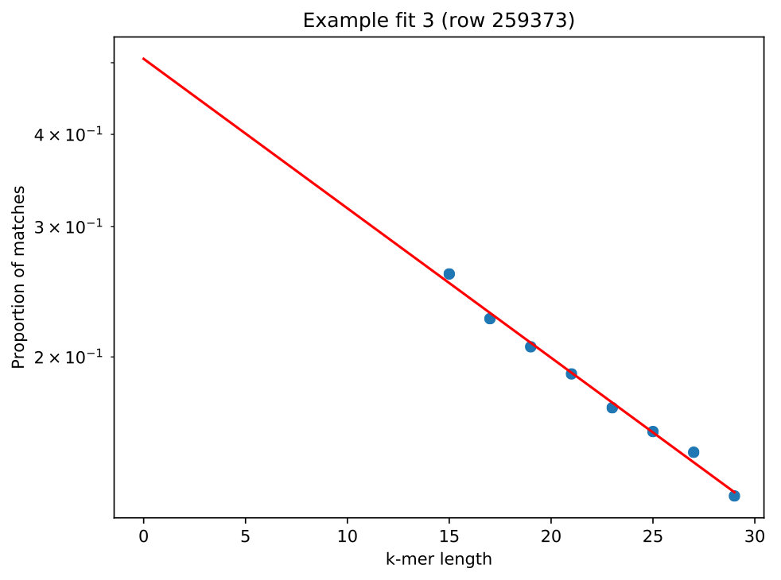
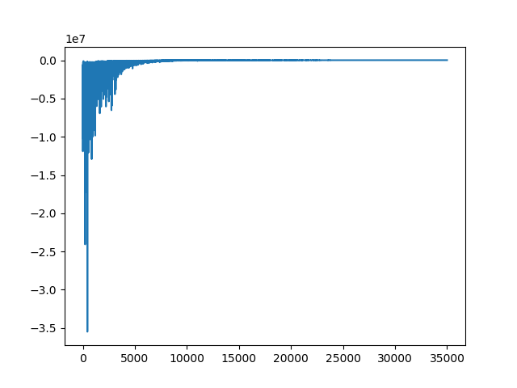
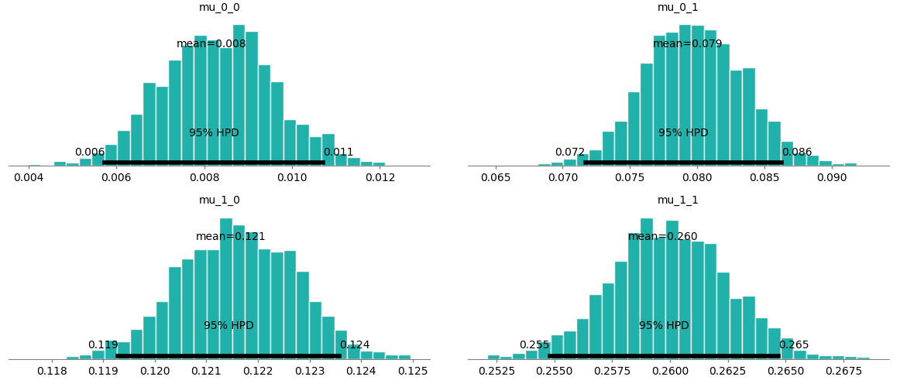
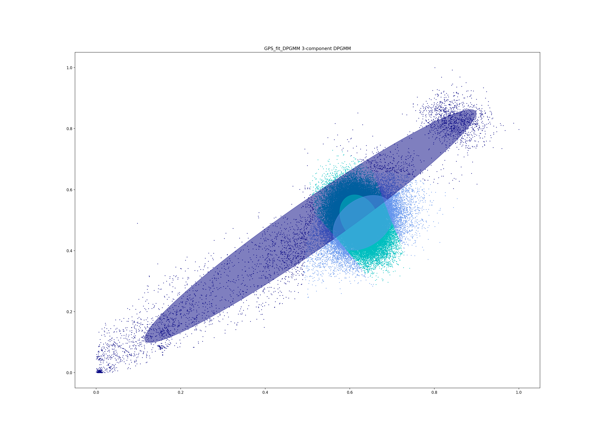
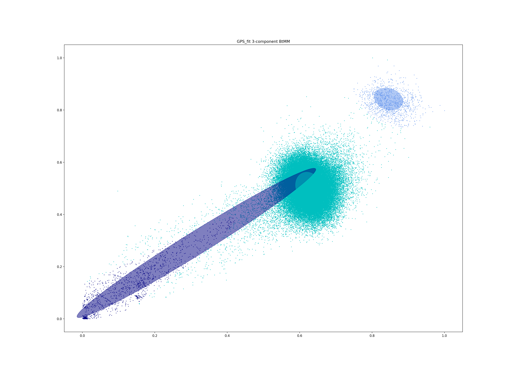
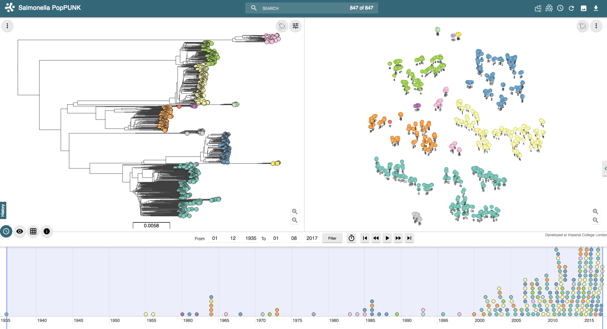
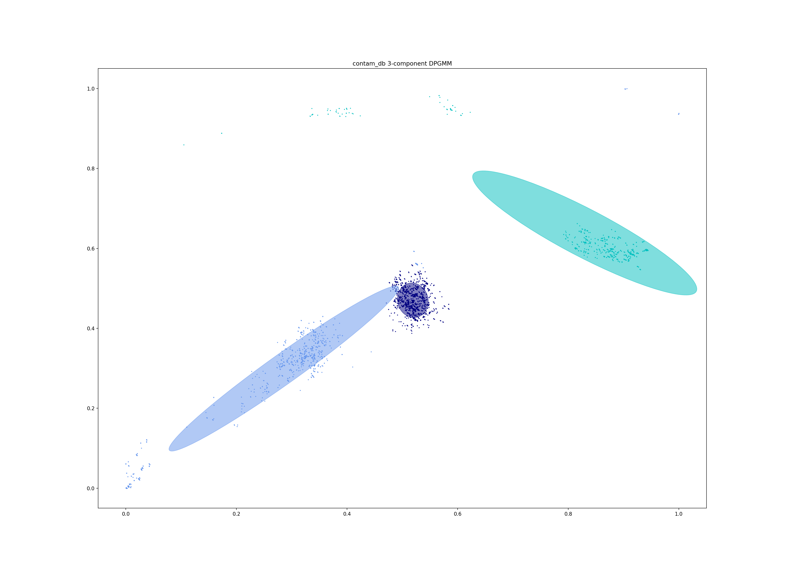
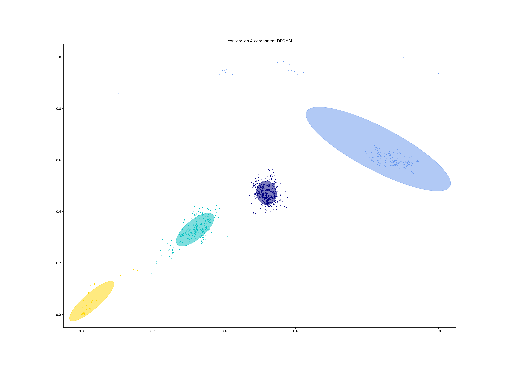

Troubleshooting
===============

This page deals with common issues in running the analysis. For issues with
installing or running the software please raise an issue on github.

.. contents::
   :local:

.. _kmer-length:

Choosing the right k-mer lengths
--------------------------------
When using in the ``--create-db`` mode a straight line fit is required. Make
sure to run with the ``--plot-fit`` option, which will randomly choose a number
of sample pairs to plot the relation between k-mer distances and core and
accessory fits.

To get a sensitive estimate of accessory distance independent from core
distance, a small a k-mer size as possible needs to be included in the fit.
However, for longer genomes too small a k-mer size will result in biased
estimates of distances as small k-mers will match at random.

Here is an example of a fit with ``--k-step 2 --min-k 13``:

The genome being fitted is 4.6Mb long, which at 13-mer matches gives a 6%
chance of random matches (this information is written to ``STDERR``), resulting
in the left-most point being over-estimated. Using exactly the same command,
but changing ``--min-k 15`` fixes the issue:

A ``--kmer-step`` of four is usually sufficient, but drop this to two or three
to give the best accuracy.

.. _bgmm-fit:

Fine tuning model fit
---------------------
In many cases, when the within-strain distances are well separated, the
standard mixture model fit will work very well and produce good clustering.
As a rule of thumb, a transitivity over 0.9 should be expected, and a density
below 0.2. If a fit is bad, usually it will be either too conservative (not enough
links considered within-strain) leading to too many clusters, or more often too lenient
(too many links considered within-strain) leading to merging of clusters. In
the latter case, single incorrect links between components will cause clusters to
merge. A more conservative fit should generally be preferred, which is
reflected by the score function. In rare cases the fit may be completely
incorrect, perhaps because too many overlapping components have been included
with a large amount of data.

In many cases altering the ``--K`` parameter to obtain a good network score
will be sufficient. However, with large populations, especially where there has
been lots of recombination, the boundaries between the distance components may
be less clear. In this case the placement of the mixture components is likely
to be more challenging.

For these cases you should run ``--fit-model`` with the ``--bgmm`` model, which
will allow you to specify priors on the model fit as well as change the shapes
of the mixture components.

Run the ``--fit-model`` command with the ``--bgmm`` option. This uses MCMC to
fit the mixture model, but as it is ADVI-based it is still fast, and should
take around two minutes per run::

    poppunk --fit-model --distances listeria_db/listeria_db.dists --output listeria_db --full-db --ref-db listeria_db --priors priors.txt --bgmm
    PopPUNK (POPulation Partitioning Using Nucleotide Kmers)
    Mode: Fitting model to reference database

    Running model burn-in
    Average Loss = -23,202: 100%|█████████████████████████████| 25000/25000 [01:21<00:00, 306.08it/s]
    Finished [100%]: Average Loss = -23,209
    Running model fit
    Average Loss = -29,185: 100%|█████████████████████████████| 10000/10000 [00:36<00:00, 275.75it/s]
    Finished [100%]: Average Loss = -29,188
    Fit summary:
    	Avg. entropy of assignment	0.0018
    	Number of components used	4
    Network summary:
    	Components	31
    	Density	0.0897
    	Transitivity	1.0000
    	Score	0.9103

    Done

There is a burn-in of 25000 iterations, followed by 10000 main iterations, 2000
of which are sampled for the posterior. As well as the scatter plot of the fit,
take a look at the loss function *_elbos.png*:

The loss should decrease, and be mostly flat without large spikes across the
main iterations. The posterior distributions for each parameter are plotted in
*_posterior.png*:

The mean the 95% HPD are shown for all parameters in the model. The most
important ones to check are :math:`\mu` (the positions of the mixture centres),
:math:`\pi` (the weights of the mixture components). The other visible
parameter is 'cov' which are the mixture component covariances, although the
priors cannot be altered to change these.

If :math:`\mu` or :math:`\pi` are not what would be expected from the scatter
plot of distances, priors can be specified to set their values.

Specifying priors
^^^^^^^^^^^^^^^^^
The advantage of ``--bgmm`` is that you can specify priors in a file with ``--priors`` to
improve the fit. The priors file is formatted as follows::

    proportions Dirichlet
    prop_strength 1
    positions 0,0.1;0.15,0.3;0.22,0.4;0.9,0.9
    pos_strength 1000000

A key, followed by its value (space separated).

In this example, we have set the positions of the mixture components, and
allowed the model to set the covariances and weights from the data. This
strategy is useful when the mixture components get put in the wrong place by
the model. To do this, we set a high ``pos_strength`` (:math:`>10^6`) and specify the centers with
``positions``. Each mixture component is separated with a semi-colon, with the
core and accessory values comma separated (there are 4 mixture components set
above). Check for disparity between the posterior means of :math:`\mu` and
``positions`` to see how well this has worked.

When the fit is too lenient or conservative, it can help to change the mixture
component weights :math:`\pi`. To give a more conservative fit, specify a small
weight on the between-strain component::

    proportions 0.001,0.999
    prop_strength 1
    positions 0,0.1;0.9,0.9
    pos_strength 1000000

The number of weights in ``proportions`` must match the number of components in
``positions``. If this doesn't change the posterior, raising the value of
``prop_strength`` will give more weight to this prior.

Using t-distributions to deal with outliers
^^^^^^^^^^^^^^^^^^^^^^^^^^^^^^^^^^^^^^^^^^^
The Gaussian shape of the mixture components may not always fit the data well.
This can be seen if the components overlap significantly and cause
discontinuous regions of classifcation:

You may also notice a high entropy of assignment in this case. It may help to
instead use a mixture of t-distributions by specifying ``--t-dist`` along with
``--bgmm`` (and usually also specifying mean positions with ``--priors``).
The longer tails of the t-distributions can better fit outlier
data, which artifically increases the covariance of Gaussian components:

.. _manual-start:

Using fit refinement when mixture model totally fails
^^^^^^^^^^^^^^^^^^^^^^^^^^^^^^^^^^^^^^^^^^^^^^^^^^^^^
If the mixture model does not give any sort of reasonable fit to the points,
you can manually provide a file with ``--manual-start`` to give the starting parameters to
``--refine-fit`` mode. The format of this file is as follows::

    mean0 0,0
    mean1 0.5,0.6
    start_point 0.3

A key, followed by its value (space separated).

``mean0`` and ``mean1`` define the points (x,y) to draw the line between, and
``start_point`` is the distance along this line to draw the initial boundary
(which is normal to the line).

.. _cytoscape-view:

Viewing the network with cytoscape
----------------------------------
If you add the ``--cytoscape`` option when running ``--fit-model`` _cytoscape.graphml
and _cytoscape.csv files will be written to the output directory.

Open `cytoscape <http://www.cytoscape.org/>`_ and drag and drop the .graphml
file onto the window to import the network. Import -> table -> file to load the
CSV. Click 'Select None' then add the 'id' column as a key, and any required
metadata columns (at least the 'Cluster' column) as attributes. Make sure
'Node Table Columns' is selected as the data type.

Click on 'Style' and change the node fill colour to be by cluster, the mapping
type as discrete, then right click to autogenerate a colour scheme. You can
also modify the node size here. In the :doc:`tutorial` example, the components
are nicely separated and the network has high transitivity:

.. image:: cytoscape.png
   :alt:  Cytoscape plot of network
   :align: center

In some cases, edges which are between strain links may have been erroneously included
in the network. This could be due to poor model fit, or a poor quality
sequence. Use Tools -> NetworkAnalyzer -> Analyze Network to compute
information for each node and edge. It may help to analyze connected components separately.
They can be split under Tools -> NetworkAnalyzer -> Subnetwork Creation.

Here is an example where an errant node is connecting two clusters into one
large cluster, which should be split:

.. image:: cytoscape_component.png
   :alt:  Cytoscape plot of network
   :align: center

The incorrect node in question has a low CluteringCoefficient and high Stress.
The EdgeBetweeness of its connections are also high. Sorting the node and edge
tables by these columns can find individual problems such as this.

.. _perplexity:

Setting the perplexity parameter for t-SNE
------------------------------------------
In t-SNE an embedding of the accessory genome distances is found which
represents local structure of the data. Isolates with similar accessory content
will visually appear in clusters together.

The perplexity sets a guess about the number of close neighbours each point
has, and is a trade-off between local and global structure. t-SNE is reasonably
robust to changes in the perplexity parameter (set with ``--perplexity`` when
creating microreact output with ``--microreact`` in the``--fit-model`` mode),
however we would recommend trying a few values to get
a good embedding for the accessory distances.

There is a good discussion of the effect of perplexity `here <https://distill.pub/2016/misread-tsne/>`_
and the sklearn documentation shows some examples of the effect of `changing
perplexity <http://scikit-learn.org/stable/auto_examples/manifold/plot_t_sne_perplexity.html>`_.

In the :doc:`tutorial` example, a perplexity of 30 gives clear clustering of
the accessory genome content, condordant with the core genome structure (`data <https://microreact.org/project/Skg0j9sjz>`__):

.. image:: microreact.png
   :alt:  Microreact plot of results with perplexity = 30
   :align: center

With a lower perplexity of 5, the clustering is too loose, and the strain
structure cannot clearly be seen (`data <https://microreact.org/project/S1RwpK9if>`__):

30 is a good default, but you may wish to try other values, particularly with
larger or smaller datasets.

Dealing with poor quality data
------------------------------
In this example we analyse 76 *Haemophilus influenzae* isolates. One isolate, 14412_4_15,
is contaminated with 12% of reads being *Haemophilus parainfluenzae* and a total
assembly length of 3.8Mb. It should be removed before input, but its presence
can also be found with ``PopPUNK``.

With the distances
^^^^^^^^^^^^^^^^^^
A fit with three mixture components overestimates the number of between strain
links, and gives a network with a poor score (0.6849) and only five components:

Distances in the top left of the plot, with low core distances and high
accessory distances, are due to the contaminated contigs in the isolate.
Finding which isolates contribute to these distances reveals a clear culprit::

    awk '$3<0.02 && $4 > 0.3 {print $1}' contam_db/contam_db.search.out | cut -f 1 | sort | uniq -c
       1 14412_3_81
       1 14412_3_82
       1 14412_3_83
       1 14412_3_84
       1 14412_3_88
       1 14412_3_89
       1 14412_3_91
       1 14412_3_92
       1 14412_4_1
       1 14412_4_10
      28 14412_4_15

In this case it is sufficent to increase the number of mixture components to four,
which no longer includes these inflated distances. This gives a score of 0.9401 and 28 components:

The best thing to do is to remove the poor quality isolate, or if possible
remove the contaminated reads/contigs from the assembly.

With the network
^^^^^^^^^^^^^^^^
Alternatively, the network itself can be inspected with ``--cytoscape``. Using
the approach detailed in :ref:`cytoscape-view` gives the following view:

.. image:: cytoscape_contaminant.png
   :alt:  A better fit to pairwise distances
   :align: center

The contaminated node appears when ordering by ClusteringCoefficient, Stress or
TopologicalCoefficient, and its edges appear when ordering by EdgeBetweeness.
It can be seen highlighted in the top right component, connecting two clusters
which otherwise have no links. It can be removed, and components recalculated in
cytoscape directly, though removal from the PopPUNK database is best.

The second largest cluster is also suspicious, where there are few triangles
(low transitivity) and the nodes involved have high Stress. This is indicative
of a bad fit overall, rather than a single problem sample.

Memory/run-time issues
----------------------
For larger datasets resource use may be challenging. So far the largest dataset
we've analysed was around 12000 genomes, which used modest computational
resources. Here are some tips based on these experiences:

- Add ``--threads`` -- they are used fairly efficiently throughout.
- When running ``--create-db`` with many threads, add the ``--no-stream`` option.
  This will trade-off memory for disk usage, as it seems that many threaded
  ``mash dist`` output cannot be processed as fast as it is produced.
- In ``--refine-model`` set ``--pos-shift 0`` to avoid creating huge networks
  with close to :math:`N^2` edges. Mixture models normally need to be pruned.
- In ``--refine-model`` you may add the ``--no-local`` option to skip that step
  and decrease run-time, though gains are likely marginal.
- Use ``--rapid-nj``, if producing MicroReact output.

Another option for scaling is to run ``--create-db`` with a smaller initial set (not
using the ``--full-db`` command), then use ``--assign-query`` to add to this.

