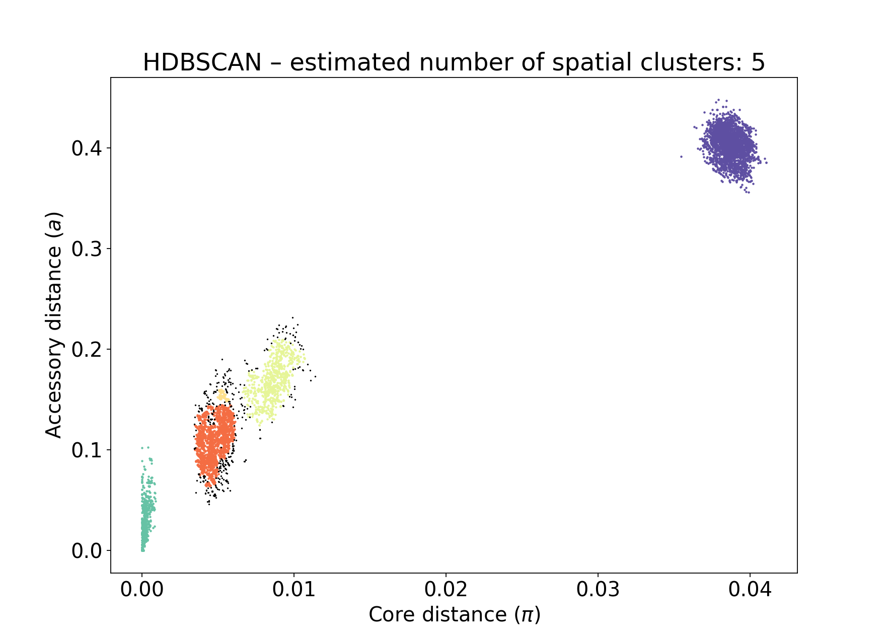
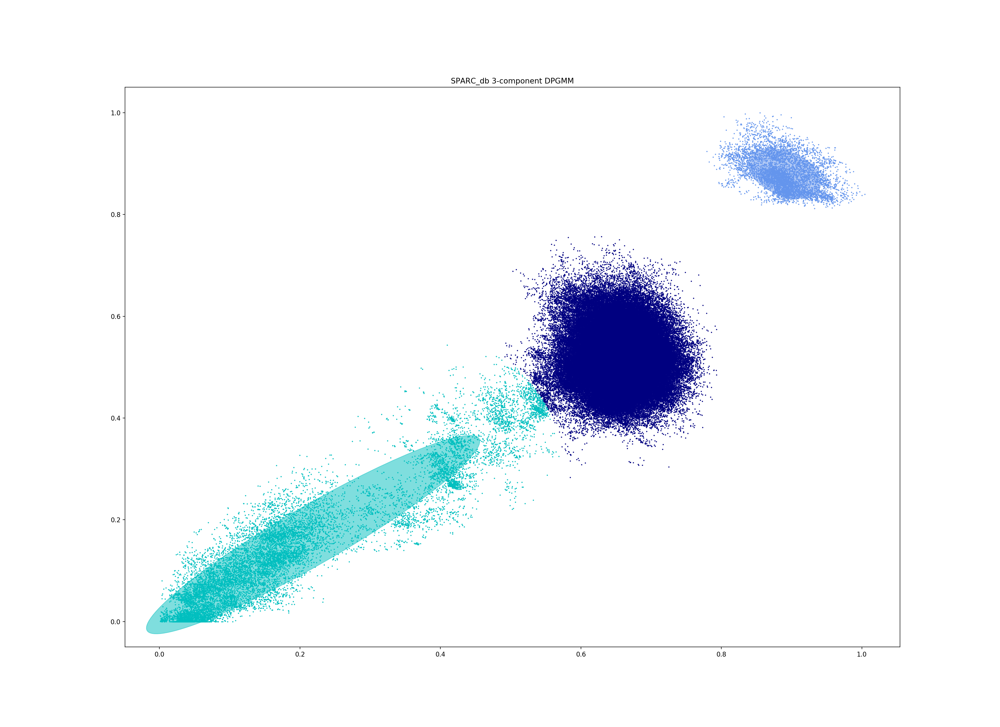
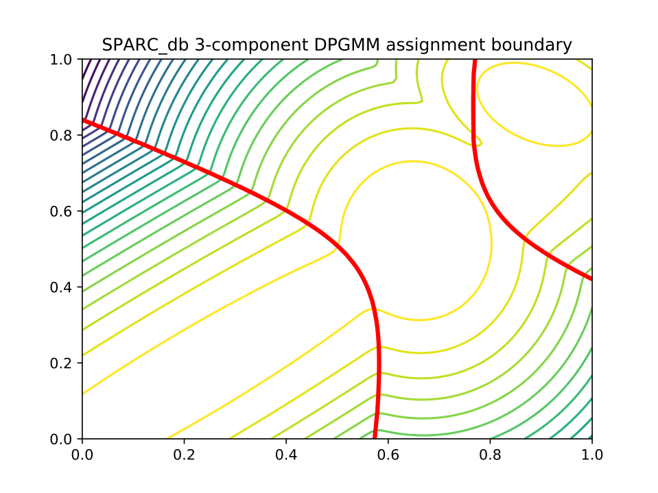
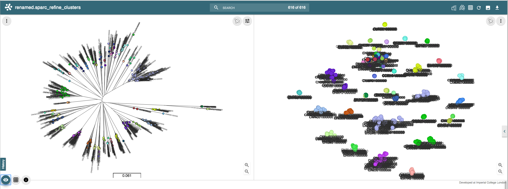
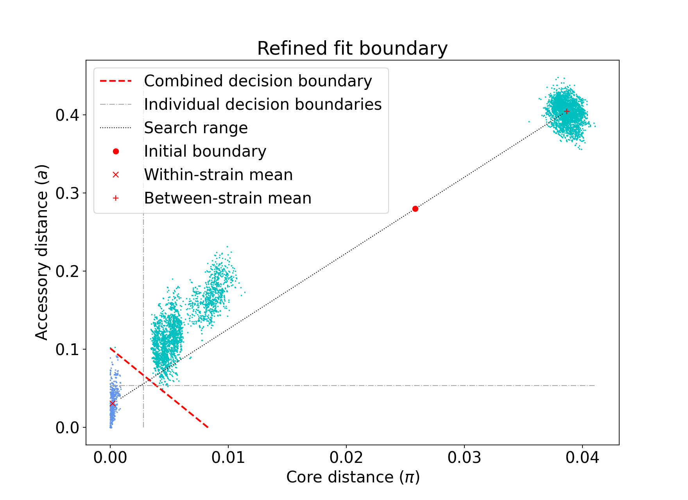

Tutorial
========

.. |nbsp| unicode:: 0xA0
   :trim:

This tutorial will guide you through the use of the four modes of PopPUNK,
explaining when to use each one. In places we refer to :doc:`troubleshooting`
which explains how to deal with common problems when the defaults don't quite
work.

The first two steps can be run together in a single command using ``--easy-run``,
which in many cases will work without need for further modification.

In this tutorial we will work with the Salmonella genomes reviewed by `Alikhan
et al <https://doi.org/10.1371/journal.pgen.1007261>`_ which can be downloaded
from `EnteroBase <https://enterobase.warwick.ac.uk/species/senterica/search_strains?query=workspace:9641>`_.

.. contents::
   :local:

Creating a database
-------------------
To analyse a population from scratch (where PopPUNK hasn't been used before)
the first step is to create a PopPUNK database, which is essentially a list of
all the core and accessory distances between each pair of isolates in the
collection.

The basic command to do this is as follows::

   poppunk --create-db --r-files reference_list.txt --output strain_db --threads 2 --plot-fit 5

Where ``references.txt`` is a list of fasta assemblies to analyse, created by,
for example::

   ls assemblies/*.fasta > reference_list.txt

The references will first be hashed at different k-mer lengths, then pairwise
distances are calculated, which are finally converted into core and accessory
distances::

   PopPUNK (POPulation Partitioning Using Nucleotide Kmers)
   Mode: Building new database from input sequences
   Creating mash database for k = 13
   Random 13-mer probability: 0.06
   Creating mash database for k = 17
   Random 17-mer probability: 0.00
   Creating mash database for k = 15
   Random 15-mer probability: 0.00
   Creating mash database for k = 19
   Random 19-mer probability: 0.00
   Creating mash database for k = 21
   Random 21-mer probability: 0.00
   Creating mash database for k = 25
   Random 25-mer probability: 0.00
   Creating mash database for k = 23
   Random 23-mer probability: 0.00
   Creating mash database for k = 27
   Random 27-mer probability: 0.00
   Creating mash database for k = 29
   Random 29-mer probability: 0.00
   mash dist -p 2 ./strain_db/strain_db.13.msh ./strain_db/strain_db.13.msh 2> strain_db.err.log
   mash dist -p 2 ./strain_db/strain_db.15.msh ./strain_db/strain_db.15.msh 2> strain_db.err.log
   mash dist -p 2 ./strain_db/strain_db.17.msh ./strain_db/strain_db.17.msh 2> strain_db.err.log
   mash dist -p 2 ./strain_db/strain_db.19.msh ./strain_db/strain_db.19.msh 2> strain_db.err.log
   mash dist -p 2 ./strain_db/strain_db.21.msh ./strain_db/strain_db.21.msh 2> strain_db.err.log
   mash dist -p 2 ./strain_db/strain_db.23.msh ./strain_db/strain_db.23.msh 2> strain_db.err.log
   mash dist -p 2 ./strain_db/strain_db.25.msh ./strain_db/strain_db.25.msh 2> strain_db.err.log
   mash dist -p 2 ./strain_db/strain_db.27.msh ./strain_db/strain_db.27.msh 2> strain_db.err.log
   mash dist -p 2 ./strain_db/strain_db.29.msh ./strain_db/strain_db.29.msh 2> strain_db.err.log
   Calculating core and accessory distances

   Done

We would recommend using as many threads as available for maximum speed (even
if #threads > #k-mers). To convert k-mer distances into core and accessory
distances the following relationship is used:

.. math::

   & \mathrm{pr}(a, b) = (1-a)(1-c)^k \\
   & \log (\mathrm{pr}(a, b)) = \log(1-a) + k \cdot \log(1-c)

Where :math:`\mathrm{pr}(a, b)` is the proportion of k-mers matching at length
:math:`k` between sequences :math:`a` and :math:`b`. In log-linear space this is
linear by k-mer length, and a constrained least squared fit gives the accessory
distance (the intercept) and the core distance (the slope).

.. warning::
   A straight line fit is required for correct calculation of core and
   accessory distances. To inspect this the use of the ``--plot-fit`` options
   is generally recommended to inspect some of the regressions. Choice of min-k
   depends on this, and is discussed in :ref:`kmer-length`.

Output files
^^^^^^^^^^^^
This will create two files `strain_db/strain_db.dists.npy` and `strain_db/strain_db.dists.pkl` which
store the distances and strain names respectively. These are then used in
:ref:`model-fit`.

There are also databases of sketches at each k-mer length (`*.msh`) which can
be re-used if the same data is fitted with a new range of k-mer lengths.
Otherwise they should be recalculated by specifying ``--overwrite``.

Relevant command line options
^^^^^^^^^^^^^^^^^^^^^^^^^^^^^
The following command line options can be used in this mode:

   Mode of operation:
     --create-db           Create pairwise distances database between reference
                           sequences
   Input files:
     --r-files R_FILES     File listing reference input assemblies

   Output options:
     --output OUTPUT       Prefix for output files (required)
     --plot-fit PLOT_FIT   Create this many plots of some fits relating k-mer to
                           core/accessory distances [default = 0]
     --overwrite           Overwrite any existing database files

   Quality control options:
     --max-a-dist MAX_A_DIST
                        Maximum accessory distance to permit [default = 0.5]
     --ignore-length    Ignore outliers in terms of assembly length [default =
                        False]

   Kmer comparison options:
     --min-k MIN_K         Minimum kmer length [default = 9]
     --max-k MAX_K         Maximum kmer length [default = 29]
     --k-step K_STEP       K-mer step size [default = 4]
     --sketch-size SKETCH_SIZE
                           Kmer sketch size [default = 10000]

   Other options:
     --mash MASH           Location of mash executable
     --threads THREADS     Number of threads to use during database querying
                           [default = 1]
     --no-stream           Use temporary files for mash dist interfacing. Reduce
                           memory use/increase disk use for large datasets

.. _model-fit:

Fitting the model
-----------------

The basic command used to fit the model is as follows::

   poppunk-runner.py --fit-model --distances strain_db/strain_db.dists --output strain_db --full-db --ref-db strain_db --K 2

This will fit a mixture of up to three 2D Gaussians to the distribution of core and
accessory distances::

   PopPUNK (POPulation Partitioning Using Nucleotide Kmers)
   Mode: Fitting model to reference database

   Fit summary:
      Avg. entropy of assignment	0.0042
      Number of components used	2
   Network summary:
      Components	12
      Density	0.1852
      Transitivity	0.9941
      Score	0.8100

   Done

The default is to fit two components, one for between-strain and one for
within-strain distances. There are a number of summary statistics which you can use to assess the fit:

==========================  ==============
Statistic                   Interpretation
==========================  ==============
Avg. entropy of assignment  How confidently each distance is assigned to a component. Closer to zero is more confident, and indicates less overlap of components, which may be indicative of less recombination overall.
Number of components used   The number of mixture components actually used, which may be less than the maximum allowed.
Components                  The number of components in the network == the number of population clusters
Density                     The proportion of edges in the network. 0 is no links, 1 is every link. Lower is better.
Transitivity                The transitivity of the network, between 0 and 1. Higher is better
Score                       Network score based on density and transitivity. Higher is better.
==========================  ==============

.. important::
   This is the most important part of getting a good estimation of population
   structure. In many cases choosing a sensible ``--K`` will get a fit with
   a good score, but in more complex cases PopPUNK allows alternative
   model fitting. See :ref:`refine-model` for a discussion on how to improve
   the model fit.

The most useful plot is `strain_db_DPGMM_fit.png` which shows the clustering:

.. image:: images/DPGMM_fit_K2.png
   :alt:  2D fit to distances (K = 2)
   :align: center

This looks reasonable. The component closest to the origin is used to create a network where isolates
determined to be within the same strain are linked by edges. The connected components of
this network are then the population clusters.

In this case, allowing more components (``--K 10``) gives a worse
fit as more complexity is introduced arbitrarily::

   PopPUNK (POPulation Partitioning Using Nucleotide Kmers)
   Mode: Fitting model to reference database

   Fit summary:
   	Avg. entropy of assignment	0.0053
   	Number of components used	10
   Network summary:
   	Components	121
   	Density	0.0534
   	Transitivity	0.8541
   	Score	0.8085

   Done

.. image:: images/DPGMM_fit_K10.png
   :alt:  2D fit to distances (K = 10)
   :align: center

In this case the fit is too conservative, and the network has a high number of
components.

Once you have a good fit, run again with the ``--microreact`` option (and
``--rapidnj`` if you have `rapidnj <http://birc.au.dk/software/rapidnj/>`_ installed).
This will create output files which can dragged and dropped into `Microreact <https://microreact.org/>`_
for visualisation of the results.

Drag the files `strain_db_microreact_clusters.csv`, `strain_db_perplexity5.0_accessory_tsne`, and
`strain_db_core_NJ_microreact.nwk` onto Microreact. For this example, the output is at https://microreact.org/project/Skg0j9sjz
(this also includes a CSV of additional metadata downloaded from EnteroBase and supplied to
PopPUNK with ``--info-csv``).

.. image:: images/microreact.png
   :alt:  Microreact plot of results
   :align: center

The left panel shows the tree from the core distances, and the right panel the
embedding of accessory distances (at perplexity 30). Differences in clustering between the two can
be informative of separate core and accessory evolution, but in this case they
are correlated as expected for strains. Tips are coloured by the PopPUNK inferred cluster.

.. note::
   t-SNE can be sensitive to the ``--perplexity`` parameter provided. This can
   be re-run as necessary by changing the parameter value. Use a value between
   5 and 50, but see :ref:`perplexity` for further discussion.

Using DBSCAN
^^^^^^^^^^^^
Clustering can also be performed by using DBSCAN, which uses the
`HDBSCAN* library <http://hdbscan.readthedocs.io/en/latest/>`__. Run the same
``fit-model`` command as above, but add the ``--dbscan`` option::

   poppunk-runner.py --fit-model --distances strain_db/strain_db.dists --output strain_db --full-db --ref-db strain_db --dbscan

The output is as follows::

   PopPUNK (POPulation Partitioning Using Nucleotide Kmers)
   Mode: Fitting model to reference database

   Fit summary:
   	Number of clusters	5
   	Number of datapoints	100000
   	Number of assignments	100000
   Network summary:
   	Components	9
   	Density	0.1906
   	Transitivity	0.9979
   	Score	0.8077

   Done

In this case the fit is quite similar to the mixture model:

The small black points are classified as noise, and are not used in the network
construction.

.. warning::
   If there are a lot of noise points (in black) then fit refinement will be
   subsequently required, as these points will not contribute to the network.
   See :ref:`refine-model`.

Use of full-db
^^^^^^^^^^^^^^
By default the ``--full-db`` option is off. When on this will keep every sample in the
analysis in the database for future querying.

When off (the default) representative samples will be picked from each cluster
by choosing only one reference sample from each clique (where all samples in
a clqiue have a within-cluster link to all other samples in the clique). This
can significantly reduce the database size for future querying without loss of
accuracy. Representative samples are written out to a .refs file, and a new
database is sketched for future distance comparison.

In the case of the example above, this reduces from 848 to 14 representatives (one for
each of the twelve clusters, except for 3 and 6 which have two each).

If the program was run through using ``--full-db``, references can be picked
and a full directory with a PopPUNK model for query assignment created using
the ``poppunk_references`` program::

   poppunk_references --network strain_db/strain_db_graph.gpickle --ref-db strain_db --distances strain_db/strain_db.dists \
   --model strain_db --output strain_references --threads 4

Using the ``--model`` will also copy over the model fit, so that the entire
PopPUNK database is in a single directory.

Providing previous cluster definitions
^^^^^^^^^^^^^^^^^^^^^^^^^^^^^^^^^^^^^^
By using the option ``--external-clustering`` one can provide cluster names
or labels that have been previously defined by any other method. This could
include, for example, another clustering methods IDs, serotypes, clonal complexes
and MLST assignments. The input is a CSV file which is formatted as follows::

   sample,serotype,MLST
   sample1,12,34
   sample2,23F,1

This can contain any subset of the samples in the input, and additionally defined
samples will be safely ignored.

PopPUNK will output a file ``_external_clusters.csv`` which has, for each sample in
the input (either reference or query, depending on the mode it was run in), a list of
of these labels which have been assigned to any sample in the PopPUNK cluster. Samples are
expected to have a single label, but may receive multiple labels. Novel query clusters
will not receive labels. An example of output::

   sample,serotype,MLST
   sample1,12,34
   sample2,23F,1
   sample3,15B;15C,21
   sample4,NA,NA

.. _fit-files:

Output files
^^^^^^^^^^^^
* strain_db.search.out -- the core and accessory distances between all
  pairs.
* strain_db_graph.gpickle -- the network used to predict clusters.
* strain_db_DPGMM_fit.png -- scatter plot of all distances, and mixture model
  fit and assignment.
* strain_db_DPGMM_fit_contours.png -- contours of likelihood function fitted to
  data (blue low -> yellow high). The thick red line is the decision boundary between
  within- and between-strain components.
* strain_db_distanceDistribution.png -- scatter plot of the distance
  distribution fitted by the model, and a kernel-density estimate.
* strain_db.csv -- isolate names and the cluster assigned.
* strain_db.png -- unclustered distribution of
  distances used in the fit (subsampled from total).
* strain_db.npz -- save fit parameters.
* strain_db.refs -- representative references in the new database (unless
  ``--full-db`` was used).

If ``--dbscan`` was used:

* strain_db_dbscan.png -- scatter plot of all distances, and DBSCAN
  assignment.

If ``--external-clustering`` was used:

* strain_db_external_clusters.csv -- a CSV file relating the samples
  to previous clusters provided in the input CSV.

If ``--microreact`` was used:

* strain_db_core_dists.csv -- matrix of pairwise core distances.
* strain_db_acc_dists.csv -- matrix of pairwise accessory distances.
* strain_db_core_NJ_microreact.nwk -- neighbour joining tree using core
  distances (for microreact).
* strain_db_perplexity5.0_accessory_tsne.dot -- t-SNE embedding of
  accessory distances at given perplexity (for microreact).
* strain_db_microreact_clusters.csv -- cluster assignments plus any epi
  data added with the ``--info-csv`` option (for microreact).

If ``--cytoscape`` was used:

* strain_db_cytoscape.csv -- cluster assignments plus any epi data added
  with the ``--info-csv`` option (for cytoscape).
* strain_db_cytoscape.graphml -- XML representation of resulting network
  (for cytoscape).

Relevant command line options
^^^^^^^^^^^^^^^^^^^^^^^^^^^^^
The following command line options can be used in this mode:

   Mode of operation:
     --fit-model           Fit a mixture model to a reference database

   Input files:
     --ref-db REF_DB       Location of built reference database
     --distances DISTANCES
                           Prefix of input pickle of pre-calculated distances
     --external-clustering EXTERNAL_CLUSTERING
                           File with cluster definitions or other labels
                           generated with any other method.

   Output options:
     --output OUTPUT       Prefix for output files (required)
     --full-db             Keep full reference database, not just representatives
     --overwrite           Overwrite any existing database files

   Quality control options:
     --max-a-dist MAX_A_DIST
                        Maximum accessory distance to permit [default = 0.5]

   Model fit options:
     --K K                 Maximum number of mixture components [default = 2]
     --dbscan              Use DBSCAN rather than mixture model
     --D D                 Maximum number of clusters in DBSCAN fitting [default
                           = 100]
     --min-cluster-prop MIN_CLUSTER_PROP
                           Minimum proportion of points in a cluster in DBSCAN
                           fitting [default = 0.0001]
   Further analysis options:
     --microreact          Generate output files for microreact visualisation
     --cytoscape           Generate network output files for Cytoscape
     --phandango           Generate phylogeny and TSV for Phandango visualisation
     --grapetree           Generate phylogeny and CSV for grapetree visualisation
     --rapidnj RAPIDNJ     Path to rapidNJ binary to build NJ tree for Microreact
     --perplexity PERPLEXITY
                        Perplexity used to calculate t-SNE projection (with
                        --microreact) [default=20.0]
     --info-csv INFO_CSV   Epidemiological information CSV formatted for
                        microreact (can be used with other outputs)

   Other options:
     --mash MASH           Location of mash executable

.. note::
   If using the default mixture model threads will only be used if ``--full-db``
   is *not* specified and sketching of the representatives is performed at the end.

.. _refine-model:

Refining a model
-------------------
In species with a relatively high recombination rate the distinction between
the within- and between-strain distributions may be blurred in core and
accessory space. This does not give the mixture model enough information to
draw a good boundary as the likelihood is very flat in this region.

See this example of 616 *S.*\ |nbsp| \ *pneumoniae* genomes with the DPGMM fit. These genomes were collected from Massachusetts,
first reported `here <https://www.nature.com/articles/ng.2625>`__ and can be accessed
`here <https://www.nature.com/articles/sdata201558>`__.

Although the score of this fit looks ok (0.904), inspection of the network and
microreact reveals that it is too liberal and clusters have been merged. This
is because some of the blur between the origin and the central distribution has
been included, and connected clusters together erroneously.

The likelihood of the model fit and the decision boundary looks like this:

Using the core and accessory distributions alone does not give much information
about exactly where to put the boundary, and the only way to fix this would be
by specifying strong priors on the weights of the distributions. Fortunately
the network properties give information in the region, and we can use
``--refine-fit`` to tweak the existing fit and pick a better boundary.

Run::

   poppunk --refine-model --distances strain_db/strain_db.dists --output strain_db --full-db --ref-db strain_db --threads 4

Briefly:

* A line between the within- and between-strain means is constructed
* The point on this line where samples go from being assigned as within-strain to between-strain is used as the starting point
* A line normal to the first line, passing through this point is constructed. The triangle formed by this line and the x- and y-axes is now the decision boundary. Points within this line are within-strain.
* The starting point is shifted by a distance along the first line, and a new decision boundary formed in the same way. The network is reconstructed.
* The shift of the starting point is optimised, as judged by the network score. First globally by a grid search, then locally near the global optimum.

If the mixture model does not give any sort of reasonable fit to the points,
see :ref:`manual-start` for details about how to set the starting parameters
for this mode manually.

The score is a function of transitivity (which is expected to be high, as
everything within a cluster should be the same strain as everything else in the
cluster) and density (which should be low, as there are far fewer within- than
between-strain links).

Here is the refined fit, which has a score of 0.939, and 62 rather than 32
components:

.. image:: images/pneumo_refined.png
   :alt:  The refined fit
   :align: center

Which, looking at the `microreact output <https://microreact.org/project/SJxxLMcaf>`__, is much better:

The core and accessory distances can also be used on their own.
Add the ``--indiv-refine`` option to refine the fit to these two distances
independently (see :ref:`indiv-refine` for more information).

Output files
^^^^^^^^^^^^
The files are as for ``--fit-model`` (:ref:`fit-files`), and also include:

* strain_db_refined_fit.png -- A plot of the new linear boundary, and core and
  accessory distances coloured by assignment to either side of this boundary.
* strain_db_refined_fit.npz -- The saved parameters of the refined fit.

If ``--indiv-refine`` was used, a copy of the *_clusters.csv* and network *.gpickle*
files for core and accessory only will also be produced.

Relevant command line options
^^^^^^^^^^^^^^^^^^^^^^^^^^^^^
The following command line options can be used in this mode:

   Mode of operation:
     --refine-model        Refine the accuracy of a fitted model

   Input files:
     --ref-db REF_DB       Location of built reference database
     --distances DISTANCES
                           Prefix of input pickle of pre-calculated distances
     --external-clustering EXTERNAL_CLUSTERING
                           File with cluster definitions or other labels
                           generated with any other method.

   Output options:
     --output OUTPUT       Prefix for output files (required)
     --full-db             Keep full reference database, not just representatives
     --overwrite           Overwrite any existing database files

   Quality control options:
     --max-a-dist MAX_A_DIST
                        Maximum accessory distance to permit [default = 0.5]

   Refine model options:
     --pos-shift POS_SHIFT
                           Maximum amount to move the boundary away from origin
                           [default = 0.2]
     --neg-shift NEG_SHIFT
                           Maximum amount to move the boundary towards the origin
                           [default = 0.4]
     --manual-start MANUAL_START
                           A file containing information for a start point. See
                           documentation for help.
     --indiv-refine        Also run refinement for core and accessory
                           individually
     --no-local            Do not perform the local optimization step (speed up
                           on very large datasets)

   Further analysis options:
     --microreact          Generate output files for microreact visualisation
     --cytoscape           Generate network output files for Cytoscape
     --phandango           Generate phylogeny and TSV for Phandango visualisation
     --grapetree           Generate phylogeny and CSV for grapetree visualisation
     --rapidnj RAPIDNJ     Path to rapidNJ binary to build NJ tree for Microreact
     --perplexity PERPLEXITY
                        Perplexity used to calculate t-SNE projection (with
                        --microreact) [default=20.0]
     --info-csv INFO_CSV   Epidemiological information CSV formatted for
                        microreact (can be used with other outputs)

   Other options:
     --mash MASH           Location of mash executable
     --threads THREADS     Number of threads to use during database querying
                           [default = 1]

.. note::
   Threads are used for the global optimisation step only. If the local
   optimisation step is slow, turn it off with ``--no-local``.

Applying a single distance threshold
------------------------------------
If you want to find clusters beneath a genetic distance cutoff, but using
a network which forms clusters by joining samples beneath this threshold,
you can use ``--threshold``. This will connect samples with core distances
below the provided threshold::

   poppunk --threshold 0.05 --distances strain_db/strain_db.dists --output strain_db --full-db --ref-db strain_db

.. _assign-query:

Assigning queries
-----------------
Once a database has been built and a model fitted (either in one step with
``--easy-run``, or having run both steps separately) new sequences can be
assigned to a cluster using ``--assign-queries``. This process is much quicker
than building a database of all sequences from scratch, and will use the same model fit as
before. Cluster names will not change, unless queries cause clusters to be
merged (in which case they will be the previous cluster names, underscore separated).

Having created a file listing the new sequences to assign ``query_list.txt``,
the command to assign a cluster to new sequences is::

   poppunk --assign-query --ref-db strain_db --q-files query_list.txt --output strain_query --threads 3 --update-db

Where *strain_db* is the output of the previous ``PopPUNK`` commands,
containing the model fit and distances.

.. note::
   It is possible to specify a model fit in a separate directory from the
   distance sketches using ``--model-dir``. Similarly a clustering and network
   can be specified using ``--previous-clustering``.

First, distances between queries and
sequences in the reference database will be calculated. The model fit (whether mixture model,
DBSCAN or refined) will be loaded and used to determine matches to existing
clusters::

   PopPUNK (POPulation Partitioning Using Nucleotide Kmers)
   Mode: Assigning clusters of query sequences

   Creating mash database for k = 15
   Random 15-mer probability: 0.00
   Creating mash database for k = 13
   Random 13-mer probability: 0.04
   Creating mash database for k = 17
   Random 17-mer probability: 0.00
   Creating mash database for k = 19
   Random 19-mer probability: 0.00
   Creating mash database for k = 21
   Random 21-mer probability: 0.00
   Creating mash database for k = 23
   Random 23-mer probability: 0.00
   Creating mash database for k = 25
   Random 25-mer probability: 0.00
   Creating mash database for k = 27
   Random 27-mer probability: 0.00
   Creating mash database for k = 29
   Random 29-mer probability: 0.00
   mash dist -p 3 ./strain_db/strain_db.13.msh ./strain_query/strain_query.13.msh 2> strain_db.err.log
   mash dist -p 3 ./strain_db/strain_db.15.msh ./strain_query/strain_query.15.msh 2> strain_db.err.log
   mash dist -p 3 ./strain_db/strain_db.17.msh ./strain_query/strain_query.17.msh 2> strain_db.err.log
   mash dist -p 3 ./strain_db/strain_db.19.msh ./strain_query/strain_query.19.msh 2> strain_db.err.log
   mash dist -p 3 ./strain_db/strain_db.21.msh ./strain_query/strain_query.21.msh 2> strain_db.err.log
   mash dist -p 3 ./strain_db/strain_db.23.msh ./strain_query/strain_query.23.msh 2> strain_db.err.log
   mash dist -p 3 ./strain_db/strain_db.25.msh ./strain_query/strain_query.25.msh 2> strain_db.err.log
   mash dist -p 3 ./strain_db/strain_db.27.msh ./strain_query/strain_query.27.msh 2> strain_db.err.log
   mash dist -p 3 ./strain_db/strain_db.29.msh ./strain_query/strain_query.29.msh 2> strain_db.err.log
   Calculating core and accessory distances
   Loading DBSCAN model

If query sequences were found which didn't match an existing cluster they will
start a new cluster. ``PopPUNK`` will check whether any of these novel clusters
should be merged, based on the model fit::

   Found novel query clusters. Calculating distances between them:
   Creating mash database for k = 13
   Random 13-mer probability: 0.04
   Creating mash database for k = 15
   Random 15-mer probability: 0.00
   Creating mash database for k = 17
   Random 17-mer probability: 0.00
   Creating mash database for k = 19
   Random 19-mer probability: 0.00
   Creating mash database for k = 21
   Random 21-mer probability: 0.00
   Creating mash database for k = 23
   Random 23-mer probability: 0.00
   Creating mash database for k = 25
   Random 25-mer probability: 0.00
   Creating mash database for k = 27
   Random 27-mer probability: 0.00
   Creating mash database for k = 29
   Random 29-mer probability: 0.00
   mash dist -p 3 ././strain_dbij_sqnjr_tmp/./strain_dbij_sqnjr_tmp.13.msh ././strain_dbij_sqnjr_tmp/./strain_dbij_sqnjr_tmp.13.msh 2> ./strain_dbij_sqnjr_tmp.err.log
   mash dist -p 3 ././strain_dbij_sqnjr_tmp/./strain_dbij_sqnjr_tmp.15.msh ././strain_dbij_sqnjr_tmp/./strain_dbij_sqnjr_tmp.15.msh 2> ./strain_dbij_sqnjr_tmp.err.log
   mash dist -p 3 ././strain_dbij_sqnjr_tmp/./strain_dbij_sqnjr_tmp.17.msh ././strain_dbij_sqnjr_tmp/./strain_dbij_sqnjr_tmp.17.msh 2> ./strain_dbij_sqnjr_tmp.err.log
   mash dist -p 3 ././strain_dbij_sqnjr_tmp/./strain_dbij_sqnjr_tmp.19.msh ././strain_dbij_sqnjr_tmp/./strain_dbij_sqnjr_tmp.19.msh 2> ./strain_dbij_sqnjr_tmp.err.log
   mash dist -p 3 ././strain_dbij_sqnjr_tmp/./strain_dbij_sqnjr_tmp.21.msh ././strain_dbij_sqnjr_tmp/./strain_dbij_sqnjr_tmp.21.msh 2> ./strain_dbij_sqnjr_tmp.err.log
   mash dist -p 3 ././strain_dbij_sqnjr_tmp/./strain_dbij_sqnjr_tmp.23.msh ././strain_dbij_sqnjr_tmp/./strain_dbij_sqnjr_tmp.23.msh 2> ./strain_dbij_sqnjr_tmp.err.log
   mash dist -p 3 ././strain_dbij_sqnjr_tmp/./strain_dbij_sqnjr_tmp.25.msh ././strain_dbij_sqnjr_tmp/./strain_dbij_sqnjr_tmp.25.msh 2> ./strain_dbij_sqnjr_tmp.err.log
   mash dist -p 3 ././strain_dbij_sqnjr_tmp/./strain_dbij_sqnjr_tmp.27.msh ././strain_dbij_sqnjr_tmp/./strain_dbij_sqnjr_tmp.27.msh 2> ./strain_dbij_sqnjr_tmp.err.log
   mash dist -p 3 ././strain_dbij_sqnjr_tmp/./strain_dbij_sqnjr_tmp.29.msh ././strain_dbij_sqnjr_tmp/./strain_dbij_sqnjr_tmp.29.msh 2> ./strain_dbij_sqnjr_tmp.err.log
   Calculating core and accessory distances

At this point, cluster assignments for the query sequences are written to a CSV
file. Finally, if new clusters were created due to the queries, the database
will be updated to reflect this if ``--update-db`` was used::

   Creating mash database for k = 13
   Random 13-mer probability: 0.04
   Overwriting db: ./strain_query/strain_query.13.msh
   Creating mash database for k = 15
   Random 15-mer probability: 0.00
   Overwriting db: ./strain_query/strain_query.15.msh
   Creating mash database for k = 17
   Random 17-mer probability: 0.00
   Overwriting db: ./strain_query/strain_query.17.msh
   Creating mash database for k = 19
   Random 19-mer probability: 0.00
   Overwriting db: ./strain_query/strain_query.19.msh
   Creating mash database for k = 21
   Random 21-mer probability: 0.00
   Overwriting db: ./strain_query/strain_query.21.msh
   Creating mash database for k = 23
   Random 23-mer probability: 0.00
   Overwriting db: ./strain_query/strain_query.23.msh
   Creating mash database for k = 25
   Random 25-mer probability: 0.00
   Overwriting db: ./strain_query/strain_query.25.msh
   Creating mash database for k = 27
   Random 27-mer probability: 0.00
   Overwriting db: ./strain_query/strain_query.27.msh
   Creating mash database for k = 29
   Random 29-mer probability: 0.00
   Overwriting db: ./strain_query/strain_query.29.msh
   Writing strain_query/strain_query.13.joined.msh...
   Writing strain_query/strain_query.15.joined.msh...
   Writing strain_query/strain_query.17.joined.msh...
   Writing strain_query/strain_query.19.joined.msh...
   Writing strain_query/strain_query.21.joined.msh...
   Writing strain_query/strain_query.23.joined.msh...
   Writing strain_query/strain_query.25.joined.msh...
   Writing strain_query/strain_query.27.joined.msh...
   Writing strain_query/strain_query.29.joined.msh...

   Done

.. note::
   For future uses of ``--assign-query``, the database now stored in
   ``strain-query`` should be used as the ``--ref-db`` argument.

.. _indiv-refine:

Using core/accessory only
^^^^^^^^^^^^^^^^^^^^^^^^^
In some cases, such as analysis within a lineage, it may be desirable to use
only core or accessory distances to classify further queries. This can be
achieved by using the ``--core-only`` or ``--accessory-only`` options with
a fit produced by :ref:`refine-model`. The default is to use the x-axis
intercept of the boundary as the core distance cutoff (y-axis for accessory).
However, if planning on using this mode we recommend running the refinement
with the ``--indiv-refine`` options, which will allow these boundaries to be
placed independently, allowing the best fit in each case::

   poppunk --refine-model --distances strain_db/strain_db.dists --output strain_db --full-db --indiv-refine --ref-db strain_db --threads 4
   PopPUNK (POPulation Partitioning Using Nucleotide Kmers)
   Mode: Refining model fit using network properties

   Loading BGMM 2D Gaussian model
   Initial boundary based network construction
   Decision boundary starts at (0.54,0.36)
   Trying to optimise score globally
   Trying to optimise score locally
   Refining core and accessory separately
   Initial boundary based network construction
   Decision boundary starts at (0.54,0.36)
   Trying to optimise score globally
   Trying to optimise score locally
   Initial boundary based network construction
   Decision boundary starts at (0.54,0.36)
   Trying to optimise score globally
   Trying to optimise score locally
   Network summary:
   	Components	132
   	Density	0.0889
   	Transitivity	0.9717
   	Score	0.8853
   Network summary:
   	Components	114
   	Density	0.0955
   	Transitivity	0.9770
   	Score	0.8837
   Network summary:
   	Components	92
   	Density	0.0937
   	Transitivity	0.9327
   	Score	0.8453
   writing microreact output:
   Building phylogeny
   Running t-SNE

   Done

There are three different networks, and the core and accessory boundaries will
also be shown on the *refined_fit.png* plot as dashed gray lines:

Output files
^^^^^^^^^^^^
The main output is *strain_query/strain_query_clusters.csv*, which contains the
cluster assignments of the query sequences, ordered by frequency.

If ``--update-db`` was used a full updated database will be written to
``--output``, which consists of sketches at each k-mer length (*\*.msh*),
a *search.out* file of distances, and a *.gpickle* of the network.

Relevant command line options
^^^^^^^^^^^^^^^^^^^^^^^^^^^^^
The following command line options can be used in this mode:

   Mode of operation:
     --assign-query        Assign the cluster of query sequences without re-
                           running the whole mixture model

   Input files:
     --ref-db REF_DB       Location of built reference database
     --q-files Q_FILES     File listing query input assemblies
     --external-clustering EXTERNAL_CLUSTERING
                           File with cluster definitions or other labels
                           generated with any other method.

   Output options:
     --output OUTPUT       Prefix for output files (required)
     --update-db           Update reference database with query sequences

   Quality control options:
     --max-a-dist MAX_A_DIST
                        Maximum accessory distance to permit [default = 0.5]
     --ignore-length    Ignore outliers in terms of assembly length [default =
                        False]

   Database querying options:
     --model-dir MODEL_DIR
                           Directory containing model to use for assigning
                           queries to clusters [default = reference database
                           directory]
     --previous-clustering PREVIOUS_CLUSTERING
                           Directory containing previous cluster definitions and
                           network [default = use that in the directory
                           containing the model]
     --core-only           Use a core-distance only model for assigning queries
                           [default = False]
     --accessory-only      Use an accessory-distance only model for assigning
                           queries [default = False]

   Other options:
     --mash MASH           Location of mash executable
     --threads THREADS     Number of threads to use [default = 1]
     --no-stream           Use temporary files for mash dist interfacing. Reduce
                           memory use/increase disk use for large datasets
     --version             show program's version number and exit

Creating external visualisations from a fitted model
----------------------------------------------------
Visualisations for external software (Microreact etc) will be created in a mode
calling ``--fit-model``, ``--refine-model`` or ``--assign-query`` if any of the following options
were added:

- ``--microreact``
- ``--cytoscape``
- ``--phandango``
- ``--grapetree``

Additionally, if ``--refine-model``, ``--indiv-refine`` and ``--cytoscape`` are all
specified, the networks for core and accessory distances only will also be output.

To create these outputs for visualisation after the initial command has been run use
the ``--generate-viz`` mode, with the same options as the original run (plus any specific
to the visualisation). In this mode you may also specify a file containing a list of samples to
include in the visualisation with ``--subset``.

.. note::
   Only a single network will be used in this mode if core and accessory distance
   restricted models have also been produced. To visualise these instead of the combined
   fit use ``--core-only`` or ``--accessory-only``.

Using a previous model with a new database
------------------------------------------
If you have a model which has been fitted which you wish to apply this to a new reference
database, you may do this with ``--use-model``. This will take a fitted model, apply it
to distances from ``--create-db`` and produce a network, assignment and reference database
for future use with ``--assign-query``.

.. note::
   Generally, to use an existing model with new data it is better to
   ``--assign-query`` (see :ref:`assign-query`). This mode can be used when
   the model, reference database and network are out of sync due to accidentally
   overwriting one or losing track of versions.

Options are the same as ``--fit-model`` for GMM and DBSCAN models or ``--refine-model`` for
refined models.
