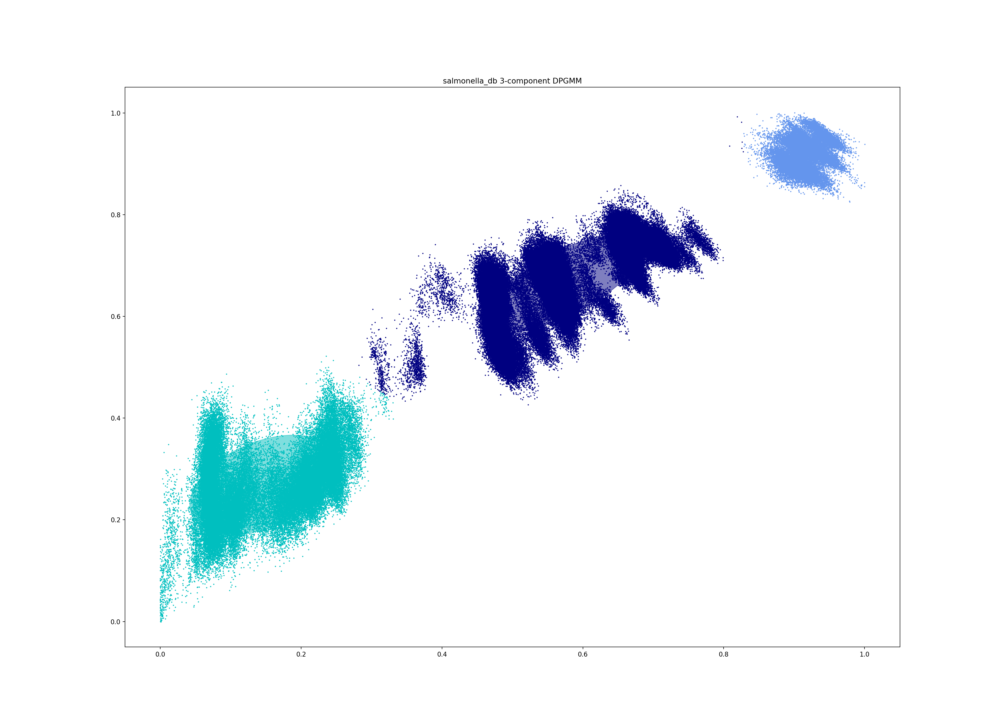

Tutorial
========
This tutorial will guide you through the use of the four modes of PopPUNK,
explaining when to use each one. In places we refer to :doc:`troubleshooting`
which explains how to deal with common problems when the defaults don't quite
work.

In this tutorial we will work with the Salmonella genomes reviewed by `Alikhan
et al <https://doi.org/10.1371/journal.pgen.1007261>`_ which can be downloaded
from `EnteroBase <https://enterobase.warwick.ac.uk/species/senterica/search_strains?query=workspace:9641>`_.

.. contents::
   :local:

Creating a database
-------------------
To analyse a population from scratch (where PopPUNK hasn't been used before)
the first step is to create a PopPUNK database, which is essentially a list of
all the core and accessory distances between each pair of isolates in the
collection.

The basic command to do this is as follows::

   poppunk --create-db --r-files reference_list.txt --output strain_db --threads 2 --plot-fit 5

Where ``references.txt`` is a list of fasta assemblies to analyse, created by,
for example::

   ls assemblies/*.fasta > reference_list.txt

The references will first be hashed at different k-mer lengths, then pairwise
distances are calculated, which are finally converted into core and accessory
distances::

   PopPUNK (POPulation Partitioning Using Nucleotide Kmers)
   Mode: Building new database from input sequences
   Creating mash database for k = 13
   Random 13-mer probability: 0.06
   Creating mash database for k = 17
   Random 17-mer probability: 0.00
   Creating mash database for k = 15
   Random 15-mer probability: 0.00
   Creating mash database for k = 19
   Random 19-mer probability: 0.00
   Creating mash database for k = 21
   Random 21-mer probability: 0.00
   Creating mash database for k = 25
   Random 25-mer probability: 0.00
   Creating mash database for k = 23
   Random 23-mer probability: 0.00
   Creating mash database for k = 27
   Random 27-mer probability: 0.00
   Creating mash database for k = 29
   Random 29-mer probability: 0.00
   mash dist -p 2 ./strain_db/strain_db.13.msh ./strain_db/strain_db.13.msh 2> strain_db.err.log
   mash dist -p 2 ./strain_db/strain_db.15.msh ./strain_db/strain_db.15.msh 2> strain_db.err.log
   mash dist -p 2 ./strain_db/strain_db.17.msh ./strain_db/strain_db.17.msh 2> strain_db.err.log
   mash dist -p 2 ./strain_db/strain_db.19.msh ./strain_db/strain_db.19.msh 2> strain_db.err.log
   mash dist -p 2 ./strain_db/strain_db.21.msh ./strain_db/strain_db.21.msh 2> strain_db.err.log
   mash dist -p 2 ./strain_db/strain_db.23.msh ./strain_db/strain_db.23.msh 2> strain_db.err.log
   mash dist -p 2 ./strain_db/strain_db.25.msh ./strain_db/strain_db.25.msh 2> strain_db.err.log
   mash dist -p 2 ./strain_db/strain_db.27.msh ./strain_db/strain_db.27.msh 2> strain_db.err.log
   mash dist -p 2 ./strain_db/strain_db.29.msh ./strain_db/strain_db.29.msh 2> strain_db.err.log
   Calculating core and accessory distances

   Done

We would recommend using as many threads as available for maximum speed (even
if #threads > #k-mers). To convert k-mer distances into core and accessory
distances the following relationship is used:

.. math::

   & \mathrm{pr}(a, b) = (1-a)(1-c)^k \\
   & \log (\mathrm{pr}(a, b)) = \log(1-a) + k \cdot \log(1-c)

Where :math:`\mathrm{pr}(a, b)` is the proportion of k-mers matching at length
:math:`k` between sequences :math:`a` and :math:`b`. In log-linear space this is
linear by k-mer length, and a constrained least squared fit gives the accessory
distance (the intercept) and the core distance (the slope).

.. warning::
   A straight line fit is required for correct calculation of core and
   accessory distances. To inspect this the use of the ``--plot-fit`` options
   is generally recommended to inspect some of the regressions. Choice of min-k
   depends on this, and is discussed in :ref:`kmer-length`.

Output files
^^^^^^^^^^^^
This will create two files `strain_db/strain_db.dists.npy` and `strain_db/strain_db.dists.pkl` which
store the distances and strain names respectively. These are then used in
:ref:`model-fit`.

There are also databases of sketches at each k-mer length (`*.msh`) which can
be re-used if the same data is fitted with a new range of k-mer lengths.
Otherwise they should be recalculated by specifying ``--overwrite``.

Relevant command line options
^^^^^^^^^^^^^^^^^^^^^^^^^^^^^
The following command line options can be used in this mode:

   Mode of operation:
     --create-db           Create pairwise distances database between reference
                           sequences
   Input files:
     --r-files R_FILES     File listing reference input assemblies

   Output options:
     --output OUTPUT       Prefix for output files (required)
     --plot-fit PLOT_FIT   Create this many plots of some fits relating k-mer to
                           core/accessory distances [default = 0]
     --overwrite           Overwrite any existing database files

   Kmer comparison options:
     --min-k MIN_K         Minimum kmer length [default = 9]
     --max-k MAX_K         Maximum kmer length [default = 29]
     --k-step K_STEP       K-mer step size [default = 4]
     --sketch-size SKETCH_SIZE
                           Kmer sketch size [default = 10000]

   Other options:
     --mash MASH           Location of mash executable
     --threads THREADS     Number of threads to use during database querying
                           [default = 1]

.. _model-fit:

Fitting the model
-----------------

The basic command used to fit the model is as follows::

   poppunk-runner.py --fit-model --distances strain_db/strain_db.dists --output strain_db --full-db --ref-db strain_db --K 3

This will fit a mixture of up to three 2D Gaussians to the distribution of core and
accessory distances::

   PopPUNK (POPulation Partitioning Using Nucleotide Kmers)
   Mode: Fitting model to reference database

   Fit summary:
   	Avg. entropy of assignment	0.0044
   	Number of components used	3
   Network summary:
   	Components	10
   	Density	0.1874
   	Transitivity	0.9995
   	Score	0.8122

   Done

There are a number of summary statistics which you can use to assess the fit:

==========================  ==============
Statistic                   Interpretation
==========================  ==============
Avg. entropy of assignment  How confidently each distance is assigned to a component. Closer to zero is more confident, and indicates less overlap of componenets, which may be indicative of less recombination overall.
Number of components used   The number of mixture components actually used, which may be less than the maximum allowed.
Components                  The number of componenets in the network == the number of population clusters
Density                     The proportion of edges in the network. 0 is no links, 1 is every link. Lower is better.
Transitivity                The transitivity of the network, between 0 and 1. Higher is better
Score                       Network score based on density and transitivity. Higher is better.
==========================  ==============

.. important::
   This is the most important part of getting a good estimation of population
   structure. In many cases choosing a sensible ``--K`` will get a fit with
   a good score, but in more complex cases PopPUNK allows much more flexible
   model fitting. See :ref:`bgmm-fit` for a discussion on how to achieve a good
   model fit at this stage.

The most useful plot is `strain_db_DPGMM_fit.png` which shows the clustering:

This looks reasonable. The component closest to the origin is used to create a network where isolates
determined to be within the same strain are linked by edges. The components of
this network are then the population clusters.

In this case, allowing more componenets (``--K 10``) gives a worse
fit as more complexity is introduced arbitrarily::

   PopPUNK (POPulation Partitioning Using Nucleotide Kmers)
   Mode: Fitting model to reference database

   Fit summary:
   	Avg. entropy of assignment	0.0053
   	Number of components used	10
   Network summary:
   	Components	121
   	Density	0.0534
   	Transitivity	0.8541
   	Score	0.8085

   Done

.. image:: DPGMM_fit_K10.png
   :alt:  2D fit to distances (K = 10)
   :align: center

In this case the fit is too conservative, and the network has a high number of
components.

Once you have a good fit, run again with the ``--microreact`` option (and
``--rapidnj`` if you have `rapidnj <http://birc.au.dk/software/rapidnj/>`_ installed).
This will create output files which can dragged and dropped into `Microreact <https://microreact.org/>`_
for visualisation of the results.

Drag the files `strain_db_microreact_clusters.csv`, `strain_db_perplexity5.0_accessory_tsne`, and
`strain_db_core_NJ_microreact.nwk` onto Microreact. For this example, the output is at LINK.
TODO

Output files
^^^^^^^^^^^^
TODO

Relevant command line options
^^^^^^^^^^^^^^^^^^^^^^^^^^^^^
TODO

