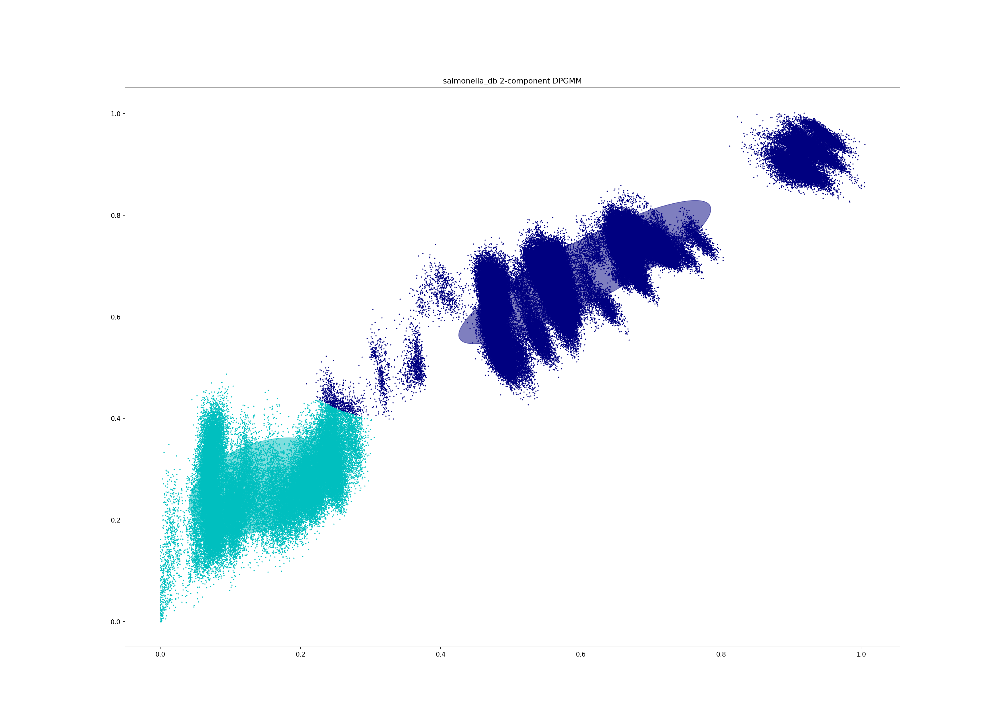
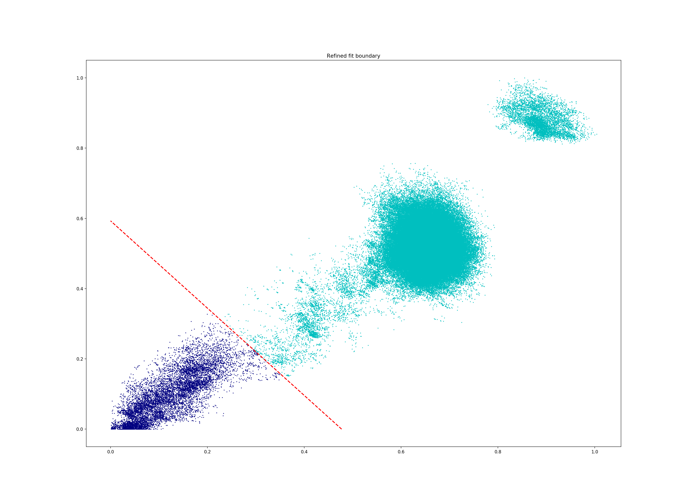

Tutorial
========

.. |nbsp| unicode:: 0xA0
   :trim:

This tutorial will guide you through the use of the four modes of PopPUNK,
explaining when to use each one. In places we refer to :doc:`troubleshooting`
which explains how to deal with common problems when the defaults don't quite
work.

In this tutorial we will work with the Salmonella genomes reviewed by `Alikhan
et al <https://doi.org/10.1371/journal.pgen.1007261>`_ which can be downloaded
from `EnteroBase <https://enterobase.warwick.ac.uk/species/senterica/search_strains?query=workspace:9641>`_.

.. contents::
   :local:

Creating a database
-------------------
To analyse a population from scratch (where PopPUNK hasn't been used before)
the first step is to create a PopPUNK database, which is essentially a list of
all the core and accessory distances between each pair of isolates in the
collection.

The basic command to do this is as follows::

   poppunk --create-db --r-files reference_list.txt --output strain_db --threads 2 --plot-fit 5

Where ``references.txt`` is a list of fasta assemblies to analyse, created by,
for example::

   ls assemblies/*.fasta > reference_list.txt

The references will first be hashed at different k-mer lengths, then pairwise
distances are calculated, which are finally converted into core and accessory
distances::

   PopPUNK (POPulation Partitioning Using Nucleotide Kmers)
   Mode: Building new database from input sequences
   Creating mash database for k = 13
   Random 13-mer probability: 0.06
   Creating mash database for k = 17
   Random 17-mer probability: 0.00
   Creating mash database for k = 15
   Random 15-mer probability: 0.00
   Creating mash database for k = 19
   Random 19-mer probability: 0.00
   Creating mash database for k = 21
   Random 21-mer probability: 0.00
   Creating mash database for k = 25
   Random 25-mer probability: 0.00
   Creating mash database for k = 23
   Random 23-mer probability: 0.00
   Creating mash database for k = 27
   Random 27-mer probability: 0.00
   Creating mash database for k = 29
   Random 29-mer probability: 0.00
   mash dist -p 2 ./strain_db/strain_db.13.msh ./strain_db/strain_db.13.msh 2> strain_db.err.log
   mash dist -p 2 ./strain_db/strain_db.15.msh ./strain_db/strain_db.15.msh 2> strain_db.err.log
   mash dist -p 2 ./strain_db/strain_db.17.msh ./strain_db/strain_db.17.msh 2> strain_db.err.log
   mash dist -p 2 ./strain_db/strain_db.19.msh ./strain_db/strain_db.19.msh 2> strain_db.err.log
   mash dist -p 2 ./strain_db/strain_db.21.msh ./strain_db/strain_db.21.msh 2> strain_db.err.log
   mash dist -p 2 ./strain_db/strain_db.23.msh ./strain_db/strain_db.23.msh 2> strain_db.err.log
   mash dist -p 2 ./strain_db/strain_db.25.msh ./strain_db/strain_db.25.msh 2> strain_db.err.log
   mash dist -p 2 ./strain_db/strain_db.27.msh ./strain_db/strain_db.27.msh 2> strain_db.err.log
   mash dist -p 2 ./strain_db/strain_db.29.msh ./strain_db/strain_db.29.msh 2> strain_db.err.log
   Calculating core and accessory distances

   Done

We would recommend using as many threads as available for maximum speed (even
if #threads > #k-mers). To convert k-mer distances into core and accessory
distances the following relationship is used:

.. math::

   & \mathrm{pr}(a, b) = (1-a)(1-c)^k \\
   & \log (\mathrm{pr}(a, b)) = \log(1-a) + k \cdot \log(1-c)

Where :math:`\mathrm{pr}(a, b)` is the proportion of k-mers matching at length
:math:`k` between sequences :math:`a` and :math:`b`. In log-linear space this is
linear by k-mer length, and a constrained least squared fit gives the accessory
distance (the intercept) and the core distance (the slope).

.. warning::
   A straight line fit is required for correct calculation of core and
   accessory distances. To inspect this the use of the ``--plot-fit`` options
   is generally recommended to inspect some of the regressions. Choice of min-k
   depends on this, and is discussed in :ref:`kmer-length`.

Output files
^^^^^^^^^^^^
This will create two files `strain_db/strain_db.dists.npy` and `strain_db/strain_db.dists.pkl` which
store the distances and strain names respectively. These are then used in
:ref:`model-fit`.

There are also databases of sketches at each k-mer length (`*.msh`) which can
be re-used if the same data is fitted with a new range of k-mer lengths.
Otherwise they should be recalculated by specifying ``--overwrite``.

Relevant command line options
^^^^^^^^^^^^^^^^^^^^^^^^^^^^^
The following command line options can be used in this mode:

   Mode of operation:
     --create-db           Create pairwise distances database between reference
                           sequences
   Input files:
     --r-files R_FILES     File listing reference input assemblies

   Output options:
     --output OUTPUT       Prefix for output files (required)
     --plot-fit PLOT_FIT   Create this many plots of some fits relating k-mer to
                           core/accessory distances [default = 0]
     --overwrite           Overwrite any existing database files

   Kmer comparison options:
     --min-k MIN_K         Minimum kmer length [default = 9]
     --max-k MAX_K         Maximum kmer length [default = 29]
     --k-step K_STEP       K-mer step size [default = 4]
     --sketch-size SKETCH_SIZE
                           Kmer sketch size [default = 10000]

   Other options:
     --mash MASH           Location of mash executable
     --threads THREADS     Number of threads to use during database querying
                           [default = 1]

.. _model-fit:

Fitting the model
-----------------

The basic command used to fit the model is as follows::

   poppunk-runner.py --fit-model --distances strain_db/strain_db.dists --output strain_db --full-db --ref-db strain_db --K 2

This will fit a mixture of up to three 2D Gaussians to the distribution of core and
accessory distances::

   PopPUNK (POPulation Partitioning Using Nucleotide Kmers)
   Mode: Fitting model to reference database

   Fit summary:
      Avg. entropy of assignment	0.0042
      Number of components used	2
   Network summary:
      Components	12
      Density	0.1852
      Transitivity	0.9941
      Score	0.8100

   Done

The default is to fit two components, one for between-strain and one for
within-strain distances. There are a number of summary statistics which you can use to assess the fit:

==========================  ==============
Statistic                   Interpretation
==========================  ==============
Avg. entropy of assignment  How confidently each distance is assigned to a component. Closer to zero is more confident, and indicates less overlap of components, which may be indicative of less recombination overall.
Number of components used   The number of mixture components actually used, which may be less than the maximum allowed.
Components                  The number of components in the network == the number of population clusters
Density                     The proportion of edges in the network. 0 is no links, 1 is every link. Lower is better.
Transitivity                The transitivity of the network, between 0 and 1. Higher is better
Score                       Network score based on density and transitivity. Higher is better.
==========================  ==============

.. important::
   This is the most important part of getting a good estimation of population
   structure. In many cases choosing a sensible ``--K`` will get a fit with
   a good score, but in more complex cases PopPUNK allows much more flexible
   model fitting. See :ref:`bgmm-fit` for a discussion on how to achieve a good
   model fit at this stage.

The most useful plot is `strain_db_DPGMM_fit.png` which shows the clustering:

This looks reasonable. The component closest to the origin is used to create a network where isolates
determined to be within the same strain are linked by edges. The connected components of
this network are then the population clusters.

In this case, allowing more components (``--K 10``) gives a worse
fit as more complexity is introduced arbitrarily::

   PopPUNK (POPulation Partitioning Using Nucleotide Kmers)
   Mode: Fitting model to reference database

   Fit summary:
   	Avg. entropy of assignment	0.0053
   	Number of components used	10
   Network summary:
   	Components	121
   	Density	0.0534
   	Transitivity	0.8541
   	Score	0.8085

   Done

.. image:: DPGMM_fit_K10.png
   :alt:  2D fit to distances (K = 10)
   :align: center

In this case the fit is too conservative, and the network has a high number of
components.

Once you have a good fit, run again with the ``--microreact`` option (and
``--rapidnj`` if you have `rapidnj <http://birc.au.dk/software/rapidnj/>`_ installed).
This will create output files which can dragged and dropped into `Microreact <https://microreact.org/>`_
for visualisation of the results.

Drag the files `strain_db_microreact_clusters.csv`, `strain_db_perplexity5.0_accessory_tsne`, and
`strain_db_core_NJ_microreact.nwk` onto Microreact. For this example, the output is at https://microreact.org/project/Skg0j9sjz
(this also includes a CSV of additional metadata downloaded from EnteroBase and supplied to
PopPUNK with ``--info-csv``).

.. image:: microreact.png
   :alt:  Microreact plot of results
   :align: center

The left panel shows the tree from the core distances, and the right panel the
embedding of accessory distances (at perplexity 30). Differences in clustering between the two can
be informative of separate core and accessory evolution, but in this case they
are correlated as expected for strains. Tips are coloured by the PopPUNK inferred cluster.

.. note::
   t-SNE can be sensitive to the ``--perplexity`` parameter provided. This can
   be re-run as necessary by changing the parameter value. Use a value between
   5 and 50, but see :ref:`perplexity` for further discussion.

Use of full-db
^^^^^^^^^^^^^^
By default the ``--full-db`` option is off. When on this will keep every sample in the
analysis in the database for future querying.

When off (the default) representative samples will be picked from each cluster
by choosing only one reference sample from each clique (where all samples in
a clqiue have a within-cluster link to all other samples in the clique). This
can significantly reduce the database size for future querying without loss of
accuracy. Representative samples are written out to a .refs file, and a new
database is sketched for future distance comparison.

In the case of the example above, this reduces from 848 to 14 representatives (one for
each of the twelve clusters, except for 3 and 6 which have two each).

Output files
^^^^^^^^^^^^
* strain_db.search.out -- the core and accessory distances between all
  pairs.
* strain_db_DPGMM_fit.png -- scatter plot of all distances, and mixture model
  fit and assignment.
* strain_db_DPGMM_fit_contours.png -- contours of likelihood function fitted to
  data (blue low -> yellow high). The thick red line is the decision boundary between
  within- and between-strain components.
* strain_db_distanceDistribution.png -- scatter plot of the distance
  distribution fitted by the model, and a kernel-density estimate.
* strain_db.csv -- isolate names and the cluster assigned.
* strain_db.png -- unclustered distribution of
  distances used in the fit (subsampled from total).
* strain_db.npz -- save fit parameters.
* strain_db.refs -- representative references in the new database (unless
  ``--full-db`` was used).

If ``--microreact`` was used:

* strain_db_core_dists.csv -- matrix of pairwise core distances.
* strain_db_acc_dists.csv -- matrix of pairwise accessory distances.
* strain_db_core_NJ_microreact.nwk -- neighbour joining tree using core
  distances (for microreact).
* strain_db_perplexity5.0_accessory_tsne.dot -- t-SNE embedding of
  accessory distances at given perplexity (for microreact).
* strain_db_microreact_clusters.csv -- cluster assignments plus any epi
  data added with the ``--info-csv`` option (for microreact).

If ``--cytoscape`` was used:

* strain_db_cytoscape.csv -- cluster assignments plus any epi data added
  with the ``--info-csv`` option (for cytoscape).
* strain_db_cytoscape.graphml -- XML representation of resulting network
  (for cytoscape).

Relevant command line options
^^^^^^^^^^^^^^^^^^^^^^^^^^^^^
The following command line options can be used in this mode:

   Mode of operation:
     --fit-model           Fit a mixture model to a reference database

   Input files:
     --ref-db REF_DB       Location of built reference database
     --distances DISTANCES
                           Prefix of input pickle of pre-calculated distances

   Output options:
     --output OUTPUT       Prefix for output files (required)
     --full-db             Keep full reference database, not just representatives
     --overwrite           Overwrite any existing database files

   Mixture model options:
     --K K                 Maximum number of mixture components (EM only)
                           [default = 2]
     --priors PRIORS       File specifying model priors. See documentation for
                           help
     --bgmm                Use ADVI rather than EM to fit the mixture model
     --t-dist              Use a mixture of t distributions rather than Gaussians
                           (ADVI only)

   Further analysis options:
     --microreact          Generate output files for microreact visualisation
     --cytoscape           Generate network output files for Cytoscape
     --rapidnj RAPIDNJ     Path to rapidNJ binary to build NJ tree for Microreact
     --perplexity PERPLEXITY
                           Perplexity used to calculate t-SNE projection (with
                           --microreact) [default=5.0]
     --info-csv INFO_CSV   Epidemiological information CSV formatted for
                           microreact (with --microreact or --cytoscape)

   Other options:
     --mash MASH           Location of mash executable
     --threads THREADS     Number of threads to use during database querying
                           [default = 1]

.. note::
   Threads will only be used if ``--full-db`` is *not* specified and sketching
   of the representatives is performed at the end.

.. _refine-model:

Refining a model
-------------------
In species with a relatively high recombination rate the distinction between
the within- and between-strain distributions may be blurred in core and
accessory space. This does not give the mixture model enough information to
draw a good boundary as the likelihood is very flat in this region.

See this example of 616 *S.*\ |nbsp| \ *pneumoniae* genomes with the DPGMM fit. These genomes were collected from Massachusetts,
first reported `here <https://www.nature.com/articles/ng.2625>`__ and can be accessed
`here <https://www.nature.com/articles/sdata201558>`__.

.. image:: pneumo_unrefined.png
   :alt:  A bad DPGMM fit
   :align: center

Although the score of this fit looks ok (0.904), inspection of the network and
microreact reveals that it is too liberal and clusters have been merged. This
is because some of the blur between the origin and the central distribution has
been included, and connected clusters together erroneously.

The likelihood of the model fit and the decision boundary looks like this:

.. image:: pneumo_likelihood.png
   :alt:  The likelihood and decision boundary of the above fit
   :align: center

Using the core and accessory distributions alone does not give much information
about exactly where to put the boundary, and the only way to fix this would be
by specifying strong priors on the weights of the distributions. Fortunately
the network properties give information in the region, and we can use
``--refine-fit`` to tweak the existing fit and pick a better boundary.

Run::

   poppunk --refine-model --distances strain_db/strain_db.dists --output strain_db --full-db --ref-db strain_db --threads 4

Briefly:

* A line between the within- and between-strain means is constructed
* The point on this line where samples go from being assigned as within-strain to between-strain is used as the starting point
* A line normal to the first line, passing through this point is constructed. The triangle formed by this line and the x- and y-axes is now the decision boundary. Points within this line are within-strain.
* The starting point is shifted by a distance along the first line, and a new decision boundary formed in the same way. The network is reconstructed.
* The shift of the starting point is optimised, as judged by the network score. First globally by a grid search, then locally near the global optimum.

The score is a function of transitivity (which is expected to be high, as
everything within a cluster should be the same strain as everything else in the
cluster) and density (which should be low, as there are far fewer within- than
between-strain links).

Here is the refined fit, which has a score of 0.939, and 62 rather than 32
components:

Which, looking at the `microreact output <https://microreact.org/project/SJxxLMcaf>`__, is much better:

.. image:: refined_microreact.png
   :alt:  The refined fit, in microreact
   :align: center

Output files
^^^^^^^^^^^^
TODO

This will create two files `strain_db/strain_db.dists.npy` and `strain_db/strain_db.dists.pkl` which
store the distances and strain names respectively. These are then used in
:ref:`model-fit`.

There are also databases of sketches at each k-mer length (`*.msh`) which can
be re-used if the same data is fitted with a new range of k-mer lengths.
Otherwise they should be recalculated by specifying ``--overwrite``.

Relevant command line options
^^^^^^^^^^^^^^^^^^^^^^^^^^^^^
TODO

The following command line options can be used in this mode:

   Mode of operation:
     --create-db           Create pairwise distances database between reference
                           sequences
   Input files:
     --r-files R_FILES     File listing reference input assemblies

   Output options:
     --output OUTPUT       Prefix for output files (required)
     --plot-fit PLOT_FIT   Create this many plots of some fits relating k-mer to
                           core/accessory distances [default = 0]
     --overwrite           Overwrite any existing database files

   Kmer comparison options:
     --min-k MIN_K         Minimum kmer length [default = 9]
     --max-k MAX_K         Maximum kmer length [default = 29]
     --k-step K_STEP       K-mer step size [default = 4]
     --sketch-size SKETCH_SIZE
                           Kmer sketch size [default = 10000]

   Other options:
     --mash MASH           Location of mash executable
     --threads THREADS     Number of threads to use during database querying
                           [default = 1]

