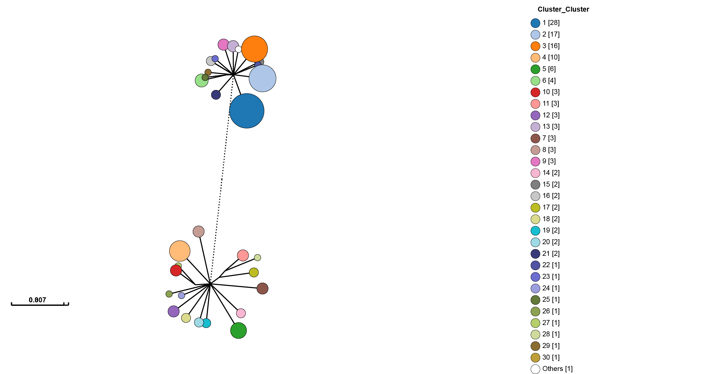

Creating visualisations
=======================

**Contents**:

.. contents::
   :local:

We have moved visualisation tools into their own program ``poppunk_visualise``, both
to reinforce our commitment to UK spellings, and so that you can rerun visualisations
with different outputs and settings without rerunning the other parts of the code.

Starting with either a full database where you have fitted a model (:doc:`model_fitting`), or
output where you have assigned queries using an existing database (:doc:`query_assignment`), you
can create outputs for external interactive visualisation tools:

- `Microreact <https://microreact.org/>`__ -- a genomic epidemiology visualisation tool, displaying clusters, phylogeny and accessory clustering.
- `GrapeTree <https://achtman-lab.github.io/GrapeTree/MSTree_holder.html>`__ -- a tool to visualise strains (designed for cgMLST).
- `Phandango <https://jameshadfield.github.io/phandango/#/>`__ -- visualisation linking genomes and phylogenies.
- `Cytoscape <https://cytoscape.org/>`__ -- a network visualisation tool, which can be used to create, view and manipulate a layout of the graph.

At least one of these output types must be specified as a flag.

.. important::
   If you run a visualisation on output from query assignment (:doc:`query_assignment`)
   this will not contain all the necessary distances, and they will be calculated before
   the visualisation files are produced.
   You will see a message ``Note: Distance will be extended to full all-vs-all distances``.
   If you are running multiple visualisations this calculation will be completed every time. To avoid
   this re-run your assignment with ``--update-db``, which will add these distances in permanently.

Common options
--------------
Some typical commands for various input settings (with ``--microreact``, but this can
be altered to any output type) with a database ``example``.

Visualisation of a full database::

   poppunk_visualise --ref-db example_db --output example_viz --microreact

Visualisation after query assignment::

   poppunk_visualise --ref-db example_db --query-db example_query --output example_viz --microreact

Visualisation when sketches and models are in different folders::

   poppunk_visualise --ref-db example_db --previous-clustering example_lineages/example_lineages_lineages.csv \
    --model-dir example_lineages --output example_viz --microreact

Visualisation with a lineage model, which has been queried (query-query distances must be provided)::

   poppunk_visualise --distances example_query/example_query.dists --ref-db example_db \
    --model-dir example_lineages --query-db example_lineage_query \
    --output example_viz --microreact

Notable modifiers include:

- ``--include-files`` -- give a file with a subset of names to be included in the visualisation.
- ``--external-clustering`` -- other cluster names to map to strains (such as MLST, serotype etc),
  as described in model fitting and query assignment.
- ``--info-csv`` -- similar to the above, but a CSV which is simply (inner-)joined to the output on sample name.
- ``--rapidnj`` -- the location of a `rapidnj <https://birc.au.dk/software/rapidnj/>`__ binary,
  used to build the core NJ tree. We highly recommend using this for any tree-building (and is included with
  the conda install). This defaults to ``rapidnj`` on the PATH. Set blank to use dendropy instead (slower, especially
  for large datasets).
- ``--core-only``/``--accessory-only`` -- use the core or accessory fit from an individually refined model (see :ref:`indiv-refine`).
- ``--threads``, ``--gpu-dist``, ``--deviceid``, ``--strand-preserved`` -- querying options used if extra distance calculations are needed.
  To avoid these, rerun your query with ``--update-db``.

Microreact
----------
Adding the ``--microreact`` flag will create the following files:

- _microreact_clusters.csv -- the strain or lineage assignments with headers formatted for microreact, plus anything from ``--info-csv``.
- _core_NJ.nwk -- a neighbour-joining tree from the core distances.
- _perplexity20.0_accessory_mandrake.dot -- a 2D embedding of the accessory distances, produced using `mandrake <https://github.com/bacpop/mandrake>`__ (in this case with
  :ref:`perplexity` 20).

From version 2.5.0 this will also include:

- .microreact -- a Microreact compatible JSON containing all of the above, which
   can be uploaded directly.

If you add ``--api-key`` and provide `your account's API key <https://docs.microreact.org/api/access-tokens>__`
this will automatically create an instance, and the URL will be output to the terminal.

Otherwise, open https://microreact.org/upload in your browser, and drag and drop these three files
to create your visualisation. Here is the result of running the visualisation on the
*Listeria* BGMM model::

   poppunk_visualise --ref-db listeria --microreact

   Graph-tools OpenMP parallelisation enabled: with 1 threads
   PopPUNK: visualise
   Loading BGMM 2D Gaussian model
   Writing microreact output
   Parsed data, now writing to CSV
   Building phylogeny
   Running mandrake

   Done

This can be viewed at https://microreact.org/project/8PeGg9fCjZADaAGuNJwU9z:

Useful controls include the tree shape, accessed with the control slider in the
top right of the phylogeny page, and the metadata labels, accessed with the 'eye'
on the right of the page. When visualising lineages, changing the 'Colour by' is useful
to compare results from different ranks.

.. _perplexity:

Setting the perplexity parameter for mandrake
^^^^^^^^^^^^^^^^^^^^^^^^^^^^^^^^^^^^^^^^^^^^^
In mandrake an embedding of the accessory genome distances is found which
represents local structure of the data. Isolates with similar accessory content
will visually appear in clusters together.

The perplexity sets a guess about the number of close neighbours each point
has, and is a trade-off between local and global structure. t-SNE (and by extension mandrake) is reasonably
robust to changes in the perplexity parameter (set with ``--perplexity`` when
creating microreact output with ``--microreact``),
however we would recommend trying a few values to get
a good embedding for the accessory distances.

There is a good discussion of the effect of perplexity `here <https://distill.pub/2016/misread-tsne/>`__
and the sklearn documentation shows some examples of the effect of `changing
perplexity <http://scikit-learn.org/stable/auto_examples/manifold/plot_t_sne_perplexity.html>`__.
In mandrake, points will usually appear 'tighter' than in t-SNE, and form more obvious clusters.

In the :doc:`model_fitting` example, a perplexity of 30 gives clear clustering of
the accessory genome content, condordant with the core genome structure (`data <https://microreact.org/project/Skg0j9sjz>`__):

.. image:: images/microreact.png
   :alt:  Microreact plot of results with perplexity = 30
   :align: center

With a lower perplexity of 5, the clustering is too loose, and the strain
structure cannot clearly be seen (`data <https://microreact.org/project/S1RwpK9if>`__):

.. image:: images/microreact_perplexity5.png
   :alt:  Microreact plot of results with perplexity = 5
   :align: center

30 is a good default, but you may wish to try other values, particularly with
larger or smaller datasets. You can re-run the mandrake using the ``poppunk_mandrake``
command, providing the distances from the previous run::

   poppunk_mandrake --distances strain_db/strain_db.dists --output strain_db \
   --perplexity 20

GrapeTree
---------
Adding the ``--grapetree`` flag will create:

- _microreact_clusters.csv -- the strain or lineage assignments with headers formatted for grapetree, plus anything from ``--info-csv``.
- _core_NJ.nwk -- a neighbour-joining tree from the core distances.

Open https://achtman-lab.github.io/GrapeTree/MSTree_holder.html in your browser, and use
the 'Load files' button once for each of the files to add the tree and strain assignments to
GrapeTree. This will display an unrooted tree with your clusters:

One of GrapeTree's key features is the ability to collapse branches, and condense information
into nodes. By going to Tree Layout -> Branch style -> Collapse branches, and setting the long
branch to be shortened, one can obtain a view which shows strain prevalence and relationships:

There is also a handy 'Export to Microreact' button in GrapeTree, though this will
not include the accessory embedding, so you may wish to add the ``--microreact`` flag
and generate the files yourself.

Phandango
---------
Adding the ``--phandango`` flag will create:

- _phandango_clusters.csv -- the strain or lineage assignments with headers formatted for phandango, plus anything from ``--info-csv``.
- _core_NJ.tree -- a neighbour-joining tree from the core distances.

Open https://www.phandango.net in your browser, and use
the 'Load files' button once for each of the files to add the tree and strain assignments to
GrapeTree. This will display the tree with your clusters:

.. image:: images/phandango.png
   :alt:  Phandango visualisation of results
   :align: center

Press 's' to access settings, and 'p' to create an .svg file. Phandango is most useful
with a genome (.gff file), and either a plot of recombination, accessory genome analysis
or GWAS results. See the documentation for more information.

.. _cytoscape-view:

Cytoscape
---------
Cytoscape is different from the above modes as it creates a layout and visualisation of
the graph used to create strains from distances. This can be useful for more detailed
investigation of network scores, particularly in strains which have less than perfect transitivity.

Add the ``--cytoscape`` option, and also ``--network-file`` to point to the
network you wish to visualise::

   poppunk_visualise --ref-db listeria --cytoscape --network-file listeria/listeria_graph.gt

   Graph-tools OpenMP parallelisation enabled: with 1 threads
   PopPUNK: visualise
   Loading BGMM 2D Gaussian model
   Writing cytoscape output
   Network loaded: 128 samples
   Parsed data, now writing to CSV

   Done

Which will create:

- _cytoscape.csv -- the strain or lineage assignments with headers formatted for cytoscape, plus anything from ``--info-csv``.
- _cytoscape.graphml -- the network in graphml format.

The .graphml file is an XML file which contains definitions of the nodes (samples)
and edges (within-strain distances) connecting them. If you used ``--graph-weights``
when you fitted your model the edges will be annotated with their Euclidean distances
in the 'weight' attribute (which you will need to tell cytoscape). These can be added
with the ``poppunk_add_weights`` script if this flag was not used.

Open `cytoscape <http://www.cytoscape.org/>`_ and drag and drop the .graphml
file onto the window to import the network. Import -> table -> file to load the
CSV. Click 'Select None' then add the 'id' column as a key, and any required
metadata columns (at least the 'Cluster' column) as attributes. Make sure
'Node Table Columns' is selected as the data type.

The graphml file does not contain a layout for the graph, that is, positions of
nodes and edges are not specified for a visualisation. These will be calculated by cytoscape,
automatically for small graphs, and with the 'Layout' menu for larger graphs. The 'Prefuse force directed layout'
or 'yFiles Organic Layout' work well. Select the 'weight' dropdown to use the edge-lengths
when drawing the network.

.. warning::
   We have found that making graphs with >10k nodes may exceed the memory on a typical
   laptop. To view larger graphs, first splitting into subgraphs of each connected component
   is very helpful. Older versions of cytoscape allowed you to split the graph into connected
   components, but newer versions have removed this feature. This can be done programmatically
   with ``networkx`` or ``graph-tool`` in python, or ``igraph`` in R.

Click on 'Style' and change the node fill colour to be by cluster, the mapping
type as discrete, then right click to autogenerate a colour scheme ('Random' is usually best). You can
also modify the node size and shape here. Here is the *Listeria* example, using edge weights in the layout:

.. image:: images/cytoscape.png
   :alt:  Cytoscape plot of network
   :align: center

If you used assign query mode you will also have a column with 'Query' or 'Reference', which can
be used to map to different shapes or colours:

.. image:: images/assign_network.png
   :alt:  Network produced after query assignment
   :align: center

Adding an info CSV, or loading external tables directly into cytoscapes gives further options
for investigating individual strains:

.. image:: images/cytoscape_gpsc.png
   :alt:  Network with added annotation
   :align: center

In some cases, edges which are between strain links may have been erroneously included
in the network. This could be due to poor model fit, or a poor quality
sequence. Use Tools -> NetworkAnalyzer -> Analyze Network to compute
information for each node and edge. It may help to analyze connected components separately.
They can be split under Tools -> NetworkAnalyzer -> Subnetwork Creation.

Here is an example where an errant node is connecting two clusters into one
large cluster, which should be split:

.. image:: images/cytoscape_component.png
   :alt:  Cytoscape plot of network
   :align: center

The incorrect node in question has a low CluteringCoefficient and high Stress.
The EdgeBetweeness of its connections are also high. Sorting the node and edge
tables by these columns can find individual problems such as this.
