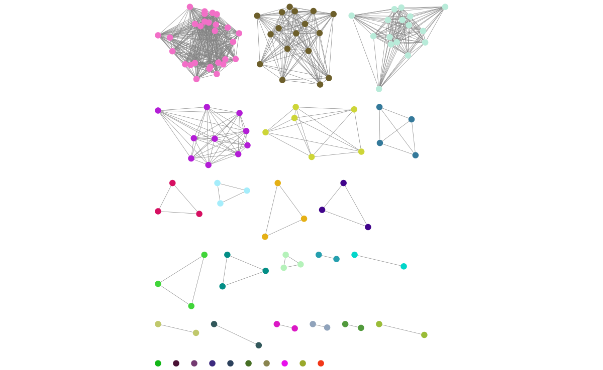

Creating visualisations
=======================

.. _cytoscape-view:

Viewing the network with cytoscape
----------------------------------
If you add the ``--cytoscape`` option when running ``--fit-model`` _cytoscape.graphml
and _cytoscape.csv files will be written to the output directory.

Open `cytoscape <http://www.cytoscape.org/>`_ and drag and drop the .graphml
file onto the window to import the network. Import -> table -> file to load the
CSV. Click 'Select None' then add the 'id' column as a key, and any required
metadata columns (at least the 'Cluster' column) as attributes. Make sure
'Node Table Columns' is selected as the data type.

Click on 'Style' and change the node fill colour to be by cluster, the mapping
type as discrete, then right click to autogenerate a colour scheme. You can
also modify the node size here. In the :doc:`tutorial` example, the components
are nicely separated and the network has high transitivity:

In some cases, edges which are between strain links may have been erroneously included
in the network. This could be due to poor model fit, or a poor quality
sequence. Use Tools -> NetworkAnalyzer -> Analyze Network to compute
information for each node and edge. It may help to analyze connected components separately.
They can be split under Tools -> NetworkAnalyzer -> Subnetwork Creation.

Here is an example where an errant node is connecting two clusters into one
large cluster, which should be split:

.. image:: images/cytoscape_component.png
   :alt:  Cytoscape plot of network
   :align: center

The incorrect node in question has a low CluteringCoefficient and high Stress.
The EdgeBetweeness of its connections are also high. Sorting the node and edge
tables by these columns can find individual problems such as this.

.. _perplexity:

Setting the perplexity parameter for t-SNE
------------------------------------------
In t-SNE an embedding of the accessory genome distances is found which
represents local structure of the data. Isolates with similar accessory content
will visually appear in clusters together.

The perplexity sets a guess about the number of close neighbours each point
has, and is a trade-off between local and global structure. t-SNE is reasonably
robust to changes in the perplexity parameter (set with ``--perplexity`` when
creating microreact output with ``--microreact`` in the``--fit-model`` mode),
however we would recommend trying a few values to get
a good embedding for the accessory distances.

There is a good discussion of the effect of perplexity `here <https://distill.pub/2016/misread-tsne/>`_
and the sklearn documentation shows some examples of the effect of `changing
perplexity <http://scikit-learn.org/stable/auto_examples/manifold/plot_t_sne_perplexity.html>`_.

In the :doc:`tutorial` example, a perplexity of 30 gives clear clustering of
the accessory genome content, condordant with the core genome structure (`data <https://microreact.org/project/Skg0j9sjz>`__):

.. image:: images/microreact.png
   :alt:  Microreact plot of results with perplexity = 30
   :align: center

With a lower perplexity of 5, the clustering is too loose, and the strain
structure cannot clearly be seen (`data <https://microreact.org/project/S1RwpK9if>`__):

.. image:: images/microreact_perplexity5.png
   :alt:  Microreact plot of results with perplexity = 5
   :align: center

30 is a good default, but you may wish to try other values, particularly with
larger or smaller datasets. You can re-run the t-SNE using the ``poppunk_tsne``
command, providing the distances from the previous run::

   poppunk_tsne --distances strain_db/strain_db.dists --output strain_db \
   --perplexity 20 --verbosity 1